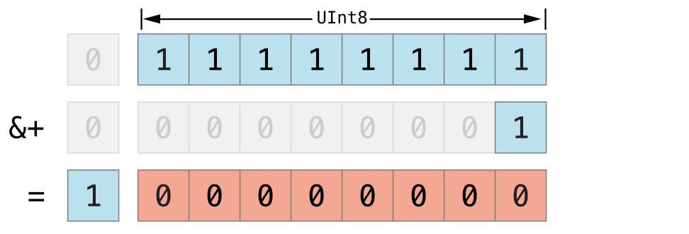

[‌](){#TP40016643-CH27}[‌](){#TP40016643-CH27-ID28}
Advanced Operators {#advanced-operators .chapter-name}
------------------

In addition to the operators described in [Basic Operators](BasicOperators.md), Swift provides several advanced operators that perform more complex value manipulation. These include all of the bitwise and bit shifting operators you will be familiar with from C and Objective-C.

Unlike arithmetic operators in C, arithmetic operators in Swift do not overflow by default. Overflow behavior is trapped and reported as an error. To opt in to overflow behavior, use Swift’s second set of arithmetic operators that overflow by default, such as the overflow addition operator (`&+`{.code-voice}). All of these overflow operators begin with an ampersand (`&`{.code-voice}).

When you define your own structures, classes, and enumerations, it can be useful to provide your own implementations of the standard Swift operators for these custom types. Swift makes it easy to provide tailored implementations of these operators and to determine exactly what their behavior should be for each type you create.

You’re not limited to the predefined operators. Swift gives you the freedom to define your own custom infix, prefix, postfix, and assignment operators, with custom precedence and associativity values. These operators can be used and adopted in your code like any of the predefined operators, and you can even extend existing types to support the custom operators you define.

[‌](){#TP40016643-CH27-ID29}
### Bitwise Operators {#bitwise-operators .section-name}

*Bitwise operators* enable you to manipulate the individual raw data bits within a data structure. They are often used in low-level programming, such as graphics programming and device driver creation. Bitwise operators can also be useful when you work with raw data from external sources, such as encoding and decoding data for communication over a custom protocol.

Swift supports all of the bitwise operators found in C, as described below.

[‌](){#TP40016643-CH27-ID30}
### Bitwise NOT Operator {#bitwise-not-operator .section-name}

The *bitwise NOT operator* (`~`{.code-voice}) inverts all bits in a number:

{width="447" height="129"}

The bitwise NOT operator is a prefix operator, and appears immediately before the value it operates on, without any white space:

1.  `let`{.code-voice} `initialBits`{.vc}: `UInt8`{.n} = `0b00001111`{.m}
2.  `let`{.code-voice} `invertedBits`{.vc} = \~`initialBits`{.vc} `// equals 11110000`{.c}

`UInt8`{.code-voice} integers have eight bits and can store any value between `0`{.code-voice} and `255`{.code-voice}. This example initializes a `UInt8`{.code-voice} integer with the binary value `00001111`{.code-voice}, which has its first four bits set to `0`{.code-voice}, and its second four bits set to `1`{.code-voice}. This is equivalent to a decimal value of `15`{.code-voice}.

The bitwise NOT operator is then used to create a new constant called `invertedBits`{.code-voice}, which is equal to `initialBits`{.code-voice}, but with all of the bits inverted. Zeros become ones, and ones become zeros. The value of `invertedBits`{.code-voice} is `11110000`{.code-voice}, which is equal to an unsigned decimal value of `240`{.code-voice}.

[‌](){#TP40016643-CH27-ID31}
### Bitwise AND Operator {#bitwise-and-operator .section-name}

The *bitwise AND operator* (`&`{.code-voice}) combines the bits of two numbers. It returns a new number whose bits are set to `1`{.code-voice} only if the bits were equal to `1`{.code-voice} in *both* input numbers:

{width="447" height="208"}

In the example below, the values of `firstSixBits`{.code-voice} and `lastSixBits`{.code-voice} both have four middle bits equal to `1`{.code-voice}. The bitwise AND operator combines them to make the number `00111100`{.code-voice}, which is equal to an unsigned decimal value of `60`{.code-voice}:

1.  `let`{.code-voice} `firstSixBits`{.vc}: `UInt8`{.n} = `0b11111100`{.m}
2.  `let`{.code-voice} `lastSixBits`{.vc}: `UInt8`{.n} = `0b00111111`{.m}
3.  `let`{.code-voice} `middleFourBits`{.vc} = `firstSixBits`{.vc} & `lastSixBits`{.vc} `// equals 00111100`{.c}

[‌](){#TP40016643-CH27-ID32}
### Bitwise OR Operator {#bitwise-or-operator .section-name}

The *bitwise OR operator* (`|`{.code-voice}) compares the bits of two numbers. The operator returns a new number whose bits are set to `1`{.code-voice} if the bits are equal to `1`{.code-voice} in *either* input number:

{width="447" height="208"}

In the example below, the values of `someBits`{.code-voice} and `moreBits`{.code-voice} have different bits set to `1`{.code-voice}. The bitwise OR operator combines them to make the number `11111110`{.code-voice}, which equals an unsigned decimal of `254`{.code-voice}:

1.  `let`{.code-voice} `someBits`{.vc}: `UInt8`{.n} = `0b10110010`{.m}
2.  `let`{.code-voice} `moreBits`{.vc}: `UInt8`{.n} = `0b01011110`{.m}
3.  `let`{.code-voice} `combinedbits`{.vc} = `someBits`{.vc} | `moreBits`{.vc} `// equals 11111110`{.c}

[‌](){#TP40016643-CH27-ID33}
### Bitwise XOR Operator {#bitwise-xor-operator .section-name}

The *bitwise XOR operator*, or “exclusive OR operator” (`^`{.code-voice}), compares the bits of two numbers. The operator returns a new number whose bits are set to `1`{.code-voice} where the input bits are different and are set to `0`{.code-voice} where the input bits are the same:

{width="447" height="208"}

In the example below, the values of `firstBits`{.code-voice} and `otherBits`{.code-voice} each have a bit set to `1`{.code-voice} in a location that the other does not. The bitwise XOR operator sets both of these bits to `1`{.code-voice} in its output value. All of the other bits in `firstBits`{.code-voice} and `otherBits`{.code-voice} match and are set to `0`{.code-voice} in the output value:

1.  `let`{.code-voice} `firstBits`{.vc}: `UInt8`{.n} = `0b00010100`{.m}
2.  `let`{.code-voice} `otherBits`{.vc}: `UInt8`{.n} = `0b00000101`{.m}
3.  `let`{.code-voice} `outputBits`{.vc} = `firstBits`{.vc} \^ `otherBits`{.vc} `// equals 00010001`{.c}

[‌](){#TP40016643-CH27-ID34}
### Bitwise Left and Right Shift Operators {#bitwise-left-and-right-shift-operators .section-name}

The *bitwise left shift operator* (`>`{.code-voice}) move all bits in a number to the left or the right by a certain number of places, according to the rules defined below.

Bitwise left and right shifts have the effect of multiplying or dividing an integer number by a factor of two. Shifting an integer’s bits to the left by one position doubles its value, whereas shifting it to the right by one position halves its value.

[‌](){#TP40016643-CH27-ID35}
### Shifting Behavior for Unsigned Integers {#shifting-behavior-for-unsigned-integers .section-name}

The bit-shifting behavior for unsigned integers is as follows:

1.  Existing bits are moved to the left or right by the requested number of places.

2.  Any bits that are moved beyond the bounds of the integer’s storage are discarded.

3.  Zeros are inserted in the spaces left behind after the original bits are moved to the left or right.

This approach is known as a *logical shift*.

The illustration below shows the results of `11111111 > 1`{.code-voice} (which is `11111111`{.code-voice} shifted to the right by `1`{.code-voice} place). Blue numbers are shifted, gray numbers are discarded, and orange zeros are inserted:

{width="649" height="130"}

Here’s how bit shifting looks in Swift code:

1.  `let`{.code-voice} `shiftBits`{.vc}: `UInt8`{.n} = `4`{.m} `// 00000100 in binary`{.c}
2.  `shiftBits`{.code-voice} &lt;&lt; `1`{.m} `// 00001000`{.c}
3.  `shiftBits`{.code-voice} &lt;&lt; `2`{.m} `// 00010000`{.c}
4.  `shiftBits`{.code-voice} &lt;&lt; `5`{.m} `// 10000000`{.c}
5.  `shiftBits`{.code-voice} &lt;&lt; `6`{.m} `// 00000000`{.c}
6.  `shiftBits`{.code-voice} &gt;&gt; `2`{.m} `// 00000001`{.c}

You can use bit shifting to encode and decode values within other data types:

1.  `let`{.code-voice} `pink`{.vc}: `UInt32`{.n} = `0xCC6699`{.m}
2.  `let`{.code-voice} `redComponent`{.vc} = (`pink`{.vc} & `0xFF0000`{.m}) &gt;&gt; `16`{.m} `// redComponent is 0xCC, or 204`{.c}
3.  `let`{.code-voice} `greenComponent`{.vc} = (`pink`{.vc} & `0x00FF00`{.m}) &gt;&gt; `8`{.m} `// greenComponent is 0x66, or 102`{.c}
4.  `let`{.code-voice} `blueComponent`{.vc} = `pink`{.vc} & `0x0000FF`{.m} `// blueComponent is 0x99, or 153`{.c}

This example uses a `UInt32`{.code-voice} constant called `pink`{.code-voice} to store a Cascading Style Sheets color value for the color pink. The CSS color value `#CC6699`{.code-voice} is written as `0xCC6699`{.code-voice} in Swift’s hexadecimal number representation. This color is then decomposed into its red (`CC`{.code-voice}), green (`66`{.code-voice}), and blue (`99`{.code-voice}) components by the bitwise AND operator (`&`{.code-voice}) and the bitwise right shift operator (`>>`{.code-voice}).

The red component is obtained by performing a bitwise AND between the numbers `0xCC6699`{.code-voice} and `0xFF0000`{.code-voice}. The zeros in `0xFF0000`{.code-voice} effectively “mask” the second and third bytes of `0xCC6699`{.code-voice}, causing the `6699`{.code-voice} to be ignored and leaving `0xCC0000`{.code-voice} as the result.

This number is then shifted 16 places to the right (`>> 16`{.code-voice}). Each pair of characters in a hexadecimal number uses 8 bits, so a move 16 places to the right will convert `0xCC0000`{.code-voice} into `0x0000CC`{.code-voice}. This is the same as `0xCC`{.code-voice}, which has a decimal value of `204`{.code-voice}.

Similarly, the green component is obtained by performing a bitwise AND between the numbers `0xCC6699`{.code-voice} and `0x00FF00`{.code-voice}, which gives an output value of `0x006600`{.code-voice}. This output value is then shifted eight places to the right, giving a value of `0x66`{.code-voice}, which has a decimal value of `102`{.code-voice}.

Finally, the blue component is obtained by performing a bitwise AND between the numbers `0xCC6699`{.code-voice} and `0x0000FF`{.code-voice}, which gives an output value of `0x000099`{.code-voice}. There’s no need to shift this to the right, as `0x000099`{.code-voice} already equals `0x99`{.code-voice}, which has a decimal value of `153`{.code-voice}.

[‌](){#TP40016643-CH27-ID36}
### Shifting Behavior for Signed Integers {#shifting-behavior-for-signed-integers .section-name}

The shifting behavior is more complex for signed integers than for unsigned integers, because of the way signed integers are represented in binary. (The examples below are based on 8-bit signed integers for simplicity, but the same principles apply for signed integers of any size.)

Signed integers use their first bit (known as the *sign bit*) to indicate whether the integer is positive or negative. A sign bit of `0`{.code-voice} means positive, and a sign bit of `1`{.code-voice} means negative.

The remaining bits (known as the *value bits*) store the actual value. Positive numbers are stored in exactly the same way as for unsigned integers, counting upwards from `0`{.code-voice}. Here’s how the bits inside an `Int8`{.code-voice} look for the number `4`{.code-voice}:

{width="396" height="99"}

The sign bit is `0`{.code-voice} (meaning “positive”), and the seven value bits are just the number `4`{.code-voice}, written in binary notation.

Negative numbers, however, are stored differently. They are stored by subtracting their absolute value from `2`{.code-voice} to the power of `n`{.code-voice}, where `n`{.code-voice} is the number of value bits. An eight-bit number has seven value bits, so this means `2`{.code-voice} to the power of `7`{.code-voice}, or `128`{.code-voice}.

Here’s how the bits inside an `Int8`{.code-voice} look for the number `-4`{.code-voice}:

{width="396" height="99"}

This time, the sign bit is `1`{.code-voice} (meaning “negative”), and the seven value bits have a binary value of `124`{.code-voice} (which is `128 - 4`{.code-voice}):

{width="393" height="85"}

The encoding for negative numbers is known as a *two’s complement* representation. It may seem an unusual way to represent negative numbers, but it has several advantages.

First, you can add `-1`{.code-voice} to `-4`{.code-voice}, simply by performing a standard binary addition of all eight bits (including the sign bit), and discarding anything that doesn’t fit in the eight bits once you’re done:

{width="446" height="199"}

Second, the two’s complement representation also lets you shift the bits of negative numbers to the left and right like positive numbers, and still end up doubling them for every shift you make to the left, or halving them for every shift you make to the right. To achieve this, an extra rule is used when signed integers are shifted to the right:

-   When you shift signed integers to the right, apply the same rules as for unsigned integers, but fill any empty bits on the left with the *sign bit*, rather than with a zero.

{width="649" height="130"}

This action ensures that signed integers have the same sign after they are shifted to the right, and is known as an *arithmetic shift*.

Because of the special way that positive and negative numbers are stored, shifting either of them to the right moves them closer to zero. Keeping the sign bit the same during this shift means that negative integers remain negative as their value moves closer to zero.

[‌](){#TP40016643-CH27-ID37}
### Overflow Operators {#overflow-operators .section-name}

If you try to insert a number into an integer constant or variable that cannot hold that value, by default Swift reports an error rather than allowing an invalid value to be created. This behavior gives extra safety when you work with numbers that are too large or too small.

For example, the `Int16`{.code-voice} integer type can hold any signed integer number between `-32768`{.code-voice} and `32767`{.code-voice}. Trying to set an `Int16`{.code-voice} constant or variable to a number outside of this range causes an error:

1.  `var`{.code-voice} `potentialOverflow`{.vc} = `Int16`{.vc}.`max`{.vc}
2.  `// potentialOverflow equals 32767, which is the maximum value an Int16 can hold`{.code-voice}
3.  `potentialOverflow`{.code-voice} += `1`{.m}
4.  `// this causes an error`{.code-voice}

Providing error handling when values get too large or too small gives you much more flexibility when coding for boundary value conditions.

However, when you specifically want an overflow condition to truncate the number of available bits, you can opt in to this behavior rather than triggering an error. Swift provides three arithmetic *overflow operators* that opt in to the overflow behavior for integer calculations. These operators all begin with an ampersand (`&`{.code-voice}):

-   Overflow addition (`&+`{.code-voice})

-   Overflow subtraction (`&-`{.code-voice})

-   Overflow multiplication (`&*`{.code-voice})

[‌](){#TP40016643-CH27-ID38}
### Value Overflow {#value-overflow .section-name}

Numbers can overflow in both the positive and negative direction.

Here’s an example of what happens when an unsigned integer is allowed to overflow in the positive direction, using the overflow addition operator (`&+`{.code-voice}):

1.  `var`{.code-voice} `unsignedOverflow`{.vc} = `UInt8`{.vc}.`max`{.vc}
2.  `// unsignedOverflow equals 255, which is the maximum value a UInt8 can hold`{.code-voice}
3.  `unsignedOverflow`{.code-voice} = `unsignedOverflow`{.vc} &+ `1`{.m}
4.  `// unsignedOverflow is now equal to 0`{.code-voice}

The variable `unsignedOverflow`{.code-voice} is initialized with the maximum value a `UInt8`{.code-voice} can hold (`255`{.code-voice}, or `11111111`{.code-voice} in binary). It is then incremented by `1`{.code-voice} using the overflow addition operator (`&+`{.code-voice}). This pushes its binary representation just over the size that a `UInt8`{.code-voice} can hold, causing it to overflow beyond its bounds, as shown in the diagram below. The value that remains within the bounds of the `UInt8`{.code-voice} after the overflow addition is `00000000`{.code-voice}, or zero.

{width="486" height="165"}

Something similar happens when an unsigned integer is allowed to overflow in the negative direction. Here’s an example using the overflow subtraction operator (`&-`{.code-voice}):

1.  `var`{.code-voice} `unsignedOverflow`{.vc} = `UInt8`{.vc}.`min`{.vc}
2.  `// unsignedOverflow equals 0, which is the minimum value a UInt8 can hold`{.code-voice}
3.  `unsignedOverflow`{.code-voice} = `unsignedOverflow`{.vc} &- `1`{.m}
4.  `// unsignedOverflow is now equal to 255`{.code-voice}

The minimum value that a `UInt8`{.code-voice} can hold is zero, or `00000000`{.code-voice} in binary. If you subtract `1`{.code-voice} from `00000000`{.code-voice} using the overflow subtraction operator (`&-`{.code-voice}), the number will overflow and wrap around to `11111111`{.code-voice}, or `255`{.code-voice} in decimal.

{width="486" height="165"}

Overflow also occurs for signed integers. All addition and subtraction for signed integers is performed in bitwise fashion, with the sign bit included as part of the numbers being added or subtracted, as described in [Bitwise Left and Right Shift Operators](AdvancedOperators.md#TP40016643-CH27-ID34).

1.  `var`{.code-voice} `signedOverflow`{.vc} = `Int8`{.vc}.`min`{.vc}
2.  `// signedOverflow equals -128, which is the minimum value an Int8 can hold`{.code-voice}
3.  `signedOverflow`{.code-voice} = `signedOverflow`{.vc} &- `1`{.m}
4.  `// signedOverflow is now equal to 127`{.code-voice}

The minimum value that an `Int8`{.code-voice} can hold is `-128`{.code-voice}, or `10000000`{.code-voice} in binary. Subtracting `1`{.code-voice} from this binary number with the overflow operator gives a binary value of `01111111`{.code-voice}, which toggles the sign bit and gives positive `127`{.code-voice}, the maximum positive value that an `Int8`{.code-voice} can hold.

{width="486" height="199"}

For both signed and unsigned integers, overflow in the positive direction wraps around from the maximum valid integer value back to the minimum, and overflow in the negative direction wraps around from the minimum value to the maximum.

[‌](){#TP40016643-CH27-ID41}
### Precedence and Associativity {#precedence-and-associativity .section-name}

Operator *precedence* gives some operators higher priority than others; these operators are applied first.

Operator *associativity* defines how operators of the same precedence are grouped together—either grouped from the left, or grouped from the right. Think of it as meaning “they associate with the expression to their left,” or “they associate with the expression to their right.”

It is important to consider each operator’s precedence and associativity when working out the order in which a compound expression will be calculated. For example, operator precedence explains why the following expression equals `17`{.code-voice}.

1.  `2`{.code-voice} + `3`{.m} % `4`{.m} \* `5`{.m}
2.  `// this equals 17`{.code-voice}

If you read strictly from left to right, you might expect the expression to be calculated as follows:

-   `2`{.code-voice} plus `3`{.code-voice} equals `5`{.code-voice}

-   `5`{.code-voice} remainder `4`{.code-voice} equals `1`{.code-voice}

-   `1`{.code-voice} times `5`{.code-voice} equals `5`{.code-voice}

However, the actual answer is `17`{.code-voice}, not `5`{.code-voice}. Higher-precedence operators are evaluated before lower-precedence ones. In Swift, as in C, the remainder operator (`%`{.code-voice}) and the multiplication operator (`*`{.code-voice}) have a higher precedence than the addition operator (`+`{.code-voice}). As a result, they are both evaluated before the addition is considered.

However, remainder and multiplication have the *same* precedence as each other. To work out the exact evaluation order to use, you also need to consider their associativity. Remainder and multiplication both associate with the expression to their left. Think of this as adding implicit parentheses around these parts of the expression, starting from their left:

1.  `2`{.code-voice} + ((`3`{.m} % `4`{.m}) \* `5`{.m})

`(3 % 4)`{.code-voice} is `3`{.code-voice}, so this is equivalent to:

1.  `2`{.code-voice} + (`3`{.m} \* `5`{.m})

`(3 * 5)`{.code-voice} is `15`{.code-voice}, so this is equivalent to:

1.  `2`{.code-voice} + `15`{.m}

This calculation yields the final answer of `17`{.code-voice}.

For a complete list of Swift operator precedences and associativity rules, see [Expressions](Expressions.md). For information about the operators provided by the Swift standard library, see *Swift Standard Library Operators Reference*.

Note

Swift’s operator precedences and associativity rules are simpler and more predictable than those found in C and Objective-C. However, this means that they are not exactly the same as in C-based languages. Be careful to ensure that operator interactions still behave in the way you intend when porting existing code to Swift.

[‌](){#TP40016643-CH27-ID42}
### Operator Functions {#operator-functions .section-name}

Classes and structures can provide their own implementations of existing operators. This is known as *overloading* the existing operators.

The example below shows how to implement the arithmetic addition operator (`+`{.code-voice}) for a custom structure. The arithmetic addition operator is a *binary operator* because it operates on two targets and is said to be *infix* because it appears in between those two targets.

The example defines a `Vector2D`{.code-voice} structure for a two-dimensional position vector `(x, y)`{.code-voice}, followed by a definition of an *operator function* to add together instances of the `Vector2D`{.code-voice} structure:

1.  `struct`{.code-voice} `Vector2D`{.vc} {
2.  `    var`{.code-voice} `x`{.vc} = `0.0`{.m}, `y`{.vc} = `0.0`{.m}
3.  `}`{.code-voice}
4.  `func`{.code-voice} + (`left`{.vc}: `Vector2D`{.n}, `right`{.vc}: `Vector2D`{.n}) -&gt; `Vector2D`{.n} {
5.  `    return`{.code-voice} `Vector2D`{.vc}(`x`{.vc}: `left`{.vc}.`x`{.vc} + `right`{.vc}.`x`{.vc}, `y`{.vc}: `left`{.vc}.`y`{.vc} + `right`{.vc}.`y`{.vc})
6.  `}`{.code-voice}

The operator function is defined as a global function with a function name that matches the operator to be overloaded (`+`{.code-voice}). Because the arithmetic addition operator is a binary operator, this operator function takes two input parameters of type `Vector2D`{.code-voice} and returns a single output value, also of type `Vector2D`{.code-voice}.

In this implementation, the input parameters are named `left`{.code-voice} and `right`{.code-voice} to represent the `Vector2D`{.code-voice} instances that will be on the left side and right side of the `+`{.code-voice} operator. The function returns a new `Vector2D`{.code-voice} instance, whose `x`{.code-voice} and `y`{.code-voice} properties are initialized with the sum of the `x`{.code-voice} and `y`{.code-voice} properties from the two `Vector2D`{.code-voice} instances that are added together.

The function is defined globally, rather than as a method on the `Vector2D`{.code-voice} structure, so that it can be used as an infix operator between existing `Vector2D`{.code-voice} instances:

1.  `let`{.code-voice} `vector`{.vc} = `Vector2D`{.vc}(`x`{.vc}: `3.0`{.m}, `y`{.vc}: `1.0`{.m})
2.  `let`{.code-voice} `anotherVector`{.vc} = `Vector2D`{.vc}(`x`{.vc}: `2.0`{.m}, `y`{.vc}: `4.0`{.m})
3.  `let`{.code-voice} `combinedVector`{.vc} = `vector`{.vc} + `anotherVector`{.vc}
4.  `// combinedVector is a Vector2D instance with values of (5.0, 5.0)`{.code-voice}

This example adds together the vectors `(3.0, 1.0)`{.code-voice} and `(2.0, 4.0)`{.code-voice} to make the vector `(5.0, 5.0)`{.code-voice}, as illustrated below.

{width="387" height="387"}

[‌](){#TP40016643-CH27-ID43}
### Prefix and Postfix Operators {#prefix-and-postfix-operators .section-name}

The example shown above demonstrates a custom implementation of a binary infix operator. Classes and structures can also provide implementations of the standard *unary operators*. Unary operators operate on a single target. They are *prefix* if they precede their target (such as `-a`{.code-voice}) and *postfix* operators if they follow their target (such as `i++`{.code-voice}).

You implement a prefix or postfix unary operator by writing the `prefix`{.code-voice} or `postfix`{.code-voice} modifier before the `func`{.code-voice} keyword when declaring the operator function:

1.  `prefix`{.code-voice} `func`{.kt} - (`vector`{.vc}: `Vector2D`{.n}) -&gt; `Vector2D`{.n} {
2.  `    return`{.code-voice} `Vector2D`{.vc}(`x`{.vc}: -`vector`{.vc}.`x`{.vc}, `y`{.vc}: -`vector`{.vc}.`y`{.vc})
3.  `}`{.code-voice}

The example above implements the unary minus operator (`-a`{.code-voice}) for `Vector2D`{.code-voice} instances. The unary minus operator is a prefix operator, and so this function has to be qualified with the `prefix`{.code-voice} modifier.

For simple numeric values, the unary minus operator converts positive numbers into their negative equivalent and vice versa. The corresponding implementation for `Vector2D`{.code-voice} instances performs this operation on both the `x`{.code-voice} and `y`{.code-voice} properties:

1.  `let`{.code-voice} `positive`{.vc} = `Vector2D`{.vc}(`x`{.vc}: `3.0`{.m}, `y`{.vc}: `4.0`{.m})
2.  `let`{.code-voice} `negative`{.vc} = -`positive`{.vc}
3.  `// negative is a Vector2D instance with values of (-3.0, -4.0)`{.code-voice}
4.  `let`{.code-voice} `alsoPositive`{.vc} = -`negative`{.vc}
5.  `// alsoPositive is a Vector2D instance with values of (3.0, 4.0)`{.code-voice}

[‌](){#TP40016643-CH27-ID44}
### Compound Assignment Operators {#compound-assignment-operators .section-name}

*Compound assignment operators* combine assignment (`=`{.code-voice}) with another operation. For example, the addition assignment operator (`+=`{.code-voice}) combines addition and assignment into a single operation. You mark a compound assignment operator’s left input parameter as `inout`{.code-voice}, because the parameter’s value will be modified directly from within the operator function.

The example below implements an addition assignment operator function for `Vector2D`{.code-voice} instances:

1.  `func`{.code-voice} += (`inout`{.kt} `left`{.vc}: `Vector2D`{.n}, `right`{.vc}: `Vector2D`{.n}) {
2.  `    left`{.code-voice} = `left`{.vc} + `right`{.vc}
3.  `}`{.code-voice}

Because an addition operator was defined earlier, you don’t need to reimplement the addition process here. Instead, the addition assignment operator function takes advantage of the existing addition operator function, and uses it to set the left value to be the left value plus the right value:

1.  `var`{.code-voice} `original`{.vc} = `Vector2D`{.vc}(`x`{.vc}: `1.0`{.m}, `y`{.vc}: `2.0`{.m})
2.  `let`{.code-voice} `vectorToAdd`{.vc} = `Vector2D`{.vc}(`x`{.vc}: `3.0`{.m}, `y`{.vc}: `4.0`{.m})
3.  `original`{.code-voice} += `vectorToAdd`{.vc}
4.  `// original now has values of (4.0, 6.0)`{.code-voice}

You can combine assignment with either the `prefix`{.code-voice} or `postfix`{.code-voice} modifier, as in this implementation of the prefix increment operator (`++a`{.code-voice}) for `Vector2D`{.code-voice} instances:

1.  `prefix`{.code-voice} `func`{.kt} ++ (`inout`{.kt} `vector`{.vc}: `Vector2D`{.n}) -&gt; `Vector2D`{.n} {
2.  `    vector`{.code-voice} += `Vector2D`{.vc}(`x`{.vc}: `1.0`{.m}, `y`{.vc}: `1.0`{.m})
3.  `    return`{.code-voice} `vector`{.vc}
4.  `}`{.code-voice}

The prefix increment operator function above takes advantage of the addition assignment operator defined earlier. It adds a `Vector2D`{.code-voice} with `x`{.code-voice} and `y`{.code-voice} values of `1.0`{.code-voice} to the `Vector2D`{.code-voice} on which it is called, and returns the result:

1.  `var`{.code-voice} `toIncrement`{.vc} = `Vector2D`{.vc}(`x`{.vc}: `3.0`{.m}, `y`{.vc}: `4.0`{.m})
2.  `let`{.code-voice} `afterIncrement`{.vc} = ++`toIncrement`{.vc}
3.  `// toIncrement now has values of (4.0, 5.0)`{.code-voice}
4.  `// afterIncrement also has values of (4.0, 5.0)`{.code-voice}

Note

It is not possible to overload the default assignment operator (`=`{.code-voice}). Only the compound assignment operators can be overloaded. Similarly, the ternary conditional operator (`a ? b : c`{.code-voice}) cannot be overloaded.

[‌](){#TP40016643-CH27-ID45}
### Equivalence Operators {#equivalence-operators .section-name}

Custom classes and structures do not receive a default implementation of the *equivalence operators*, known as the “equal to” operator (`==`{.code-voice}) and “not equal to” operator (`!=`{.code-voice}). It is not possible for Swift to guess what would qualify as “equal” for your own custom types, because the meaning of “equal” depends on the roles that those types play in your code.

To use the equivalence operators to check for equivalence of your own custom type, provide an implementation of the operators in the same way as for other infix operators:

1.  `func`{.code-voice} == (`left`{.vc}: `Vector2D`{.n}, `right`{.vc}: `Vector2D`{.n}) -&gt; `Bool`{.n} {
2.  `    return`{.code-voice} (`left`{.vc}.`x`{.vc} == `right`{.vc}.`x`{.vc}) && (`left`{.vc}.`y`{.vc} == `right`{.vc}.`y`{.vc})
3.  `}`{.code-voice}
4.  `func`{.code-voice} != (`left`{.vc}: `Vector2D`{.n}, `right`{.vc}: `Vector2D`{.n}) -&gt; `Bool`{.n} {
5.  `    return`{.code-voice} !(`left`{.vc} == `right`{.vc})
6.  `}`{.code-voice}

The above example implements an “equal to” operator (`==`{.code-voice}) to check if two `Vector2D`{.code-voice} instances have equivalent values. In the context of `Vector2D`{.code-voice}, it makes sense to consider “equal” as meaning “both instances have the same `x`{.code-voice} values and `y`{.code-voice} values”, and so this is the logic used by the operator implementation. The example also implements the “not equal to” operator (`!=`{.code-voice}), which simply returns the inverse of the result of the “equal to” operator.

You can now use these operators to check whether two `Vector2D`{.code-voice} instances are equivalent:

1.  `let`{.code-voice} `twoThree`{.vc} = `Vector2D`{.vc}(`x`{.vc}: `2.0`{.m}, `y`{.vc}: `3.0`{.m})
2.  `let`{.code-voice} `anotherTwoThree`{.vc} = `Vector2D`{.vc}(`x`{.vc}: `2.0`{.m}, `y`{.vc}: `3.0`{.m})
3.  `if`{.code-voice} `twoThree`{.vc} == `anotherTwoThree`{.vc} {
4.  `    print`{.code-voice}(`"These two vectors are equivalent."`{.s})
5.  `}`{.code-voice}
6.  `// prints "These two vectors are equivalent."`{.code-voice}

[‌](){#TP40016643-CH27-ID46}
### Custom Operators {#custom-operators .section-name}

You can declare and implement your own *custom operators* in addition to the standard operators provided by Swift. For a list of characters that can be used to define custom operators, see [Operators](LexicalStructure.md#TP40016643-CH30-ID418).

New operators are declared at a global level using the `operator`{.code-voice} keyword, and are marked with the `prefix`{.code-voice}, `infix`{.code-voice} or `postfix`{.code-voice} modifiers:

1.  `prefix`{.code-voice} `operator`{.kt} +++ {}

The example above defines a new prefix operator called `+++`{.code-voice}. This operator does not have an existing meaning in Swift, and so it is given its own custom meaning below in the specific context of working with `Vector2D`{.code-voice} instances. For the purposes of this example, `+++`{.code-voice} is treated as a new “prefix doubling incrementer” operator. It doubles the `x`{.code-voice} and `y`{.code-voice} values of a `Vector2D`{.code-voice} instance, by adding the vector to itself with the addition assignment operator defined earlier:

1.  `prefix`{.code-voice} `func`{.kt} +++ (`inout`{.kt} `vector`{.vc}: `Vector2D`{.n}) -&gt; `Vector2D`{.n} {
2.  `    vector`{.code-voice} += `vector`{.vc}
3.  `    return`{.code-voice} `vector`{.vc}
4.  `}`{.code-voice}

This implementation of `+++`{.code-voice} is very similar to the implementation of `++`{.code-voice} for `Vector2D`{.code-voice}, except that this operator function adds the vector to itself, rather than adding `Vector2D(1.0, 1.0)`{.code-voice}:

1.  `var`{.code-voice} `toBeDoubled`{.vc} = `Vector2D`{.vc}(`x`{.vc}: `1.0`{.m}, `y`{.vc}: `4.0`{.m})
2.  `let`{.code-voice} `afterDoubling`{.vc} = +++`toBeDoubled`{.vc}
3.  `// toBeDoubled now has values of (2.0, 8.0)`{.code-voice}
4.  `// afterDoubling also has values of (2.0, 8.0)`{.code-voice}

[‌](){#TP40016643-CH27-ID47}
### Precedence and Associativity for Custom Infix Operators {#precedence-and-associativity-for-custom-infix-operators .section-name}

Custom `infix`{.code-voice} operators can also specify a precedence and an associativity. See [Precedence and Associativity](AdvancedOperators.md#TP40016643-CH27-ID41) for an explanation of how these two characteristics affect an infix operator’s interaction with other infix operators.

The possible values for `associativity`{.code-voice} are `left`{.code-voice}, `right`{.code-voice}, and `none`{.code-voice}. Left-associative operators associate to the left if written next to other left-associative operators of the same precedence. Similarly, right-associative operators associate to the right if written next to other right-associative operators of the same precedence. Non-associative operators cannot be written next to other operators with the same precedence.

The `associativity`{.code-voice} value defaults to `none`{.code-voice} if it is not specified. The `precedence`{.code-voice} value defaults to `100`{.code-voice} if it is not specified.

The following example defines a new custom `infix`{.code-voice} operator called `+-`{.code-voice}, with `left`{.code-voice} associativity and a precedence of `140`{.code-voice}:

1.  `infix`{.code-voice} `operator`{.kt} +- { `associativity`{.kt} `left`{.vc} `precedence`{.kt} `140`{.m} }
2.  `func`{.code-voice} +- (`left`{.vc}: `Vector2D`{.n}, `right`{.vc}: `Vector2D`{.n}) -&gt; `Vector2D`{.n} {
3.  `    return`{.code-voice} `Vector2D`{.vc}(`x`{.vc}: `left`{.vc}.`x`{.vc} + `right`{.vc}.`x`{.vc}, `y`{.vc}: `left`{.vc}.`y`{.vc} - `right`{.vc}.`y`{.vc})
4.  `}`{.code-voice}
5.  `let`{.code-voice} `firstVector`{.vc} = `Vector2D`{.vc}(`x`{.vc}: `1.0`{.m}, `y`{.vc}: `2.0`{.m})
6.  `let`{.code-voice} `secondVector`{.vc} = `Vector2D`{.vc}(`x`{.vc}: `3.0`{.m}, `y`{.vc}: `4.0`{.m})
7.  `let`{.code-voice} `plusMinusVector`{.vc} = `firstVector`{.vc} +- `secondVector`{.vc}
8.  `// plusMinusVector is a Vector2D instance with values of (4.0, -2.0)`{.code-voice}

This operator adds together the `x`{.code-voice} values of two vectors, and subtracts the `y`{.code-voice} value of the second vector from the first. Because it is in essence an “additive” operator, it has been given the same associativity and precedence values (`left`{.code-voice} and `140`{.code-voice}) as default additive infix operators such as `+`{.code-voice} and `-`{.code-voice}. For a complete list of the operator precedence and associativity settings, for the operators provided by the Swift standard library, see *Swift Standard Library Operators Reference*.

Note

You do not specify a precedence when defining a prefix or postfix operator. However, if you apply both a prefix and a postfix operator to the same operand, the postfix operator is applied first.

