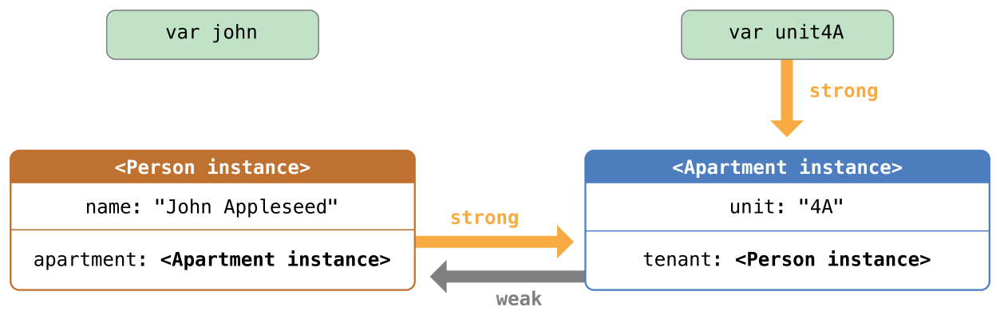

[‌](){#TP40016643-CH20}[‌](){#TP40016643-CH20-ID48}
Automatic Reference Counting {#automatic-reference-counting .chapter-name}
----------------------------

Swift uses *Automatic Reference Counting* (ARC) to track and manage your app’s memory usage. In most cases, this means that memory management “just works” in Swift, and you do not need to think about memory management yourself. ARC automatically frees up the memory used by class instances when those instances are no longer needed.

However, in a few cases ARC requires more information about the relationships between parts of your code in order to manage memory for you. This chapter describes those situations and shows how you enable ARC to manage all of your app’s memory.

Note

Reference counting only applies to instances of classes. Structures and enumerations are value types, not reference types, and are not stored and passed by reference.

[‌](){#TP40016643-CH20-ID49}
### How ARC Works {#how-arc-works .section-name}

Every time you create a new instance of a class, ARC allocates a chunk of memory to store information about that instance. This memory holds information about the type of the instance, together with the values of any stored properties associated with that instance.

Additionally, when an instance is no longer needed, ARC frees up the memory used by that instance so that the memory can be used for other purposes instead. This ensures that class instances do not take up space in memory when they are no longer needed.

However, if ARC were to deallocate an instance that was still in use, it would no longer be possible to access that instance’s properties, or call that instance’s methods. Indeed, if you tried to access the instance, your app would most likely crash.

To make sure that instances don’t disappear while they are still needed, ARC tracks how many properties, constants, and variables are currently referring to each class instance. ARC will not deallocate an instance as long as at least one active reference to that instance still exists.

To make this possible, whenever you assign a class instance to a property, constant, or variable, that property, constant, or variable makes a *strong reference* to the instance. The reference is called a “strong“ reference because it keeps a firm hold on that instance, and does not allow it to be deallocated for as long as that strong reference remains.

[‌](){#TP40016643-CH20-ID50}
### ARC in Action {#arc-in-action .section-name}

Here’s an example of how Automatic Reference Counting works. This example starts with a simple class called `Person`{.code-voice}, which defines a stored constant property called `name`{.code-voice}:

1.  `class`{.code-voice} `Person`{.vc} {
2.  `    let`{.code-voice} `name`{.vc}: `String`{.n}
3.  `    init`{.code-voice}(`name`{.vc}: `String`{.n}) {
4.  `        self`{.code-voice}.`name`{.vc} = `name`{.vc}
5.  `        print`{.code-voice}(`"`{.s}\\(`name`{.vc})` is being initialized"`{.s})
6.  `    }`{.code-voice}
7.  `    deinit`{.code-voice} {
8.  `        print`{.code-voice}(`"`{.s}\\(`name`{.vc})` is being deinitialized"`{.s})
9.  `    }`{.code-voice}
10. `}`{.code-voice}

The `Person`{.code-voice} class has an initializer that sets the instance’s `name`{.code-voice} property and prints a message to indicate that initialization is underway. The `Person`{.code-voice} class also has a deinitializer that prints a message when an instance of the class is deallocated.

The next code snippet defines three variables of type `Person?`{.code-voice}, which are used to set up multiple references to a new `Person`{.code-voice} instance in subsequent code snippets. Because these variables are of an optional type (`Person?`{.code-voice}, not `Person`{.code-voice}), they are automatically initialized with a value of `nil`{.code-voice}, and do not currently reference a `Person`{.code-voice} instance.

1.  `var`{.code-voice} `reference1`{.vc}: `Person`{.n}?
2.  `var`{.code-voice} `reference2`{.vc}: `Person`{.n}?
3.  `var`{.code-voice} `reference3`{.vc}: `Person`{.n}?

You can now create a new `Person`{.code-voice} instance and assign it to one of these three variables:

1.  `reference1`{.code-voice} = `Person`{.vc}(`name`{.vc}: `"John Appleseed"`{.s})
2.  `// prints "John Appleseed is being initialized"`{.code-voice}

Note that the message `"John Appleseed is being initialized"`{.code-voice} is printed at the point that you call the `Person`{.code-voice} class’s initializer. This confirms that initialization has taken place.

Because the new `Person`{.code-voice} instance has been assigned to the `reference1`{.code-voice} variable, there is now a strong reference from `reference1`{.code-voice} to the new `Person`{.code-voice} instance. Because there is at least one strong reference, ARC makes sure that this `Person`{.code-voice} is kept in memory and is not deallocated.

If you assign the same `Person`{.code-voice} instance to two more variables, two more strong references to that instance are established:

1.  `reference2`{.code-voice} = `reference1`{.vc}
2.  `reference3`{.code-voice} = `reference1`{.vc}

There are now *three* strong references to this single `Person`{.code-voice} instance.

If you break two of these strong references (including the original reference) by assigning `nil`{.code-voice} to two of the variables, a single strong reference remains, and the `Person`{.code-voice} instance is not deallocated:

1.  `reference1`{.code-voice} = `nil`{.kt}
2.  `reference2`{.code-voice} = `nil`{.kt}

ARC does not deallocate the `Person`{.code-voice} instance until the third and final strong reference is broken, at which point it is clear that you are no longer using the `Person`{.code-voice} instance:

1.  `reference3`{.code-voice} = `nil`{.kt}
2.  `// prints "John Appleseed is being deinitialized"`{.code-voice}

[‌](){#TP40016643-CH20-ID51}
### Strong Reference Cycles Between Class Instances {#strong-reference-cycles-between-class-instances .section-name}

In the examples above, ARC is able to track the number of references to the new `Person`{.code-voice} instance you create and to deallocate that `Person`{.code-voice} instance when it is no longer needed.

However, it is possible to write code in which an instance of a class *never* gets to a point where it has zero strong references. This can happen if two class instances hold a strong reference to each other, such that each instance keeps the other alive. This is known as a *strong reference cycle*.

You resolve strong reference cycles by defining some of the relationships between classes as weak or unowned references instead of as strong references. This process is described in [Resolving Strong Reference Cycles Between Class Instances](AutomaticReferenceCounting.md#TP40016643-CH20-ID52). However, before you learn how to resolve a strong reference cycle, it is useful to understand how such a cycle is caused.

Here’s an example of how a strong reference cycle can be created by accident. This example defines two classes called `Person`{.code-voice} and `Apartment`{.code-voice}, which model a block of apartments and its residents:

1.  `class`{.code-voice} `Person`{.vc} {
2.  `    let`{.code-voice} `name`{.vc}: `String`{.n}
3.  `    init`{.code-voice}(`name`{.vc}: `String`{.n}) { `self`{.kt}.`name`{.vc} = `name`{.vc} }
4.  `    var`{.code-voice} `apartment`{.vc}: `Apartment`{.n}?
5.  `    deinit`{.code-voice} { `print`{.vc}(`"`{.s}\\(`name`{.vc})` is being deinitialized"`{.s}) }
6.  `}`{.code-voice}
7.  ` `{.code-voice}
8.  `class`{.code-voice} `Apartment`{.vc} {
9.  `    let`{.code-voice} `unit`{.vc}: `String`{.n}
10. `    init`{.code-voice}(`unit`{.vc}: `String`{.n}) { `self`{.kt}.`unit`{.vc} = `unit`{.vc} }
11. `    var`{.code-voice} `tenant`{.vc}: `Person`{.n}?
12. `    deinit`{.code-voice} { `print`{.vc}(`"Apartment `{.s}\\(`unit`{.vc})` is being deinitialized"`{.s}) }
13. `}`{.code-voice}

Every `Person`{.code-voice} instance has a `name`{.code-voice} property of type `String`{.code-voice} and an optional `apartment`{.code-voice} property that is initially `nil`{.code-voice}. The `apartment`{.code-voice} property is optional, because a person may not always have an apartment.

Similarly, every `Apartment`{.code-voice} instance has a `unit`{.code-voice} property of type `String`{.code-voice} and has an optional `tenant`{.code-voice} property that is initially `nil`{.code-voice}. The tenant property is optional because an apartment may not always have a tenant.

Both of these classes also define a deinitializer, which prints the fact that an instance of that class is being deinitialized. This enables you to see whether instances of `Person`{.code-voice} and `Apartment`{.code-voice} are being deallocated as expected.

This next code snippet defines two variables of optional type called `john`{.code-voice} and `unit4A`{.code-voice}, which will be set to a specific `Apartment`{.code-voice} and `Person`{.code-voice} instance below. Both of these variables have an initial value of `nil`{.code-voice}, by virtue of being optional:

1.  `var`{.code-voice} `john`{.vc}: `Person`{.n}?
2.  `var`{.code-voice} `unit4A`{.vc}: `Apartment`{.n}?

You can now create a specific `Person`{.code-voice} instance and `Apartment`{.code-voice} instance and assign these new instances to the `john`{.code-voice} and `unit4A`{.code-voice} variables:

1.  `john`{.code-voice} = `Person`{.vc}(`name`{.vc}: `"John Appleseed"`{.s})
2.  `unit4A`{.code-voice} = `Apartment`{.vc}(`unit`{.vc}: `"4A"`{.s})

Here’s how the strong references look after creating and assigning these two instances. The `john`{.code-voice} variable now has a strong reference to the new `Person`{.code-voice} instance, and the `unit4A`{.code-voice} variable has a strong reference to the new `Apartment`{.code-voice} instance:

{width="626" height="188"}

You can now link the two instances together so that the person has an apartment, and the apartment has a tenant. Note that an exclamation mark (`!`{.code-voice}) is used to unwrap and access the instances stored inside the `john`{.code-voice} and `unit4A`{.code-voice} optional variables, so that the properties of those instances can be set:

1.  `john`{.code-voice}!.`apartment`{.vc} = `unit4A`{.vc}
2.  `unit4A`{.code-voice}!.`tenant`{.vc} = `john`{.vc}

Here’s how the strong references look after you link the two instances together:

{width="626" height="200"}

Unfortunately, linking these two instances creates a strong reference cycle between them. The `Person`{.code-voice} instance now has a strong reference to the `Apartment`{.code-voice} instance, and the `Apartment`{.code-voice} instance has a strong reference to the `Person`{.code-voice} instance. Therefore, when you break the strong references held by the `john`{.code-voice} and `unit4A`{.code-voice} variables, the reference counts do not drop to zero, and the instances are not deallocated by ARC:

1.  `john`{.code-voice} = `nil`{.kt}
2.  `unit4A`{.code-voice} = `nil`{.kt}

Note that neither deinitializer was called when you set these two variables to `nil`{.code-voice}. The strong reference cycle prevents the `Person`{.code-voice} and `Apartment`{.code-voice} instances from ever being deallocated, causing a memory leak in your app.

Here’s how the strong references look after you set the `john`{.code-voice} and `unit4A`{.code-voice} variables to `nil`{.code-voice}:

{width="626" height="200"}

The strong references between the `Person`{.code-voice} instance and the `Apartment`{.code-voice} instance remain and cannot be broken.

[‌](){#TP40016643-CH20-ID52}
### Resolving Strong Reference Cycles Between Class Instances {#resolving-strong-reference-cycles-between-class-instances .section-name}

Swift provides two ways to resolve strong reference cycles when you work with properties of class type: weak references and unowned references.

Weak and unowned references enable one instance in a reference cycle to refer to the other instance *without* keeping a strong hold on it. The instances can then refer to each other without creating a strong reference cycle.

Use a weak reference whenever it is valid for that reference to become `nil`{.code-voice} at some point during its lifetime. Conversely, use an unowned reference when you know that the reference will never be `nil`{.code-voice} once it has been set during initialization.

[‌](){#TP40016643-CH20-ID53}
### Weak References {#weak-references .section-name}

A *weak reference* is a reference that does not keep a strong hold on the instance it refers to, and so does not stop ARC from disposing of the referenced instance. This behavior prevents the reference from becoming part of a strong reference cycle. You indicate a weak reference by placing the `weak`{.code-voice} keyword before a property or variable declaration.

Use a weak reference to avoid reference cycles whenever it is possible for that reference to have “no value” at some point in its life. If the reference will *always* have a value, use an unowned reference instead, as described in [Unowned References](AutomaticReferenceCounting.md#TP40016643-CH20-ID54). In the `Apartment`{.code-voice} example above, it is appropriate for an apartment to be able to have “no tenant” at some point in its lifetime, and so a weak reference is an appropriate way to break the reference cycle in this case.

Note

Weak references must be declared as variables, to indicate that their value can change at runtime. A weak reference cannot be declared as a constant.

Because weak references are allowed to have “no value”, you must declare every weak reference as having an optional type. Optional types are the preferred way to represent the possibility for “no value” in Swift.

Because a weak reference does not keep a strong hold on the instance it refers to, it is possible for that instance to be deallocated while the weak reference is still referring to it. Therefore, ARC automatically sets a weak reference to `nil`{.code-voice} when the instance that it refers to is deallocated. You can check for the existence of a value in the weak reference, just like any other optional value, and you will never end up with a reference to an invalid instance that no longer exists.

The example below is identical to the `Person`{.code-voice} and `Apartment`{.code-voice} example from above, with one important difference. This time around, the `Apartment`{.code-voice} type’s `tenant`{.code-voice} property is declared as a weak reference:

1.  `class`{.code-voice} `Person`{.vc} {
2.  `    let`{.code-voice} `name`{.vc}: `String`{.n}
3.  `    init`{.code-voice}(`name`{.vc}: `String`{.n}) { `self`{.kt}.`name`{.vc} = `name`{.vc} }
4.  `    var`{.code-voice} `apartment`{.vc}: `Apartment`{.n}?
5.  `    deinit`{.code-voice} { `print`{.vc}(`"`{.s}\\(`name`{.vc})` is being deinitialized"`{.s}) }
6.  `}`{.code-voice}
7.  ` `{.code-voice}
8.  `class`{.code-voice} `Apartment`{.vc} {
9.  `    let`{.code-voice} `unit`{.vc}: `String`{.n}
10. `    init`{.code-voice}(`unit`{.vc}: `String`{.n}) { `self`{.kt}.`unit`{.vc} = `unit`{.vc} }
11. `    weak`{.code-voice} `var`{.kt} `tenant`{.vc}: `Person`{.n}?
12. `    deinit`{.code-voice} { `print`{.vc}(`"Apartment `{.s}\\(`unit`{.vc})` is being deinitialized"`{.s}) }
13. `}`{.code-voice}

The strong references from the two variables (`john`{.code-voice} and `unit4A`{.code-voice}) and the links between the two instances are created as before:

1.  `var`{.code-voice} `john`{.vc}: `Person`{.n}?
2.  `var`{.code-voice} `unit4A`{.vc}: `Apartment`{.n}?
3.  ` `{.code-voice}
4.  `john`{.code-voice} = `Person`{.vc}(`name`{.vc}: `"John Appleseed"`{.s})
5.  `unit4A`{.code-voice} = `Apartment`{.vc}(`unit`{.vc}: `"4A"`{.s})
6.  ` `{.code-voice}
7.  `john`{.code-voice}!.`apartment`{.vc} = `unit4A`{.vc}
8.  `unit4A`{.code-voice}!.`tenant`{.vc} = `john`{.vc}

Here’s how the references look now that you’ve linked the two instances together:

{width="626" height="197"}

The `Person`{.code-voice} instance still has a strong reference to the `Apartment`{.code-voice} instance, but the `Apartment`{.code-voice} instance now has a *weak* reference to the `Person`{.code-voice} instance. This means that when you break the strong reference held by the `john`{.code-voice} variables, there are no more strong references to the `Person`{.code-voice} instance:

{width="626" height="197"}

Because there are no more strong references to the `Person`{.code-voice} instance, it is deallocated:

1.  `john`{.code-voice} = `nil`{.kt}
2.  `// prints "John Appleseed is being deinitialized"`{.code-voice}

The only remaining strong reference to the `Apartment`{.code-voice} instance is from the `unit4A`{.code-voice} variable. If you break *that* strong reference, there are no more strong references to the `Apartment`{.code-voice} instance:

{width="626" height="197"}

Because there are no more strong references to the `Apartment`{.code-voice} instance, it too is deallocated:

1.  `unit4A`{.code-voice} = `nil`{.kt}
2.  `// prints "Apartment 4A is being deinitialized"`{.code-voice}

The final two code snippets above show that the deinitializers for the `Person`{.code-voice} instance and `Apartment`{.code-voice} instance print their “deinitialized” messages after the `john`{.code-voice} and `unit4A`{.code-voice} variables are set to `nil`{.code-voice}. This proves that the reference cycle has been broken.

Note

In systems that use garbage collection, weak pointers are sometimes used to implement a simple caching mechanism because objects with no strong references are deallocated only when memory pressure triggers garbage collection. However, with ARC, values are deallocated as soon as their last strong reference is removed, making weak references unsuitable for such a purpose.

[‌](){#TP40016643-CH20-ID54}
### Unowned References {#unowned-references .section-name}

Like weak references, an *unowned reference* does not keep a strong hold on the instance it refers to. Unlike a weak reference, however, an unowned reference is assumed to *always* have a value. Because of this, an unowned reference is always defined as a nonoptional type. You indicate an unowned reference by placing the `unowned`{.code-voice} keyword before a property or variable declaration.

Because an unowned reference is nonoptional, you don’t need to unwrap the unowned reference each time it is used. An unowned reference can always be accessed directly. However, ARC cannot set the reference to `nil`{.code-voice} when the instance it refers to is deallocated, because variables of a nonoptional type cannot be set to `nil`{.code-voice}.

Note

If you try to access an unowned reference after the instance that it references is deallocated, you will trigger a runtime error. Use unowned references only when you are sure that the reference will *always* refer to an instance.

Note also that Swift guarantees your app will crash if you try to access an unowned reference after the instance it references is deallocated. You will never encounter unexpected behavior in this situation. Your app will always crash reliably, although you should, of course, prevent it from doing so.

The following example defines two classes, `Customer`{.code-voice} and `CreditCard`{.code-voice}, which model a bank customer and a possible credit card for that customer. These two classes each store an instance of the other class as a property. This relationship has the potential to create a strong reference cycle.

The relationship between `Customer`{.code-voice} and `CreditCard`{.code-voice} is slightly different from the relationship between `Apartment`{.code-voice} and `Person`{.code-voice} seen in the weak reference example above. In this data model, a customer may or may not have a credit card, but a credit card will *always* be associated with a customer. To represent this, the `Customer`{.code-voice} class has an optional `card`{.code-voice} property, but the `CreditCard`{.code-voice} class has a nonoptional `customer`{.code-voice} property.

Furthermore, a new `CreditCard`{.code-voice} instance can *only* be created by passing a `number`{.code-voice} value and a `customer`{.code-voice} instance to a custom `CreditCard`{.code-voice} initializer. This ensures that a `CreditCard`{.code-voice} instance always has a `customer`{.code-voice} instance associated with it when the `CreditCard`{.code-voice} instance is created.

Because a credit card will always have a customer, you define its `customer`{.code-voice} property as an unowned reference, to avoid a strong reference cycle:

1.  `class`{.code-voice} `Customer`{.vc} {
2.  `    let`{.code-voice} `name`{.vc}: `String`{.n}
3.  `    var`{.code-voice} `card`{.vc}: `CreditCard`{.n}?
4.  `    init`{.code-voice}(`name`{.vc}: `String`{.n}) {
5.  `        self`{.code-voice}.`name`{.vc} = `name`{.vc}
6.  `    }`{.code-voice}
7.  `    deinit`{.code-voice} { `print`{.vc}(`"`{.s}\\(`name`{.vc})` is being deinitialized"`{.s}) }
8.  `}`{.code-voice}
9.  ` `{.code-voice}
10. `class`{.code-voice} `CreditCard`{.vc} {
11. `    let`{.code-voice} `number`{.vc}: `UInt64`{.n}
12. `    unowned`{.code-voice} `let`{.kt} `customer`{.vc}: `Customer`{.n}
13. `    init`{.code-voice}(`number`{.vc}: `UInt64`{.n}, `customer`{.vc}: `Customer`{.n}) {
14. `        self`{.code-voice}.`number`{.vc} = `number`{.vc}
15. `        self`{.code-voice}.`customer`{.vc} = `customer`{.vc}
16. `    }`{.code-voice}
17. `    deinit`{.code-voice} { `print`{.vc}(`"Card #`{.s}\\(`number`{.vc})` is being deinitialized"`{.s}) }
18. `}`{.code-voice}

Note

The `number`{.code-voice} property of the `CreditCard`{.code-voice} class is defined with a type of `UInt64`{.code-voice} rather than `Int`{.code-voice}, to ensure that the `number`{.code-voice} property’s capacity is large enough to store a 16-digit card number on both 32-bit and 64-bit systems.

This next code snippet defines an optional `Customer`{.code-voice} variable called `john`{.code-voice}, which will be used to store a reference to a specific customer. This variable has an initial value of nil, by virtue of being optional:

1.  `var`{.code-voice} `john`{.vc}: `Customer`{.n}?

You can now create a `Customer`{.code-voice} instance, and use it to initialize and assign a new `CreditCard`{.code-voice} instance as that customer’s `card`{.code-voice} property:

1.  `john`{.code-voice} = `Customer`{.vc}(`name`{.vc}: `"John Appleseed"`{.s})
2.  `john`{.code-voice}!.`card`{.vc} = `CreditCard`{.vc}(`number`{.vc}: `1234_5678_9012_3456`{.m}, `customer`{.vc}: `john`{.vc}!)

Here’s how the references look, now that you’ve linked the two instances:

{width="626" height="197"}

The `Customer`{.code-voice} instance now has a strong reference to the `CreditCard`{.code-voice} instance, and the `CreditCard`{.code-voice} instance has an unowned reference to the `Customer`{.code-voice} instance.

Because of the unowned `customer`{.code-voice} reference, when you break the strong reference held by the `john`{.code-voice} variable, there are no more strong references to the `Customer`{.code-voice} instance:

{width="626" height="197"}

Because there are no more strong references to the `Customer`{.code-voice} instance, it is deallocated. After this happens, there are no more strong references to the `CreditCard`{.code-voice} instance, and it too is deallocated:

1.  `john`{.code-voice} = `nil`{.kt}
2.  `// prints "John Appleseed is being deinitialized"`{.code-voice}
3.  `// prints "Card #1234567890123456 is being deinitialized"`{.code-voice}

The final code snippet above shows that the deinitializers for the `Customer`{.code-voice} instance and `CreditCard`{.code-voice} instance both print their “deinitialized” messages after the `john`{.code-voice} variable is set to `nil`{.code-voice}.

[‌](){#TP40016643-CH20-ID55}
### Unowned References and Implicitly Unwrapped Optional Properties {#unowned-references-and-implicitly-unwrapped-optional-properties .section-name}

The examples for weak and unowned references above cover two of the more common scenarios in which it is necessary to break a strong reference cycle.

The `Person`{.code-voice} and `Apartment`{.code-voice} example shows a situation where two properties, both of which are allowed to be `nil`{.code-voice}, have the potential to cause a strong reference cycle. This scenario is best resolved with a weak reference.

The `Customer`{.code-voice} and `CreditCard`{.code-voice} example shows a situation where one property that is allowed to be `nil`{.code-voice} and another property that cannot be `nil`{.code-voice} have the potential to cause a strong reference cycle. This scenario is best resolved with an unowned reference.

However, there is a third scenario, in which *both* properties should always have a value, and neither property should ever be `nil`{.code-voice} once initialization is complete. In this scenario, it is useful to combine an unowned property on one class with an implicitly unwrapped optional property on the other class.

This enables both properties to be accessed directly (without optional unwrapping) once initialization is complete, while still avoiding a reference cycle. This section shows you how to set up such a relationship.

The example below defines two classes, `Country`{.code-voice} and `City`{.code-voice}, each of which stores an instance of the other class as a property. In this data model, every country must always have a capital city, and every city must always belong to a country. To represent this, the `Country`{.code-voice} class has a `capitalCity`{.code-voice} property, and the `City`{.code-voice} class has a `country`{.code-voice} property:

1.  `class`{.code-voice} `Country`{.vc} {
2.  `    let`{.code-voice} `name`{.vc}: `String`{.n}
3.  `    var`{.code-voice} `capitalCity`{.vc}: `City`{.n}!
4.  `    init`{.code-voice}(`name`{.vc}: `String`{.n}, `capitalName`{.vc}: `String`{.n}) {
5.  `        self`{.code-voice}.`name`{.vc} = `name`{.vc}
6.  `        self`{.code-voice}.`capitalCity`{.vc} = `City`{.vc}(`name`{.vc}: `capitalName`{.vc}, `country`{.vc}: `self`{.kt})
7.  `    }`{.code-voice}
8.  `}`{.code-voice}
9.  ` `{.code-voice}
10. `class`{.code-voice} `City`{.vc} {
11. `    let`{.code-voice} `name`{.vc}: `String`{.n}
12. `    unowned`{.code-voice} `let`{.kt} `country`{.vc}: `Country`{.n}
13. `    init`{.code-voice}(`name`{.vc}: `String`{.n}, `country`{.vc}: `Country`{.n}) {
14. `        self`{.code-voice}.`name`{.vc} = `name`{.vc}
15. `        self`{.code-voice}.`country`{.vc} = `country`{.vc}
16. `    }`{.code-voice}
17. `}`{.code-voice}

To set up the interdependency between the two classes, the initializer for `City`{.code-voice} takes a `Country`{.code-voice} instance, and stores this instance in its `country`{.code-voice} property.

The initializer for `City`{.code-voice} is called from within the initializer for `Country`{.code-voice}. However, the initializer for `Country`{.code-voice} cannot pass `self`{.code-voice} to the `City`{.code-voice} initializer until a new `Country`{.code-voice} instance is fully initialized, as described in [Two-Phase Initialization](Initialization.md#TP40016643-CH18-ID220).

To cope with this requirement, you declare the `capitalCity`{.code-voice} property of `Country`{.code-voice} as an implicitly unwrapped optional property, indicated by the exclamation mark at the end of its type annotation (`City!`{.code-voice}). This means that the `capitalCity`{.code-voice} property has a default value of `nil`{.code-voice}, like any other optional, but can be accessed without the need to unwrap its value as described in [Implicitly Unwrapped Optionals](TheBasics.md#TP40016643-CH5-ID334).

Because `capitalCity`{.code-voice} has a default `nil`{.code-voice} value, a new `Country`{.code-voice} instance is considered fully initialized as soon as the `Country`{.code-voice} instance sets its `name`{.code-voice} property within its initializer. This means that the `Country`{.code-voice} initializer can start to reference and pass around the implicit `self`{.code-voice} property as soon as the `name`{.code-voice} property is set. The `Country`{.code-voice} initializer can therefore pass `self`{.code-voice} as one of the parameters for the `City`{.code-voice} initializer when the `Country`{.code-voice} initializer is setting its own `capitalCity`{.code-voice} property.

All of this means that you can create the `Country`{.code-voice} and `City`{.code-voice} instances in a single statement, without creating a strong reference cycle, and the `capitalCity`{.code-voice} property can be accessed directly, without needing to use an exclamation mark to unwrap its optional value:

1.  `var`{.code-voice} `country`{.vc} = `Country`{.vc}(`name`{.vc}: `"Canada"`{.s}, `capitalName`{.vc}: `"Ottawa"`{.s})
2.  `print`{.code-voice}(`"`{.s}\\(`country`{.vc}.`name`{.vc})`'s capital city is called `{.s}\\(`country`{.vc}.`capitalCity`{.vc}.`name`{.vc})`"`{.s})
3.  `// prints "Canada's capital city is called Ottawa"`{.code-voice}

In the example above, the use of an implicitly unwrapped optional means that all of the two-phase class initializer requirements are satisfied. The `capitalCity`{.code-voice} property can be used and accessed like a nonoptional value once initialization is complete, while still avoiding a strong reference cycle.

[‌](){#TP40016643-CH20-ID56}
### Strong Reference Cycles for Closures {#strong-reference-cycles-for-closures .section-name}

You saw above how a strong reference cycle can be created when two class instance properties hold a strong reference to each other. You also saw how to use weak and unowned references to break these strong reference cycles.

A strong reference cycle can also occur if you assign a closure to a property of a class instance, and the body of that closure captures the instance. This capture might occur because the closure’s body accesses a property of the instance, such as `self.someProperty`{.code-voice}, or because the closure calls a method on the instance, such as `self.someMethod()`{.code-voice}. In either case, these accesses cause the closure to “capture” `self`{.code-voice}, creating a strong reference cycle.

This strong reference cycle occurs because closures, like classes, are *reference types*. When you assign a closure to a property, you are assigning a *reference* to that closure. In essence, it’s the same problem as above—two strong references are keeping each other alive. However, rather than two class instances, this time it’s a class instance and a closure that are keeping each other alive.

Swift provides an elegant solution to this problem, known as a *closure capture list*. However, before you learn how to break a strong reference cycle with a closure capture list, it is useful to understand how such a cycle can be caused.

The example below shows how you can create a strong reference cycle when using a closure that references `self`{.code-voice}. This example defines a class called `HTMLElement`{.code-voice}, which provides a simple model for an individual element within an HTML document:

1.  `class`{.code-voice} `HTMLElement`{.vc} {
2.  `    `{.code-voice}
3.  `    let`{.code-voice} `name`{.vc}: `String`{.n}
4.  `    let`{.code-voice} `text`{.vc}: `String`{.n}?
5.  `    `{.code-voice}
6.  `    lazy`{.code-voice} `var`{.kt} `asHTML`{.vc}: `Void`{.n} -&gt; `String`{.n} = {
7.  `        if`{.code-voice} `let`{.kt} `text`{.vc} = `self`{.kt}.`text`{.vc} {
8.  `            return`{.code-voice} `"`{.s}\\(`text`{.vc})`"`{.s}
9.  `        } else`{.code-voice} {
10. `            return`{.code-voice} `""`{.s}
11. `        }`{.code-voice}
12. `    }`{.code-voice}
13. `    `{.code-voice}
14. `    init`{.code-voice}(`name`{.vc}: `String`{.n}, `text`{.vc}: `String`{.n}? = `nil`{.kt}) {
15. `        self`{.code-voice}.`name`{.vc} = `name`{.vc}
16. `        self`{.code-voice}.`text`{.vc} = `text`{.vc}
17. `    }`{.code-voice}
18. `    `{.code-voice}
19. `    deinit`{.code-voice} {
20. `        print`{.code-voice}(`"`{.s}\\(`name`{.vc})` is being deinitialized"`{.s})
21. `    }`{.code-voice}
22. `    `{.code-voice}
23. `}`{.code-voice}

The `HTMLElement`{.code-voice} class defines a `name`{.code-voice} property, which indicates the name of the element, such as `"h1"`{.code-voice} for a heading element, `"p"`{.code-voice} for a paragraph element, or `"br"`{.code-voice} for a line break element. `HTMLElement`{.code-voice} also defines an optional `text`{.code-voice} property, which you can set to a string that represents the text to be rendered within that HTML element.

In addition to these two simple properties, the `HTMLElement`{.code-voice} class defines a lazy property called `asHTML`{.code-voice}. This property references a closure that combines `name`{.code-voice} and `text`{.code-voice} into an HTML string fragment. The `asHTML`{.code-voice} property is of type `() -> String`{.code-voice}, or “a function that takes no parameters, and returns a `String`{.code-voice} value”.

By default, the `asHTML`{.code-voice} property is assigned a closure that returns a string representation of an HTML tag. This tag contains the optional `text`{.code-voice} value if it exists, or no text content if `text`{.code-voice} does not exist. For a paragraph element, the closure would return `"some text"`{.code-voice} or `""`{.code-voice}, depending on whether the `text`{.code-voice} property equals `"some text"`{.code-voice} or `nil`{.code-voice}.

The `asHTML`{.code-voice} property is named and used somewhat like an instance method. However, because `asHTML`{.code-voice} is a closure property rather than an instance method, you can replace the default value of the `asHTML`{.code-voice} property with a custom closure, if you want to change the HTML rendering for a particular HTML element.

For example, the `asHTML`{.code-voice} property could be set to a closure that defaults to some text if the `text`{.code-voice} property is `nil`{.code-voice}, in order to prevent the representation from returning an empty HTML tag:

1.  `let`{.code-voice} `heading`{.vc} = `HTMLElement`{.vc}(`name`{.vc}: `"h1"`{.s})
2.  `let`{.code-voice} `defaultText`{.vc} = `"some default text"`{.s}
3.  `heading`{.code-voice}.`asHTML`{.vc} = {
4.  `    return`{.code-voice} `"`{.s}\\(`heading`{.vc}.`text`{.vc} ?? `defaultText`{.vc})`"`{.s}
5.  `}`{.code-voice}
6.  `print`{.code-voice}(`heading`{.vc}.`asHTML`{.vc}())
7.  `// prints "some default text"`{.code-voice}

Note

The `asHTML`{.code-voice} property is declared as a lazy property, because it is only needed if and when the element actually needs to be rendered as a string value for some HTML output target. The fact that `asHTML`{.code-voice} is a lazy property means that you can refer to `self`{.code-voice} within the default closure, because the lazy property will not be accessed until after initialization has been completed and `self`{.code-voice} is known to exist.

The `HTMLElement`{.code-voice} class provides a single initializer, which takes a `name`{.code-voice} argument and (if desired) a `text`{.code-voice} argument to initialize a new element. The class also defines a deinitializer, which prints a message to show when an `HTMLElement`{.code-voice} instance is deallocated.

Here’s how you use the `HTMLElement`{.code-voice} class to create and print a new instance:

1.  `var`{.code-voice} `paragraph`{.vc}: `HTMLElement`{.n}? = `HTMLElement`{.vc}(`name`{.vc}: `"p"`{.s}, `text`{.vc}: `"hello, world"`{.s})
2.  `print`{.code-voice}(`paragraph`{.vc}!.`asHTML`{.vc}())
3.  `// prints "hello, world"`{.code-voice}

Note

The `paragraph`{.code-voice} variable above is defined as an *optional* `HTMLElement`{.code-voice}, so that it can be set to `nil`{.code-voice} below to demonstrate the presence of a strong reference cycle.

Unfortunately, the `HTMLElement`{.code-voice} class, as written above, creates a strong reference cycle between an `HTMLElement`{.code-voice} instance and the closure used for its default `asHTML`{.code-voice} value. Here’s how the cycle looks:

{width="626" height="218"}

The instance’s `asHTML`{.code-voice} property holds a strong reference to its closure. However, because the closure refers to `self`{.code-voice} within its body (as a way to reference `self.name`{.code-voice} and `self.text`{.code-voice}), the closure *captures* self, which means that it holds a strong reference back to the `HTMLElement`{.code-voice} instance. A strong reference cycle is created between the two. (For more information about capturing values in a closure, see [Capturing Values](Closures.md#TP40016643-CH11-ID103).)

Note

Even though the closure refers to `self`{.code-voice} multiple times, it only captures one strong reference to the `HTMLElement`{.code-voice} instance.

If you set the `paragraph`{.code-voice} variable to `nil`{.code-voice} and break its strong reference to the `HTMLElement`{.code-voice} instance, neither the `HTMLElement`{.code-voice} instance nor its closure are deallocated, because of the strong reference cycle:

1.  `paragraph`{.code-voice} = `nil`{.kt}

Note that the message in the `HTMLElement`{.code-voice} deinitializer is not printed, which shows that the `HTMLElement`{.code-voice} instance is not deallocated.

[‌](){#TP40016643-CH20-ID57}
### Resolving Strong Reference Cycles for Closures {#resolving-strong-reference-cycles-for-closures .section-name}

You resolve a strong reference cycle between a closure and a class instance by defining a *capture list* as part of the closure’s definition. A capture list defines the rules to use when capturing one or more reference types within the closure’s body. As with strong reference cycles between two class instances, you declare each captured reference to be a weak or unowned reference rather than a strong reference. The appropriate choice of weak or unowned depends on the relationships between the different parts of your code.

Note

Swift requires you to write `self.someProperty`{.code-voice} or `self.someMethod()`{.code-voice} (rather than just `someProperty`{.code-voice} or `someMethod()`{.code-voice}) whenever you refer to a member of `self`{.code-voice} within a closure. This helps you remember that it’s possible to capture `self`{.code-voice} by accident.

[‌](){#TP40016643-CH20-ID58}
### Defining a Capture List {#defining-a-capture-list .section-name}

Each item in a capture list is a pairing of the `weak`{.code-voice} or `unowned`{.code-voice} keyword with a reference to a class instance (such as `self`{.code-voice}) or a variable initialized with some value (such as `delegate = self.delegate!`{.code-voice}). These pairings are written within a pair of square braces, separated by commas.

Place the capture list before a closure’s parameter list and return type if they are provided:

1.  `lazy`{.code-voice} `var`{.kt} `someClosure`{.vc}: (`Int`{.n}, `String`{.n}) -&gt; `String`{.n} = {
2.  `    [unowned`{.code-voice} `self`{.kt}, `weak`{.vc} `delegate`{.vc} = `self`{.kt}.`delegate`{.vc}!\] (`index`{.vc}: `Int`{.n}, `stringToProcess`{.vc}: `String`{.n}) -&gt; `String`{.n} `in`{.kt}
3.  `    // closure body goes here`{.code-voice}
4.  `}`{.code-voice}

If a closure does not specify a parameter list or return type because they can be inferred from context, place the capture list at the very start of the closure, followed by the `in`{.code-voice} keyword:

1.  `lazy`{.code-voice} `var`{.kt} `someClosure`{.vc}: `Void`{.n} -&gt; `String`{.n} = {
2.  `    [unowned`{.code-voice} `self`{.kt}, `weak`{.vc} `delegate`{.vc} = `self`{.kt}.`delegate`{.vc}!\] `in`{.kt}
3.  `    // closure body goes here`{.code-voice}
4.  `}`{.code-voice}

[‌](){#TP40016643-CH20-ID59}
### Weak and Unowned References {#weak-and-unowned-references .section-name}

Define a capture in a closure as an unowned reference when the closure and the instance it captures will always refer to each other, and will always be deallocated at the same time.

Conversely, define a capture as a weak reference when the captured reference may become `nil`{.code-voice} at some point in the future. Weak references are always of an optional type, and automatically become `nil`{.code-voice} when the instance they reference is deallocated. This enables you to check for their existence within the closure’s body.

Note

If the captured reference will never become `nil`{.code-voice}, it should always be captured as an unowned reference, rather than a weak reference.

An unowned reference is the appropriate capture method to use to resolve the strong reference cycle in the `HTMLElement`{.code-voice} example from earlier. Here’s how you write the `HTMLElement`{.code-voice} class to avoid the cycle:

1.  `class`{.code-voice} `HTMLElement`{.vc} {
2.  `    `{.code-voice}
3.  `    let`{.code-voice} `name`{.vc}: `String`{.n}
4.  `    let`{.code-voice} `text`{.vc}: `String`{.n}?
5.  `    `{.code-voice}
6.  `    lazy`{.code-voice} `var`{.kt} `asHTML`{.vc}: `Void`{.n} -&gt; `String`{.n} = {
7.  `        [unowned`{.code-voice} `self`{.kt}\] `in`{.kt}
8.  `        if`{.code-voice} `let`{.kt} `text`{.vc} = `self`{.kt}.`text`{.vc} {
9.  `            return`{.code-voice} `"`{.s}\\(`text`{.vc})`"`{.s}
10. `        } else`{.code-voice} {
11. `            return`{.code-voice} `""`{.s}
12. `        }`{.code-voice}
13. `    }`{.code-voice}
14. `    `{.code-voice}
15. `    init`{.code-voice}(`name`{.vc}: `String`{.n}, `text`{.vc}: `String`{.n}? = `nil`{.kt}) {
16. `        self`{.code-voice}.`name`{.vc} = `name`{.vc}
17. `        self`{.code-voice}.`text`{.vc} = `text`{.vc}
18. `    }`{.code-voice}
19. `    `{.code-voice}
20. `    deinit`{.code-voice} {
21. `        print`{.code-voice}(`"`{.s}\\(`name`{.vc})` is being deinitialized"`{.s})
22. `    }`{.code-voice}
23. `    `{.code-voice}
24. `}`{.code-voice}

This implementation of `HTMLElement`{.code-voice} is identical to the previous implementation, apart from the addition of a capture list within the `asHTML`{.code-voice} closure. In this case, the capture list is `[unowned self]`{.code-voice}, which means “capture self as an unowned reference rather than a strong reference”.

You can create and print an `HTMLElement`{.code-voice} instance as before:

1.  `var`{.code-voice} `paragraph`{.vc}: `HTMLElement`{.n}? = `HTMLElement`{.vc}(`name`{.vc}: `"p"`{.s}, `text`{.vc}: `"hello, world"`{.s})
2.  `print`{.code-voice}(`paragraph`{.vc}!.`asHTML`{.vc}())
3.  `// prints "hello, world"`{.code-voice}

Here’s how the references look with the capture list in place:

{width="626" height="218"}

This time, the capture of `self`{.code-voice} by the closure is an unowned reference, and does not keep a strong hold on the `HTMLElement`{.code-voice} instance it has captured. If you set the strong reference from the `paragraph`{.code-voice} variable to `nil`{.code-voice}, the `HTMLElement`{.code-voice} instance is deallocated, as can be seen from the printing of its deinitializer message in the example below:

1.  `paragraph`{.code-voice} = `nil`{.kt}
2.  `// prints "p is being deinitialized"`{.code-voice}

For more information about capture lists, see [Capture Lists](Expressions.md#TP40016643-CH32-ID544).

