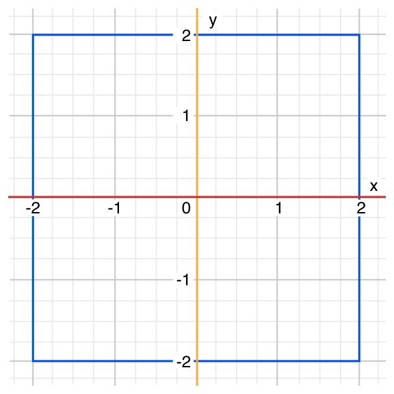

[‌](){#TP40016643-CH9}[‌](){#TP40016643-CH9-ID120}
Control Flow {#control-flow .chapter-name}
------------


Swift provides all the familiar control flow statements from C-like languages. These include `for`{.code-voice} and `while`{.code-voice} loops to perform a task multiple times; `if`{.code-voice}, `guard`{.code-voice}, and `switch`{.code-voice} statements to execute different branches of code based on certain conditions; and statements such as `break`{.code-voice} and `continue`{.code-voice} to transfer the flow of execution to another point in your code.

In addition to the traditional `for`{.code-voice} loop found in C, Swift adds a `for`{.code-voice}-`in`{.code-voice} loop that makes it easy to iterate over arrays, dictionaries, ranges, strings, and other sequences.

Swift’s `switch`{.code-voice} statement is also considerably more powerful than its counterpart in C. The cases of a `switch`{.code-voice} statement do not “fall through” to the next case in Swift, avoiding common C errors caused by missing `break`{.code-voice} statements. Cases can match many different patterns, including interval matches, tuples, and casts to a specific type. Matched values in a `switch`{.code-voice} case can be bound to temporary constants for use within the case’s body, and complex matching conditions can be expressed with a `where`{.code-voice} clause for each case.


[‌](){#TP40016643-CH9-ID121}
### For Loops {#for-loops .section-name}

Swift provides two kinds of loop that perform a set of statements a certain number of times:

-   The `for`{.code-voice}-`in`{.code-voice} loop performs a set of statements for each item in a sequence.

-   The `for`{.code-voice} loop performs a set of statements until a specific condition is met, typically by incrementing a counter each time the loop ends.


[‌](){#TP40016643-CH9-ID122}
### For-In {#for-in .section-name}

You use the `for`{.code-voice}-`in`{.code-voice} loop to iterate over a sequence, such as ranges of numbers, items in an array, or characters in a string.

This example prints the first few entries in the five-times-table:


1.  `for`{.code-voice} `index`{.vc} `in`{.kt} `1`{.m}...`5`{.m} {
2.  `    print`{.code-voice}(`"`{.s}\\(`index`{.vc})` times 5 is `{.s}\\(`index`{.vc} \* `5`{.m})`"`{.s})
3.  `}`{.code-voice}
4.  `// 1 times 5 is 5`{.code-voice}
5.  `// 2 times 5 is 10`{.code-voice}
6.  `// 3 times 5 is 15`{.code-voice}
7.  `// 4 times 5 is 20`{.code-voice}
8.  `// 5 times 5 is 25`{.code-voice}


The sequence being iterated is a range of numbers from `1`{.code-voice} to `5`{.code-voice}, inclusive, as indicated by the use of the closed range operator (`...`{.code-voice}). The value of `index`{.code-voice} is set to the first number in the range (`1`{.code-voice}), and the statements inside the loop are executed. In this case, the loop contains only one statement, which prints an entry from the five-times-table for the current value of `index`{.code-voice}. After the statement is executed, the value of `index`{.code-voice} is updated to contain the second value in the range (`2`{.code-voice}), and the `print(_:separator:terminator:)`{.code-voice} function is called again. This process continues until the end of the range is reached.

In the example above, `index`{.code-voice} is a constant whose value is automatically set at the start of each iteration of the loop. As such, it does not have to be declared before it is used. It is implicitly declared simply by its inclusion in the loop declaration, without the need for a `let`{.code-voice} declaration keyword.

If you don’t need each value from a sequence, you can ignore the values by using an underscore in place of a variable name:


1.  `let`{.code-voice} `base`{.vc} = `3`{.m}
2.  `let`{.code-voice} `power`{.vc} = `10`{.m}
3.  `var`{.code-voice} `answer`{.vc} = `1`{.m}
4.  `for`{.code-voice} `_`{.kt} `in`{.kt} `1`{.m}...`power`{.vc} {
5.  `    answer`{.code-voice} \*= `base`{.vc}
6.  `}`{.code-voice}
7.  `print`{.code-voice}(`"`{.s}\\(`base`{.vc})` to the power of `{.s}\\(`power`{.vc})` is `{.s}\\(`answer`{.vc})`"`{.s})
8.  `// prints "3 to the power of 10 is 59049"`{.code-voice}


This example calculates the value of one number to the power of another (in this case, `3`{.code-voice} to the power of `10`{.code-voice}). It multiplies a starting value of `1`{.code-voice} (that is, `3`{.code-voice} to the power of `0`{.code-voice}) by `3`{.code-voice}, ten times, using a closed range that starts with `1`{.code-voice} and ends with `10`{.code-voice}. This calculation doesn’t need to know the individual counter values each time through the loop—it simply needs to execute the loop the correct number of times. The underscore character (`_`{.code-voice}) used in place of a loop variable causes the individual values to be ignored and does not provide access to the current value during each iteration of the loop.

Use a `for`{.code-voice}-`in`{.code-voice} loop with an array to iterate over its items:


1.  `let`{.code-voice} `names`{.vc} = \[`"Anna"`{.s}, `"Alex"`{.s}, `"Brian"`{.s}, `"Jack"`{.s}\]
2.  `for`{.code-voice} `name`{.vc} `in`{.kt} `names`{.vc} {
3.  `    print`{.code-voice}(`"Hello, `{.s}\\(`name`{.vc})`!"`{.s})
4.  `}`{.code-voice}
5.  `// Hello, Anna!`{.code-voice}
6.  `// Hello, Alex!`{.code-voice}
7.  `// Hello, Brian!`{.code-voice}
8.  `// Hello, Jack!`{.code-voice}


You can also iterate over a dictionary to access its key-value pairs. Each item in the dictionary is returned as a `(key, value)`{.code-voice} tuple when the dictionary is iterated, and you can decompose the `(key, value)`{.code-voice} tuple’s members as explicitly named constants for use within the body of the `for`{.code-voice}-`in`{.code-voice} loop. Here, the dictionary’s keys are decomposed into a constant called `animalName`{.code-voice}, and the dictionary’s values are decomposed into a constant called `legCount`{.code-voice}:


1.  `let`{.code-voice} `numberOfLegs`{.vc} = \[`"spider"`{.s}: `8`{.m}, `"ant"`{.s}: `6`{.m}, `"cat"`{.s}: `4`{.m}\]
2.  `for`{.code-voice} (`animalName`{.vc}, `legCount`{.vc}) `in`{.kt} `numberOfLegs`{.vc} {
3.  `    print`{.code-voice}(`"`{.s}\\(`animalName`{.vc})`s have `{.s}\\(`legCount`{.vc})` legs"`{.s})
4.  `}`{.code-voice}
5.  `// ants have 6 legs`{.code-voice}
6.  `// cats have 4 legs`{.code-voice}
7.  `// spiders have 8 legs`{.code-voice}


Items in a `Dictionary`{.code-voice} may not necessarily be iterated in the same order as they were inserted. The contents of a `Dictionary`{.code-voice} are inherently unordered, and iterating over them does not guarantee the order in which they will be retrieved. For more on arrays and dictionaries, see [Collection Types](CollectionTypes.md).


[‌](){#TP40016643-CH9-ID123}
### For {#for .section-name}

In addition to `for`{.code-voice}-`in`{.code-voice} loops, Swift supports traditional C-style `for`{.code-voice} loops with a condition and an incrementer:


1.  `for`{.code-voice} `var`{.kt} `index`{.vc} = `0`{.m}; `index`{.vc} &lt; `3`{.m}; ++`index`{.vc} {
2.  `    print`{.code-voice}(`"index is `{.s}\\(`index`{.vc})`"`{.s})
3.  `}`{.code-voice}
4.  `// index is 0`{.code-voice}
5.  `// index is 1`{.code-voice}
6.  `// index is 2`{.code-voice}


Here’s the general form of this loop format:


-   ``` {.code-voice}
    for initialization; condition; increment {
    ```

-   ``` {.code-voice}
        statements
    ```

-   ``` {.code-voice}
    }
    ```


Semicolons separate the three parts of the loop’s definition, as in C. However, unlike C, Swift doesn’t need parentheses around the entire “initialization; condition; increment” block.

The loop is executed as follows:

1.  When the loop is first entered, the *initialization expression* is evaluated once, to set up any constants or variables that are needed for the loop.

2.  The *condition expression* is evaluated. If it evaluates to `false`{.code-voice}, the loop ends, and code execution continues after the `for`{.code-voice} loop’s closing brace (`}`{.code-voice}). If the expression evaluates to `true`{.code-voice}, code execution continues by executing the statements inside the braces.

3.  After all statements are executed, the *increment expression* is evaluated. It might increase or decrease the value of a counter, or set one of the initialized variables to a new value based on the outcome of the statements. After the increment expression has been evaluated, execution returns to step 2, and the condition expression is evaluated again.

Constants and variables declared within the initialization expression (such as `var index = 0`{.code-voice}) are only valid within the scope of the `for`{.code-voice} loop itself. To retrieve the final value of `index`{.code-voice} after the loop ends, you must declare `index`{.code-voice} before the loop’s scope begins:


1.  `var`{.code-voice} `index`{.vc}: `Int`{.n}
2.  `for`{.code-voice} `index`{.vc} = `0`{.m}; `index`{.vc} &lt; `3`{.m}; ++`index`{.vc} {
3.  `    print`{.code-voice}(`"index is `{.s}\\(`index`{.vc})`"`{.s})
4.  `}`{.code-voice}
5.  `// index is 0`{.code-voice}
6.  `// index is 1`{.code-voice}
7.  `// index is 2`{.code-voice}
8.  `print`{.code-voice}(`"The loop statements were executed `{.s}\\(`index`{.vc})` times"`{.s})
9.  `// prints "The loop statements were executed 3 times"`{.code-voice}


Note that the final value of `index`{.code-voice} after this loop is completed is `3`{.code-voice}, not `2`{.code-voice}. The last time the increment statement `++index`{.code-voice} is called, it sets `index`{.code-voice} to `3`{.code-voice}, which causes `index < 3`{.code-voice} to equate to `false`{.code-voice}, ending the loop.


[‌](){#TP40016643-CH9-ID124}
### While Loops {#while-loops .section-name}

A `while`{.code-voice} loop performs a set of statements until a condition becomes `false`{.code-voice}. These kinds of loops are best used when the number of iterations is not known before the first iteration begins. Swift provides two kinds of `while`{.code-voice} loop:

-   `while`{.code-voice} evaluates its condition at the start of each pass through the loop.

-   `repeat`{.code-voice}-`while`{.code-voice} evaluates its condition at the end of each pass through the loop.


[‌](){#TP40016643-CH9-ID125}
### While {#while .section-name}

A `while`{.code-voice} loop starts by evaluating a single condition. If the condition is `true`{.code-voice}, a set of statements is repeated until the condition becomes `false`{.code-voice}.

Here’s the general form of a `while`{.code-voice} loop:


-   ``` {.code-voice}
    while condition {
    ```

-   ``` {.code-voice}
        statements
    ```

-   ``` {.code-voice}
    }
    ```


This example plays a simple game of *Snakes and Ladders* (also known as *Chutes and Ladders*):


{width="623" height="299"}


The rules of the game are as follows:

-   The board has 25 squares, and the aim is to land on or beyond square 25.

-   Each turn, you roll a six-sided dice and move by that number of squares, following the horizontal path indicated by the dotted arrow above.

-   If your turn ends at the bottom of a ladder, you move up that ladder.

-   If your turn ends at the head of a snake, you move down that snake.

The game board is represented by an array of `Int`{.code-voice} values. Its size is based on a constant called `finalSquare`{.code-voice}, which is used to initialize the array and also to check for a win condition later in the example. The board is initialized with 26 zero `Int`{.code-voice} values, not 25 (one each at indexes `0`{.code-voice} through `25`{.code-voice} inclusive):


1.  `let`{.code-voice} `finalSquare`{.vc} = `25`{.m}
2.  `var`{.code-voice} `board`{.vc} = \[`Int`{.vc}\](`count`{.vc}: `finalSquare`{.vc} + `1`{.m}, `repeatedValue`{.vc}: `0`{.m})


Some squares are then set to have more specific values for the snakes and ladders. Squares with a ladder base have a positive number to move you up the board, whereas squares with a snake head have a negative number to move you back down the board:


1.  `board`{.code-voice}\[`03`{.m}\] = +`08`{.m}; `board`{.vc}\[`06`{.m}\] = +`11`{.m}; `board`{.vc}\[`09`{.m}\] = +`09`{.m}; `board`{.vc}\[`10`{.m}\] = +`02`{.m}
2.  `board`{.code-voice}\[`14`{.m}\] = -`10`{.m}; `board`{.vc}\[`19`{.m}\] = -`11`{.m}; `board`{.vc}\[`22`{.m}\] = -`02`{.m}; `board`{.vc}\[`24`{.m}\] = -`08`{.m}


Square 3 contains the bottom of a ladder that moves you up to square 11. To represent this, `board[03]`{.code-voice} is equal to `+08`{.code-voice}, which is equivalent to an integer value of `8`{.code-voice} (the difference between `3`{.code-voice} and `11`{.code-voice}). The unary plus operator (`+i`{.code-voice}) balances with the unary minus operator (`-i`{.code-voice}), and numbers lower than `10`{.code-voice} are padded with zeros so that all board definitions align. (Neither stylistic tweak is strictly necessary, but they lead to neater code.)

The player’s starting square is “square zero”, which is just off the bottom left corner of the board. The first dice roll always moves the player on to the board:


1.  `var`{.code-voice} `square`{.vc} = `0`{.m}
2.  `var`{.code-voice} `diceRoll`{.vc} = `0`{.m}
3.  `while`{.code-voice} `square`{.vc} &lt; `finalSquare`{.vc} {
4.  `    // roll the dice`{.code-voice}
5.  `    if`{.code-voice} ++`diceRoll`{.vc} == `7`{.m} { `diceRoll`{.vc} = `1`{.m} }
6.  `    // move by the rolled amount`{.code-voice}
7.  `    square`{.code-voice} += `diceRoll`{.vc}
8.  `    if`{.code-voice} `square`{.vc} &lt; `board`{.vc}.`count`{.vc} {
9.  `        // if we're still on the board, move up or down for a snake or a ladder`{.code-voice}
10. `        square`{.code-voice} += `board`{.vc}\[`square`{.vc}\]
11. `    }`{.code-voice}
12. `}`{.code-voice}
13. `print`{.code-voice}(`"Game over!"`{.s})


This example uses a very simple approach to dice rolling. Instead of a random number generator, it starts with a `diceRoll`{.code-voice} value of `0`{.code-voice}. Each time through the `while`{.code-voice} loop, `diceRoll`{.code-voice} is incremented with the prefix increment operator (`++i`{.code-voice}), and is then checked to see if it has become too large. The return value of `++diceRoll`{.code-voice} is equal to the value of `diceRoll`{.code-voice} *after* it is incremented. Whenever this return value equals `7`{.code-voice}, the dice roll has become too large, and is reset to a value of `1`{.code-voice}. This gives a sequence of `diceRoll`{.code-voice} values that is always `1`{.code-voice}, `2`{.code-voice}, `3`{.code-voice}, `4`{.code-voice}, `5`{.code-voice}, `6`{.code-voice}, `1`{.code-voice}, `2`{.code-voice} and so on.

After rolling the dice, the player moves forward by `diceRoll`{.code-voice} squares. It’s possible that the dice roll may have moved the player beyond square 25, in which case the game is over. To cope with this scenario, the code checks that `square`{.code-voice} is less than the `board`{.code-voice} array’s `count`{.code-voice} property before adding the value stored in `board[square]`{.code-voice} onto the current `square`{.code-voice} value to move the player up or down any ladders or snakes.

Had this check not been performed, `board[square]`{.code-voice} might try to access a value outside the bounds of the `board`{.code-voice} array, which would trigger an error. If `square`{.code-voice} is now equal to `26`{.code-voice}, the code would try to check the value of `board[26]`{.code-voice}, which is larger than the size of the array.

The current `while`{.code-voice} loop execution then ends, and the loop’s condition is checked to see if the loop should be executed again. If the player has moved on or beyond square number `25`{.code-voice}, the loop’s condition evaluates to `false`{.code-voice}, and the game ends.

A `while`{.code-voice} loop is appropriate in this case because the length of the game is not clear at the start of the `while`{.code-voice} loop. Instead, the loop is executed until a particular condition is satisfied.


[‌](){#TP40016643-CH9-ID126}
### Repeat-While {#repeat-while .section-name}

The other variation of the `while`{.code-voice} loop, known as the `repeat`{.code-voice}-`while`{.code-voice} loop, performs a single pass through the loop block first, *before* considering the loop’s condition. It then continues to repeat the loop until the condition is `false`{.code-voice}.


Note

The `repeat`{.code-voice}-`while`{.code-voice} loop in Swift is analogous to a `do`{.code-voice}-`while`{.code-voice} loop in other languages.


Here’s the general form of a `repeat`{.code-voice}-`while`{.code-voice} loop:


-   ``` {.code-voice}
    repeat {
    ```

-   ``` {.code-voice}
        statements
    ```

-   ``` {.code-voice}
    } while condition
    ```


Here’s the *Snakes and Ladders* example again, written as a `repeat`{.code-voice}-`while`{.code-voice} loop rather than a `while`{.code-voice} loop. The values of `finalSquare`{.code-voice}, `board`{.code-voice}, `square`{.code-voice}, and `diceRoll`{.code-voice} are initialized in exactly the same way as with a `while`{.code-voice} loop:


1.  `let`{.code-voice} `finalSquare`{.vc} = `25`{.m}
2.  `var`{.code-voice} `board`{.vc} = \[`Int`{.vc}\](`count`{.vc}: `finalSquare`{.vc} + `1`{.m}, `repeatedValue`{.vc}: `0`{.m})
3.  `board`{.code-voice}\[`03`{.m}\] = +`08`{.m}; `board`{.vc}\[`06`{.m}\] = +`11`{.m}; `board`{.vc}\[`09`{.m}\] = +`09`{.m}; `board`{.vc}\[`10`{.m}\] = +`02`{.m}
4.  `board`{.code-voice}\[`14`{.m}\] = -`10`{.m}; `board`{.vc}\[`19`{.m}\] = -`11`{.m}; `board`{.vc}\[`22`{.m}\] = -`02`{.m}; `board`{.vc}\[`24`{.m}\] = -`08`{.m}
5.  `var`{.code-voice} `square`{.vc} = `0`{.m}
6.  `var`{.code-voice} `diceRoll`{.vc} = `0`{.m}


In this version of the game, the *first* action in the loop is to check for a ladder or a snake. No ladder on the board takes the player straight to square 25, and so it is not possible to win the game by moving up a ladder. Therefore, it is safe to check for a snake or a ladder as the first action in the loop.

At the start of the game, the player is on “square zero”. `board[0]`{.code-voice} always equals `0`{.code-voice}, and has no effect:


1.  `repeat`{.code-voice} {
2.  `    // move up or down for a snake or ladder`{.code-voice}
3.  `    square`{.code-voice} += `board`{.vc}\[`square`{.vc}\]
4.  `    // roll the dice`{.code-voice}
5.  `    if`{.code-voice} ++`diceRoll`{.vc} == `7`{.m} { `diceRoll`{.vc} = `1`{.m} }
6.  `    // move by the rolled amount`{.code-voice}
7.  `    square`{.code-voice} += `diceRoll`{.vc}
8.  `} while`{.code-voice} `square`{.vc} &lt; `finalSquare`{.vc}
9.  `print`{.code-voice}(`"Game over!"`{.s})


After the code checks for snakes and ladders, the dice is rolled, and the player is moved forward by `diceRoll`{.code-voice} squares. The current loop execution then ends.

The loop’s condition (`while square < finalSquare`{.code-voice}) is the same as before, but this time it is not evaluated until the *end* of the first run through the loop. The structure of the `repeat`{.code-voice}-`while`{.code-voice} loop is better suited to this game than the `while`{.code-voice} loop in the previous example. In the `repeat`{.code-voice}-`while`{.code-voice} loop above, `square += board[square]`{.code-voice} is always executed *immediately after* the loop’s `while`{.code-voice} condition confirms that `square`{.code-voice} is still on the board. This behavior removes the need for the array bounds check seen in the earlier version of the game.


[‌](){#TP40016643-CH9-ID127}
### Conditional Statements {#conditional-statements .section-name}

It is often useful to execute different pieces of code based on certain conditions. You might want to run an extra piece of code when an error occurs, or to display a message when a value becomes too high or too low. To do this, you make parts of your code *conditional*.

Swift provides two ways to add conditional branches to your code, known as the `if`{.code-voice} statement and the `switch`{.code-voice} statement. Typically, you use the `if`{.code-voice} statement to evaluate simple conditions with only a few possible outcomes. The `switch`{.code-voice} statement is better suited to more complex conditions with multiple possible permutations, and is useful in situations where pattern-matching can help select an appropriate code branch to execute.


[‌](){#TP40016643-CH9-ID128}
### If {#if .section-name}

In its simplest form, the `if`{.code-voice} statement has a single `if`{.code-voice} condition. It executes a set of statements only if that condition is `true`{.code-voice}:


1.  `var`{.code-voice} `temperatureInFahrenheit`{.vc} = `30`{.m}
2.  `if`{.code-voice} `temperatureInFahrenheit`{.vc} &lt;= `32`{.m} {
3.  `    print`{.code-voice}(`"It's very cold. Consider wearing a scarf."`{.s})
4.  `}`{.code-voice}
5.  `// prints "It's very cold. Consider wearing a scarf."`{.code-voice}


The preceding example checks whether the temperature is less than or equal to 32 degrees Fahrenheit (the freezing point of water). If it is, a message is printed. Otherwise, no message is printed, and code execution continues after the `if`{.code-voice} statement’s closing brace.

The `if`{.code-voice} statement can provide an alternative set of statements, known as an *else clause*, for when the `if`{.code-voice} condition is `false`{.code-voice}. These statements are indicated by the `else`{.code-voice} keyword:


1.  `temperatureInFahrenheit`{.code-voice} = `40`{.m}
2.  `if`{.code-voice} `temperatureInFahrenheit`{.vc} &lt;= `32`{.m} {
3.  `    print`{.code-voice}(`"It's very cold. Consider wearing a scarf."`{.s})
4.  `} else`{.code-voice} {
5.  `    print`{.code-voice}(`"It's not that cold. Wear a t-shirt."`{.s})
6.  `}`{.code-voice}
7.  `// prints "It's not that cold. Wear a t-shirt."`{.code-voice}


One of these two branches is always executed. Because the temperature has increased to `40`{.code-voice} degrees Fahrenheit, it is no longer cold enough to advise wearing a scarf, and so the `else`{.code-voice} branch is triggered instead.

You can chain multiple `if`{.code-voice} statements together, to consider additional clauses:


1.  `temperatureInFahrenheit`{.code-voice} = `90`{.m}
2.  `if`{.code-voice} `temperatureInFahrenheit`{.vc} &lt;= `32`{.m} {
3.  `    print`{.code-voice}(`"It's very cold. Consider wearing a scarf."`{.s})
4.  `} else`{.code-voice} `if`{.kt} `temperatureInFahrenheit`{.vc} &gt;= `86`{.m} {
5.  `    print`{.code-voice}(`"It's really warm. Don't forget to wear sunscreen."`{.s})
6.  `} else`{.code-voice} {
7.  `    print`{.code-voice}(`"It's not that cold. Wear a t-shirt."`{.s})
8.  `}`{.code-voice}
9.  `// prints "It's really warm. Don't forget to wear sunscreen."`{.code-voice}


Here, an additional `if`{.code-voice} statement is added to respond to particularly warm temperatures. The final `else`{.code-voice} clause remains, and prints a response for any temperatures that are neither too warm nor too cold.

The final `else`{.code-voice} clause is optional, however, and can be excluded if the set of conditions does not need to be complete:


1.  `temperatureInFahrenheit`{.code-voice} = `72`{.m}
2.  `if`{.code-voice} `temperatureInFahrenheit`{.vc} &lt;= `32`{.m} {
3.  `    print`{.code-voice}(`"It's very cold. Consider wearing a scarf."`{.s})
4.  `} else`{.code-voice} `if`{.kt} `temperatureInFahrenheit`{.vc} &gt;= `86`{.m} {
5.  `    print`{.code-voice}(`"It's really warm. Don't forget to wear sunscreen."`{.s})
6.  `}`{.code-voice}


In this example, the temperature is neither too cold nor too warm to trigger the `if`{.code-voice} or `else if`{.code-voice} conditions, and so no message is printed.


[‌](){#TP40016643-CH9-ID129}
### Switch {#switch .section-name}

A `switch`{.code-voice} statement considers a value and compares it against several possible matching patterns. It then executes an appropriate block of code, based on the first pattern that matches successfully. A `switch`{.code-voice} statement provides an alternative to the `if`{.code-voice} statement for responding to multiple potential states.

In its simplest form, a `switch`{.code-voice} statement compares a value against one or more values of the same type:


-   ``` {.code-voice}
    switch some value to consider {
    ```

-   ``` {.code-voice}
    case value 1:
    ```

-   ``` {.code-voice}
        respond to value 1
    ```

-   ``` {.code-voice}
    case value 2,
    ```

-   ``` {.code-voice}
    value 3:
    ```

-   ``` {.code-voice}
        respond to value 2 or 3
    ```

-   ``` {.code-voice}
    default:
    ```

-   ``` {.code-voice}
        otherwise, do something else
    ```

-   ``` {.code-voice}
    }
    ```


Every `switch`{.code-voice} statement consists of multiple possible *cases*, each of which begins with the `case`{.code-voice} keyword. In addition to comparing against specific values, Swift provides several ways for each case to specify more complex matching patterns. These options are described later in this section.

The body of each `switch`{.code-voice} case is a separate branch of code execution, in a similar manner to the branches of an `if`{.code-voice} statement. The `switch`{.code-voice} statement determines which branch should be selected. This is known as *switching* on the value that is being considered.

Every `switch`{.code-voice} statement must be *exhaustive*. That is, every possible value of the type being considered must be matched by one of the `switch`{.code-voice} cases. If it is not appropriate to provide a `switch`{.code-voice} case for every possible value, you can define a default catch-all case to cover any values that are not addressed explicitly. This catch-all case is indicated by the `default`{.code-voice} keyword, and must always appear last.

This example uses a `switch`{.code-voice} statement to consider a single lowercase character called `someCharacter`{.code-voice}:


1.  `let`{.code-voice} `someCharacter`{.vc}: `Character`{.n} = `"e"`{.s}
2.  `switch`{.code-voice} `someCharacter`{.vc} {
3.  `case`{.code-voice} `"a"`{.s}, `"e"`{.s}, `"i"`{.s}, `"o"`{.s}, `"u"`{.s}:
4.  `    print`{.code-voice}(`"`{.s}\\(`someCharacter`{.vc})` is a vowel"`{.s})
5.  `case`{.code-voice} `"b"`{.s}, `"c"`{.s}, `"d"`{.s}, `"f"`{.s}, `"g"`{.s}, `"h"`{.s}, `"j"`{.s}, `"k"`{.s}, `"l"`{.s}, `"m"`{.s},
6.  `"n"`{.code-voice}, `"p"`{.s}, `"q"`{.s}, `"r"`{.s}, `"s"`{.s}, `"t"`{.s}, `"v"`{.s}, `"w"`{.s}, `"x"`{.s}, `"y"`{.s}, `"z"`{.s}:
7.  `    print`{.code-voice}(`"`{.s}\\(`someCharacter`{.vc})` is a consonant"`{.s})
8.  `default`{.code-voice}:
9.  `    print`{.code-voice}(`"`{.s}\\(`someCharacter`{.vc})` is not a vowel or a consonant"`{.s})
10. `}`{.code-voice}
11. `// prints "e is a vowel"`{.code-voice}


The `switch`{.code-voice} statement’s first case matches all five lowercase vowels in the English language. Similarly, its second case matches all lowercase English consonants.

It is not practical to write all other possible characters as part of a `switch`{.code-voice} case, and so this `switch`{.code-voice} statement provides a `default`{.code-voice} case to match all other characters that are not vowels or consonants. This provision ensures that the `switch`{.code-voice} statement is exhaustive.


[‌](){#TP40016643-CH9-ID130}
### No Implicit Fallthrough {#no-implicit-fallthrough .section-name}

In contrast with `switch`{.code-voice} statements in C and Objective-C, `switch`{.code-voice} statements in Swift do not fall through the bottom of each case and into the next one by default. Instead, the entire `switch`{.code-voice} statement finishes its execution as soon as the first matching `switch`{.code-voice} case is completed, without requiring an explicit `break`{.code-voice} statement. This makes the `switch`{.code-voice} statement safer and easier to use than in C, and avoids executing more than one `switch`{.code-voice} case by mistake.


Note

Although `break`{.code-voice} is not required in Swift, you can still use a `break`{.code-voice} statement to match and ignore a particular case, or to break out of a matched case before that case has completed its execution. See [Break in a Switch Statement](ControlFlow.md#TP40016643-CH9-ID139) for details.


The body of each case *must* contain at least one executable statement. It is not valid to write the following code, because the first case is empty:


1.  `let`{.code-voice} `anotherCharacter`{.vc}: `Character`{.n} = `"a"`{.s}
2.  `switch`{.code-voice} `anotherCharacter`{.vc} {
3.  `case`{.code-voice} `"a"`{.s}:
4.  `case`{.code-voice} `"A"`{.s}:
5.  `    print`{.code-voice}(`"The letter A"`{.s})
6.  `default`{.code-voice}:
7.  `    print`{.code-voice}(`"Not the letter A"`{.s})
8.  `}`{.code-voice}
9.  `// this will report a compile-time error`{.code-voice}


Unlike a `switch`{.code-voice} statement in C, this `switch`{.code-voice} statement does not match both `"a"`{.code-voice} and `"A"`{.code-voice}. Rather, it reports a compile-time error that `case "a":`{.code-voice} does not contain any executable statements. This approach avoids accidental fallthrough from one case to another, and makes for safer code that is clearer in its intent.

Multiple matches for a single `switch`{.code-voice} case can be separated by commas, and can be written over multiple lines if the list is long:


-   ``` {.code-voice}
    switch some value to consider {
    ```

-   ``` {.code-voice}
    case value 1,
    ```

-   ``` {.code-voice}
    value 2:
    ```

-   ``` {.code-voice}
        statements
    ```

-   ``` {.code-voice}
    }
    ```


Note

To opt in to fallthrough behavior for a particular `switch`{.code-voice} case, use the `fallthrough`{.code-voice} keyword, as described in [Fallthrough](ControlFlow.md#TP40016643-CH9-ID140).


[‌](){#TP40016643-CH9-ID131}
### Interval Matching {#interval-matching .section-name}

Values in `switch`{.code-voice} cases can be checked for their inclusion in an interval. This example uses number intervals to provide a natural-language count for numbers of any size:


1.  `let`{.code-voice} `approximateCount`{.vc} = `62`{.m}
2.  `let`{.code-voice} `countedThings`{.vc} = `"moons orbiting Saturn"`{.s}
3.  `var`{.code-voice} `naturalCount`{.vc}: `String`{.n}
4.  `switch`{.code-voice} `approximateCount`{.vc} {
5.  `case`{.code-voice} `0`{.m}:
6.  `    naturalCount`{.code-voice} = `"no"`{.s}
7.  `case`{.code-voice} `1`{.m}..&lt;`5`{.m}:
8.  `    naturalCount`{.code-voice} = `"a few"`{.s}
9.  `case`{.code-voice} `5`{.m}..&lt;`12`{.m}:
10. `    naturalCount`{.code-voice} = `"several"`{.s}
11. `case`{.code-voice} `12`{.m}..&lt;`100`{.m}:
12. `    naturalCount`{.code-voice} = `"dozens of"`{.s}
13. `case`{.code-voice} `100`{.m}..&lt;`1000`{.m}:
14. `    naturalCount`{.code-voice} = `"hundreds of"`{.s}
15. `default`{.code-voice}:
16. `    naturalCount`{.code-voice} = `"many"`{.s}
17. `}`{.code-voice}
18. `print`{.code-voice}(`"There are `{.s}\\(`naturalCount`{.vc})` `{.s}\\(`countedThings`{.vc})`."`{.s})
19. `// prints "There are dozens of moons orbiting Saturn."`{.code-voice}


In the above example, `approximateCount`{.code-voice} is evaluated in a `switch`{.code-voice} statement. Each `case`{.code-voice} compares that value to a number or interval. Because the value of `approximateCount`{.code-voice} falls between 12 and 100, `naturalCount`{.code-voice} is assigned the value `"dozens of"`{.code-voice}, and execution is transferred out of the `switch`{.code-voice} statement.


Note

Both the closed range operator (`...`{.code-voice}) and half-open range operator (`..<`{.code-voice}) functions are overloaded to return either an `IntervalType`{.code-voice} or `Range`{.code-voice}. An interval can determine whether it contains a particular element, such as when matching a `switch`{.code-voice} statement `case`{.code-voice}. A range is a collection of consecutive values, which can be iterated on in a `for-in`{.code-voice} statement.


[‌](){#TP40016643-CH9-ID132}
### Tuples {#tuples .section-name}

You can use tuples to test multiple values in the same `switch`{.code-voice} statement. Each element of the tuple can be tested against a different value or interval of values. Alternatively, use the underscore character (`_`{.code-voice}), also known as the wildcard pattern, to match any possible value.

The example below takes an (x, y) point, expressed as a simple tuple of type `(Int, Int)`{.code-voice}, and categorizes it on the graph that follows the example:


1.  `let`{.code-voice} `somePoint`{.vc} = (`1`{.m}, `1`{.m})
2.  `switch`{.code-voice} `somePoint`{.vc} {
3.  `case`{.code-voice} (`0`{.m}, `0`{.m}):
4.  `    print`{.code-voice}(`"(0, 0) is at the origin"`{.s})
5.  `case`{.code-voice} (`_`{.kt}, `0`{.m}):
6.  `    print`{.code-voice}(`"(`{.s}\\(`somePoint`{.vc}.`0`{.m})`, 0) is on the x-axis"`{.s})
7.  `case`{.code-voice} (`0`{.m}, `_`{.kt}):
8.  `    print`{.code-voice}(`"(0, `{.s}\\(`somePoint`{.vc}.`1`{.m})`) is on the y-axis"`{.s})
9.  `case`{.code-voice} (-`2`{.m}...`2`{.m}, -`2`{.m}...`2`{.m}):
10. `    print`{.code-voice}(`"(`{.s}\\(`somePoint`{.vc}.`0`{.m})`, `{.s}\\(`somePoint`{.vc}.`1`{.m})`) is inside the box"`{.s})
11. `default`{.code-voice}:
12. `    print`{.code-voice}(`"(`{.s}\\(`somePoint`{.vc}.`0`{.m})`, `{.s}\\(`somePoint`{.vc}.`1`{.m})`) is outside of the box"`{.s})
13. `}`{.code-voice}
14. `// prints "(1, 1) is inside the box"`{.code-voice}


{width="288" height="288"}


The `switch`{.code-voice} statement determines if the point is at the origin (0, 0); on the red x-axis; on the orange y-axis; inside the blue 4-by-4 box centered on the origin; or outside of the box.

Unlike C, Swift allows multiple `switch`{.code-voice} cases to consider the same value or values. In fact, the point (0, 0) could match all *four* of the cases in this example. However, if multiple matches are possible, the first matching case is always used. The point (0, 0) would match `case (0, 0)`{.code-voice} first, and so all other matching cases would be ignored.


[‌](){#TP40016643-CH9-ID133}
### Value Bindings {#value-bindings .section-name}

A `switch`{.code-voice} case can bind the value or values it matches to temporary constants, for use in the body of the case. This is known as *value binding*, because the values are “bound” to temporary constants within the case’s body.

The example below takes an (x, y) point, expressed as a tuple of type `(Int, Int)`{.code-voice} and categorizes it on the graph that follows:


1.  `let`{.code-voice} `anotherPoint`{.vc} = (`2`{.m}, `0`{.m})
2.  `switch`{.code-voice} `anotherPoint`{.vc} {
3.  `case`{.code-voice} (`let`{.kt} `x`{.vc}, `0`{.m}):
4.  `    print`{.code-voice}(`"on the x-axis with an x value of `{.s}\\(`x`{.vc})`"`{.s})
5.  `case`{.code-voice} (`0`{.m}, `let`{.kt} `y`{.vc}):
6.  `    print`{.code-voice}(`"on the y-axis with a y value of `{.s}\\(`y`{.vc})`"`{.s})
7.  `case`{.code-voice} `let`{.kt} (`x`{.vc}, `y`{.vc}):
8.  `    print`{.code-voice}(`"somewhere else at (`{.s}\\(`x`{.vc})`, `{.s}\\(`y`{.vc})`)"`{.s})
9.  `}`{.code-voice}
10. `// prints "on the x-axis with an x value of 2"`{.code-voice}


{width="288" height="288"}


The `switch`{.code-voice} statement determines if the point is on the red x-axis, on the orange y-axis, or elsewhere, on neither axis.

The three `switch`{.code-voice} cases declare placeholder constants `x`{.code-voice} and `y`{.code-voice}, which temporarily take on one or both tuple values from `anotherPoint`{.code-voice}. The first case, `case (let x, 0)`{.code-voice}, matches any point with a `y`{.code-voice} value of `0`{.code-voice} and assigns the point’s `x`{.code-voice} value to the temporary constant `x`{.code-voice}. Similarly, the second case, `case (0, let y)`{.code-voice}, matches any point with an `x`{.code-voice} value of `0`{.code-voice} and assigns the point’s `y`{.code-voice} value to the temporary constant `y`{.code-voice}.

Once the temporary constants are declared, they can be used within the case’s code block. Here, they are used as shorthand for printing the values with the `print(_:separator:terminator:)`{.code-voice} function.

Note that this `switch`{.code-voice} statement does not have a `default`{.code-voice} case. The final case, `case let (x, y)`{.code-voice}, declares a tuple of two placeholder constants that can match any value. As a result, it matches all possible remaining values, and a `default`{.code-voice} case is not needed to make the `switch`{.code-voice} statement exhaustive.


[‌](){#TP40016643-CH9-ID134}
### Where {#where .section-name}

A `switch`{.code-voice} case can use a `where`{.code-voice} clause to check for additional conditions.

The example below categorizes an (x, y) point on the following graph:


1.  `let`{.code-voice} `yetAnotherPoint`{.vc} = (`1`{.m}, -`1`{.m})
2.  `switch`{.code-voice} `yetAnotherPoint`{.vc} {
3.  `case`{.code-voice} `let`{.kt} (`x`{.vc}, `y`{.vc}) `where`{.kt} `x`{.vc} == `y`{.vc}:
4.  `    print`{.code-voice}(`"(`{.s}\\(`x`{.vc})`, `{.s}\\(`y`{.vc})`) is on the line x == y"`{.s})
5.  `case`{.code-voice} `let`{.kt} (`x`{.vc}, `y`{.vc}) `where`{.kt} `x`{.vc} == -`y`{.vc}:
6.  `    print`{.code-voice}(`"(`{.s}\\(`x`{.vc})`, `{.s}\\(`y`{.vc})`) is on the line x == -y"`{.s})
7.  `case`{.code-voice} `let`{.kt} (`x`{.vc}, `y`{.vc}):
8.  `    print`{.code-voice}(`"(`{.s}\\(`x`{.vc})`, `{.s}\\(`y`{.vc})`) is just some arbitrary point"`{.s})
9.  `}`{.code-voice}
10. `// prints "(1, -1) is on the line x == -y"`{.code-voice}


{width="289" height="290"}


The `switch`{.code-voice} statement determines if the point is on the green diagonal line where `x == y`{.code-voice}, on the purple diagonal line where `x == -y`{.code-voice}, or neither.

The three `switch`{.code-voice} cases declare placeholder constants `x`{.code-voice} and `y`{.code-voice}, which temporarily take on the two tuple values from `yetAnotherPoint`{.code-voice}. These constants are used as part of a `where`{.code-voice} clause, to create a dynamic filter. The `switch`{.code-voice} case matches the current value of `point`{.code-voice} only if the `where`{.code-voice} clause’s condition evaluates to `true`{.code-voice} for that value.

As in the previous example, the final case matches all possible remaining values, and so a `default`{.code-voice} case is not needed to make the `switch`{.code-voice} statement exhaustive.


[‌](){#TP40016643-CH9-ID135}
### Control Transfer Statements {#control-transfer-statements .section-name}

*Control transfer statements* change the order in which your code is executed, by transferring control from one piece of code to another. Swift has five control transfer statements:

-   `continue`{.code-voice}

-   `break`{.code-voice}

-   `fallthrough`{.code-voice}

-   `return`{.code-voice}

-   `throw`{.code-voice}

The `continue`{.code-voice}, `break`{.code-voice}, and `fallthrough`{.code-voice} statements are described below. The `return`{.code-voice} statement is described in [Functions](Functions.md), and the `throw`{.code-voice} statement is described in [Propagating Errors Using Throwing Functions](ErrorHandling.md#TP40016643-CH42-ID510).


[‌](){#TP40016643-CH9-ID136}
### Continue {#continue .section-name}

The `continue`{.code-voice} statement tells a loop to stop what it is doing and start again at the beginning of the next iteration through the loop. It says “I am done with the current loop iteration” without leaving the loop altogether.


Note

In a `for`{.code-voice} loop with a condition and incrementer, the loop’s incrementer is still evaluated after calling the `continue`{.code-voice} statement. The loop itself continues to work as usual; only the code within the loop’s body is skipped.


The following example removes all vowels and spaces from a lowercase string to create a cryptic puzzle phrase:


1.  `let`{.code-voice} `puzzleInput`{.vc} = `"great minds think alike"`{.s}
2.  `var`{.code-voice} `puzzleOutput`{.vc} = `""`{.s}
3.  `for`{.code-voice} `character`{.vc} `in`{.kt} `puzzleInput`{.vc}.`characters`{.vc} {
4.  `    switch`{.code-voice} `character`{.vc} {
5.  `    case`{.code-voice} `"a"`{.s}, `"e"`{.s}, `"i"`{.s}, `"o"`{.s}, `"u"`{.s}, `" "`{.s}:
6.  `        continue`{.code-voice}
7.  `    default`{.code-voice}:
8.  `        puzzleOutput`{.code-voice}.`append`{.vc}(`character`{.vc})
9.  `    }`{.code-voice}
10. `}`{.code-voice}
11. `print`{.code-voice}(`puzzleOutput`{.vc})
12. `// prints "grtmndsthnklk"`{.code-voice}


The code above calls the `continue`{.code-voice} keyword whenever it matches a vowel or a space, causing the current iteration of the loop to end immediately and to jump straight to the start of the next iteration. This behavior enables the switch block to match (and ignore) only the vowel and space characters, rather than requiring the block to match every character that should get printed.


[‌](){#TP40016643-CH9-ID137}
### Break {#break .section-name}

The `break`{.code-voice} statement ends execution of an entire control flow statement immediately. The `break`{.code-voice} statement can be used inside a `switch`{.code-voice} statement or loop statement when you want to terminate the execution of the `switch`{.code-voice} or loop statement earlier than would otherwise be the case.


[‌](){#TP40016643-CH9-ID138}
### Break in a Loop Statement {#break-in-a-loop-statement .section-name}

When used inside a loop statement, `break`{.code-voice} ends the loop’s execution immediately, and transfers control to the first line of code after the loop’s closing brace (`}`{.code-voice}). No further code from the current iteration of the loop is executed, and no further iterations of the loop are started.


[‌](){#TP40016643-CH9-ID139}
### Break in a Switch Statement {#break-in-a-switch-statement .section-name}

When used inside a `switch`{.code-voice} statement, `break`{.code-voice} causes the `switch`{.code-voice} statement to end its execution immediately, and to transfer control to the first line of code after the `switch`{.code-voice} statement’s closing brace (`}`{.code-voice}).

This behavior can be used to match and ignore one or more cases in a `switch`{.code-voice} statement. Because Swift’s `switch`{.code-voice} statement is exhaustive and does not allow empty cases, it is sometimes necessary to deliberately match and ignore a case in order to make your intentions explicit. You do this by writing the `break`{.code-voice} statement as the entire body of the case you want to ignore. When that case is matched by the `switch`{.code-voice} statement, the `break`{.code-voice} statement inside the case ends the `switch`{.code-voice} statement’s execution immediately.


Note

A `switch`{.code-voice} case that only contains a comment is reported as a compile-time error. Comments are not statements and do not cause a `switch`{.code-voice} case to be ignored. Always use a `break`{.code-voice} statement to ignore a `switch`{.code-voice} case.


The following example switches on a `Character`{.code-voice} value and determines whether it represents a number symbol in one of four languages. Multiple values are covered in a single `switch`{.code-voice} case for brevity:


1.  `let`{.code-voice} `numberSymbol`{.vc}: `Character`{.n} = `"三"`{.s} `// Simplified Chinese for the number 3`{.c}
2.  `var`{.code-voice} `possibleIntegerValue`{.vc}: `Int`{.n}?
3.  `switch`{.code-voice} `numberSymbol`{.vc} {
4.  `case`{.code-voice} `"1"`{.s}, `"١"`{.s}, `"一"`{.s}, `"๑"`{.s}:
5.  `    possibleIntegerValue`{.code-voice} = `1`{.m}
6.  `case`{.code-voice} `"2"`{.s}, `"٢"`{.s}, `"二"`{.s}, `"๒"`{.s}:
7.  `    possibleIntegerValue`{.code-voice} = `2`{.m}
8.  `case`{.code-voice} `"3"`{.s}, `"٣"`{.s}, `"三"`{.s}, `"๓"`{.s}:
9.  `    possibleIntegerValue`{.code-voice} = `3`{.m}
10. `case`{.code-voice} `"4"`{.s}, `"٤"`{.s}, `"四"`{.s}, `"๔"`{.s}:
11. `    possibleIntegerValue`{.code-voice} = `4`{.m}
12. `default`{.code-voice}:
13. `    break`{.code-voice}
14. `}`{.code-voice}
15. `if`{.code-voice} `let`{.kt} `integerValue`{.vc} = `possibleIntegerValue`{.vc} {
16. `    print`{.code-voice}(`"The integer value of `{.s}\\(`numberSymbol`{.vc})` is `{.s}\\(`integerValue`{.vc})`."`{.s})
17. `} else`{.code-voice} {
18. `    print`{.code-voice}(`"An integer value could not be found for `{.s}\\(`numberSymbol`{.vc})`."`{.s})
19. `}`{.code-voice}
20. `// prints "The integer value of 三 is 3."`{.code-voice}


This example checks `numberSymbol`{.code-voice} to determine whether it is a Latin, Arabic, Chinese, or Thai symbol for the numbers `1`{.code-voice} to `4`{.code-voice}. If a match is found, one of the `switch`{.code-voice} statement’s cases sets an optional `Int?`{.code-voice} variable called `possibleIntegerValue`{.code-voice} to an appropriate integer value.

After the switch statement completes its execution, the example uses optional binding to determine whether a value was found. The `possibleIntegerValue`{.code-voice} variable has an implicit initial value of `nil`{.code-voice} by virtue of being an optional type, and so the optional binding will succeed only if `possibleIntegerValue`{.code-voice} was set to an actual value by one of the `switch`{.code-voice} statement’s first four cases.

It is not practical to list every possible `Character`{.code-voice} value in the example above, so a `default`{.code-voice} case provides a catchall for any characters that are not matched. This `default`{.code-voice} case does not need to perform any action, and so it is written with a single `break`{.code-voice} statement as its body. As soon as the `default`{.code-voice} case is matched, the `break`{.code-voice} statement ends the `switch`{.code-voice} statement’s execution, and code execution continues from the `if let`{.code-voice} statement.


[‌](){#TP40016643-CH9-ID140}
### Fallthrough {#fallthrough .section-name}

Switch statements in Swift do not fall through the bottom of each case and into the next one. Instead, the entire switch statement completes its execution as soon as the first matching case is completed. By contrast, C requires you to insert an explicit `break`{.code-voice} statement at the end of every `switch`{.code-voice} case to prevent fallthrough. Avoiding default fallthrough means that Swift `switch`{.code-voice} statements are much more concise and predictable than their counterparts in C, and thus they avoid executing multiple `switch`{.code-voice} cases by mistake.

If you really need C-style fallthrough behavior, you can opt in to this behavior on a case-by-case basis with the `fallthrough`{.code-voice} keyword. The example below uses `fallthrough`{.code-voice} to create a textual description of a number:


1.  `let`{.code-voice} `integerToDescribe`{.vc} = `5`{.m}
2.  `var`{.code-voice} `description`{.vc} = `"The number `{.s}\\(`integerToDescribe`{.vc})` is"`{.s}
3.  `switch`{.code-voice} `integerToDescribe`{.vc} {
4.  `case`{.code-voice} `2`{.m}, `3`{.m}, `5`{.m}, `7`{.m}, `11`{.m}, `13`{.m}, `17`{.m}, `19`{.m}:
5.  `    description`{.code-voice} += `" a prime number, and also"`{.s}
6.  `    fallthrough`{.code-voice}
7.  `default`{.code-voice}:
8.  `    description`{.code-voice} += `" an integer."`{.s}
9.  `}`{.code-voice}
10. `print`{.code-voice}(`description`{.vc})
11. `// prints "The number 5 is a prime number, and also an integer."`{.code-voice}


This example declares a new `String`{.code-voice} variable called `description`{.code-voice} and assigns it an initial value. The function then considers the value of `integerToDescribe`{.code-voice} using a `switch`{.code-voice} statement. If the value of `integerToDescribe`{.code-voice} is one of the prime numbers in the list, the function appends text to the end of `description`{.code-voice}, to note that the number is prime. It then uses the `fallthrough`{.code-voice} keyword to “fall into” the `default`{.code-voice} case as well. The `default`{.code-voice} case adds some extra text to the end of the description, and the `switch`{.code-voice} statement is complete.

If the value of `integerToDescribe`{.code-voice} is *not* in the list of known prime numbers, it is not matched by the first `switch`{.code-voice} case at all. There are no other specific cases, and so `integerToDescribe`{.code-voice} is matched by the catchall `default`{.code-voice} case.

After the `switch`{.code-voice} statement has finished executing, the number’s description is printed using the `print(_:separator:terminator:)`{.code-voice} function. In this example, the number `5`{.code-voice} is correctly identified as a prime number.


Note

The `fallthrough`{.code-voice} keyword does not check the case conditions for the `switch`{.code-voice} case that it causes execution to fall into. The `fallthrough`{.code-voice} keyword simply causes code execution to move directly to the statements inside the next case (or `default`{.code-voice} case) block, as in C’s standard `switch`{.code-voice} statement behavior.


[‌](){#TP40016643-CH9-ID141}
### Labeled Statements {#labeled-statements .section-name}

You can nest loops and conditional statements inside other loops and conditional statements in Swift to create complex control flow structures. However, loops and conditional statements can both use the `break`{.code-voice} statement to end their execution prematurely. Therefore, it is sometimes useful to be explicit about which loop or conditional statement you want a `break`{.code-voice} statement to terminate. Similarly, if you have multiple nested loops, it can be useful to be explicit about which loop the `continue`{.code-voice} statement should affect.

To achieve these aims, you can mark a loop statement or conditional statement with a *statement label*. With a conditional statement, you can use a statement label with the `break`{.code-voice} statement to end the execution of the labeled statement. With a loop statement, you can use a statement label with the `break`{.code-voice} or `continue`{.code-voice} statement to end or continue the execution of the labeled statement.

A labeled statement is indicated by placing a label on the same line as the statement’s introducer keyword, followed by a colon. Here’s an example of this syntax for a `while`{.code-voice} loop, although the principle is the same for all loops and `switch`{.code-voice} statements:


-   ``` {.code-voice}
    label name: while condition {
    ```

-   ``` {.code-voice}
        statements
    ```

-   ``` {.code-voice}
    }
    ```


The following example uses the `break`{.code-voice} and `continue`{.code-voice} statements with a labeled `while`{.code-voice} loop for an adapted version of the *Snakes and Ladders* game that you saw earlier in this chapter. This time around, the game has an extra rule:

-   To win, you must land *exactly* on square 25.

If a particular dice roll would take you beyond square 25, you must roll again until you roll the exact number needed to land on square 25.

The game board is the same as before:


{width="623" height="299"}


The values of `finalSquare`{.code-voice}, `board`{.code-voice}, `square`{.code-voice}, and `diceRoll`{.code-voice} are initialized in the same way as before:


1.  `let`{.code-voice} `finalSquare`{.vc} = `25`{.m}
2.  `var`{.code-voice} `board`{.vc} = \[`Int`{.vc}\](`count`{.vc}: `finalSquare`{.vc} + `1`{.m}, `repeatedValue`{.vc}: `0`{.m})
3.  `board`{.code-voice}\[`03`{.m}\] = +`08`{.m}; `board`{.vc}\[`06`{.m}\] = +`11`{.m}; `board`{.vc}\[`09`{.m}\] = +`09`{.m}; `board`{.vc}\[`10`{.m}\] = +`02`{.m}
4.  `board`{.code-voice}\[`14`{.m}\] = -`10`{.m}; `board`{.vc}\[`19`{.m}\] = -`11`{.m}; `board`{.vc}\[`22`{.m}\] = -`02`{.m}; `board`{.vc}\[`24`{.m}\] = -`08`{.m}
5.  `var`{.code-voice} `square`{.vc} = `0`{.m}
6.  `var`{.code-voice} `diceRoll`{.vc} = `0`{.m}


This version of the game uses a `while`{.code-voice} loop and a `switch`{.code-voice} statement to implement the game’s logic. The `while`{.code-voice} loop has a statement label called `gameLoop`{.code-voice}, to indicate that it is the main game loop for the Snakes and Ladders game.

The `while`{.code-voice} loop’s condition is `while square != finalSquare`{.code-voice}, to reflect that you must land exactly on square 25:


1.  `gameLoop`{.code-voice}: `while`{.kt} `square`{.vc} != `finalSquare`{.vc} {
2.  `    if`{.code-voice} ++`diceRoll`{.vc} == `7`{.m} { `diceRoll`{.vc} = `1`{.m} }
3.  `    switch`{.code-voice} `square`{.vc} + `diceRoll`{.vc} {
4.  `    case`{.code-voice} `finalSquare`{.vc}:
5.  `        // diceRoll will move us to the final square, so the game is over`{.code-voice}
6.  `        break`{.code-voice} `gameLoop`{.vc}
7.  `    case`{.code-voice} `let`{.kt} `newSquare`{.vc} `where`{.kt} `newSquare`{.vc} &gt; `finalSquare`{.vc}:
8.  `        // diceRoll will move us beyond the final square, so roll again`{.code-voice}
9.  `        continue`{.code-voice} `gameLoop`{.vc}
10. `    default`{.code-voice}:
11. `        // this is a valid move, so find out its effect`{.code-voice}
12. `        square`{.code-voice} += `diceRoll`{.vc}
13. `        square`{.code-voice} += `board`{.vc}\[`square`{.vc}\]
14. `    }`{.code-voice}
15. `}`{.code-voice}
16. `print`{.code-voice}(`"Game over!"`{.s})


The dice is rolled at the start of each loop. Rather than moving the player immediately, a `switch`{.code-voice} statement is used to consider the result of the move, and to work out if the move is allowed:

-   If the dice roll will move the player onto the final square, the game is over. The `break gameLoop`{.code-voice} statement transfers control to the first line of code outside of the `while`{.code-voice} loop, which ends the game.

-   If the dice roll will move the player *beyond* the final square, the move is invalid, and the player needs to roll again. The `continue gameLoop`{.code-voice} statement ends the current `while`{.code-voice} loop iteration and begins the next iteration of the loop.

-   In all other cases, the dice roll is a valid move. The player moves forward by `diceRoll`{.code-voice} squares, and the game logic checks for any snakes and ladders. The loop then ends, and control returns to the `while`{.code-voice} condition to decide whether another turn is required.


Note

If the `break`{.code-voice} statement above did not use the `gameLoop`{.code-voice} label, it would break out of the `switch`{.code-voice} statement, not the `while`{.code-voice} statement. Using the `gameLoop`{.code-voice} label makes it clear which control statement should be terminated.

Note also that it is not strictly necessary to use the `gameLoop`{.code-voice} label when calling `continue gameLoop`{.code-voice} to jump to the next iteration of the loop. There is only one loop in the game, and so there is no ambiguity as to which loop the `continue`{.code-voice} statement will affect. However, there is no harm in using the `gameLoop`{.code-voice} label with the `continue`{.code-voice} statement. Doing so is consistent with the label’s use alongside the `break`{.code-voice} statement, and helps make the game’s logic clearer to read and understand.


[‌](){#TP40016643-CH9-ID525}
### Early Exit {#early-exit .section-name}

A `guard`{.code-voice} statement, like an `if`{.code-voice} statement, executes statements depending on the Boolean value of an expression. You use a `guard`{.code-voice} statement to require that a condition must be true in order for the code after the `guard`{.code-voice} statement to be executed. Unlike an `if`{.code-voice} statement, a `guard`{.code-voice} statement always has an `else`{.code-voice} clause—the code inside the `else`{.code-voice} clause is executed if the condition is not true.


1.  `func`{.code-voice} `greet`{.vc}(`person`{.vc}: \[`String`{.n}: `String`{.n}\]) {
2.  `    guard`{.code-voice} `let`{.kt} `name`{.vc} = `person`{.vc}\[`"name"`{.s}\] `else`{.kt} {
3.  `        return`{.code-voice}
4.  `    }`{.code-voice}
5.  `    `{.code-voice}
6.  `    print`{.code-voice}(`"Hello `{.s}\\(`name`{.vc})`!"`{.s})
7.  `    `{.code-voice}
8.  `    guard`{.code-voice} `let`{.kt} `location`{.vc} = `person`{.vc}\[`"location"`{.s}\] `else`{.kt} {
9.  `        print`{.code-voice}(`"I hope the weather is nice near you."`{.s})
10. `        return`{.code-voice}
11. `    }`{.code-voice}
12. `    `{.code-voice}
13. `    print`{.code-voice}(`"I hope the weather is nice in `{.s}\\(`location`{.vc})`."`{.s})
14. `}`{.code-voice}
15. ` `{.code-voice}
16. `greet`{.code-voice}(\[`"name"`{.s}: `"John"`{.s}\])
17. `// prints "Hello John!"`{.code-voice}
18. `// prints "I hope the weather is nice near you."`{.code-voice}
19. `greet`{.code-voice}(\[`"name"`{.s}: `"Jane"`{.s}, `"location"`{.s}: `"Cupertino"`{.s}\])
20. `// prints "Hello Jane!"`{.code-voice}
21. `// prints "I hope the weather is nice in Cupertino."`{.code-voice}


If the `guard`{.code-voice} statement’s condition is met, code execution continues after the `guard`{.code-voice} statement’s closing brace. Any variables or constants that were assigned values using an optional binding as part of the condition are available for the rest of the code block that the `guard`{.code-voice} statement appears in.

If that condition is not met, the code inside the `else`{.code-voice} branch is executed. That branch must transfer control to exit the code block that that `guard`{.code-voice} statement appears in. It can do this with a control transfer statement such as `return`{.code-voice}, `break`{.code-voice}, `continue`{.code-voice}, or `throw`{.code-voice}, or it can call a function or method that doesn’t return, such as `fatalError()`{.code-voice}.

Using a `guard`{.code-voice} statement for requirements improves the readability of your code, compared to doing the same check with an `if`{.code-voice} statement. It lets you write the code that’s typically executed without wrapping it in an `else`{.code-voice} block, and it lets you keep the code that handles a violated requirement next to the requirement.


[‌](){#TP40016643-CH9-ID523}
### Checking API Availability {#checking-api-availability .section-name}

Swift has built-in support for checking API availability, which ensures that you don’t accidentally use APIs that are unavailable on a given deployment target.

The compiler uses availability information in the SDK to verify that all of the APIs used in your code are available on the deployment target specified by your project. Swift reports an error at compile time if you try to use an API that isn’t available.

You use an *availability condition* in an `if`{.code-voice} or `guard`{.code-voice} statement to conditionally execute a block of code, depending on whether the APIs you want to use are available at runtime. The compiler uses the information from the availability condition when it verifies that the APIs in that block of code are available.


1.  `if`{.code-voice} `#available`{.kt}(`iOS`{.kt} `9`{.m}, `OSX`{.kt} `10.10`{.m}, \*) {
2.  `    // Use iOS 9 APIs on iOS, and use OS X v10.10 APIs on OS X`{.code-voice}
3.  `} else`{.code-voice} {
4.  `    // Fall back to earlier iOS and OS X APIs`{.code-voice}
5.  `}`{.code-voice}


The availability condition above specifies that on iOS, the body of the `if`{.code-voice} executes only on iOS 9 and later; on OS X, only on OS X v10.10 and later. The last argument, `*`{.code-voice}, is required and specifies that on any other platform, the body of the `if`{.code-voice} executes on the minimum deployment target specified by your target.

In its general form, the availability condition takes a list of platform names and versions. You use `iOS`{.code-voice}, `OSX`{.code-voice}, and `watchOS`{.code-voice} for the platform names. In addition to specifying major version numbers like iOS 8, you can specify minor versions numbers like iOS 8.3 and OS X v10.10.3.


-   ``` {.code-voice}
    if #available(platform name version, ..., *) {
    ```

-   ``` {.code-voice}
        statements to execute if the APIs are available
    ```

-   ``` {.code-voice}
    } else {
    ```

-   ``` {.code-voice}
        fallback statements to execute if the APIs are unavailable
    ```

-   ``` {.code-voice}
    }
    ```


