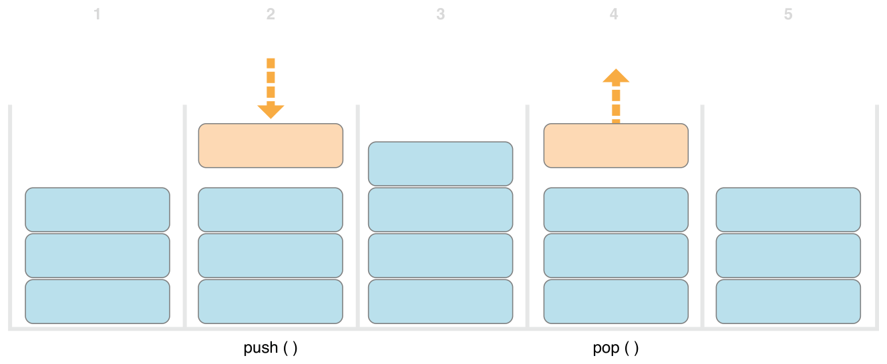

[‌](){#TP40016643-CH26}[‌](){#TP40016643-CH26-ID179}
Generics {#generics .chapter-name}
--------

*Generic code* enables you to write flexible, reusable functions and types that can work with any type, subject to requirements that you define. You can write code that avoids duplication and expresses its intent in a clear, abstracted manner.

Generics are one of the most powerful features of Swift, and much of the Swift standard library is built with generic code. In fact, you’ve been using generics throughout the *Language Guide*, even if you didn’t realize it. For example, Swift’s `Array`{.code-voice} and `Dictionary`{.code-voice} types are both generic collections. You can create an array that holds `Int`{.code-voice} values, or an array that holds `String`{.code-voice} values, or indeed an array for any other type that can be created in Swift. Similarly, you can create a dictionary to store values of any specified type, and there are no limitations on what that type can be.

[‌](){#TP40016643-CH26-ID180}
### The Problem That Generics Solve {#the-problem-that-generics-solve .section-name}

Here’s a standard, non-generic function called `swapTwoInts(_:_:)`{.code-voice}, which swaps two `Int`{.code-voice} values:

1.  `func`{.code-voice} `swapTwoInts`{.vc}(`inout`{.kt} `a`{.vc}: `Int`{.n}, `inout`{.kt} `_`{.kt} `b`{.vc}: `Int`{.n}) {
2.  `    let`{.code-voice} `temporaryA`{.vc} = `a`{.vc}
3.  `    a`{.code-voice} = `b`{.vc}
4.  `    b`{.code-voice} = `temporaryA`{.vc}
5.  `}`{.code-voice}

This function makes use of in-out parameters to swap the values of `a`{.code-voice} and `b`{.code-voice}, as described in [In-Out Parameters](Functions.md#TP40016643-CH10-ID173).

The `swapTwoInts(_:_:)`{.code-voice} function swaps the original value of `b`{.code-voice} into `a`{.code-voice}, and the original value of `a`{.code-voice} into `b`{.code-voice}. You can call this function to swap the values in two `Int`{.code-voice} variables:

1.  `var`{.code-voice} `someInt`{.vc} = `3`{.m}
2.  `var`{.code-voice} `anotherInt`{.vc} = `107`{.m}
3.  `swapTwoInts`{.code-voice}(&`someInt`{.vc}, &`anotherInt`{.vc})
4.  `print`{.code-voice}(`"someInt is now `{.s}\\(`someInt`{.vc})`, and anotherInt is now `{.s}\\(`anotherInt`{.vc})`"`{.s})
5.  `// prints "someInt is now 107, and anotherInt is now 3"`{.code-voice}

The `swapTwoInts(_:_:)`{.code-voice} function is useful, but it can only be used with `Int`{.code-voice} values. If you want to swap two `String`{.code-voice} values, or two `Double`{.code-voice} values, you have to write more functions, such as the `swapTwoStrings(_:_:)`{.code-voice} and `swapTwoDoubles(_:_:)`{.code-voice} functions shown below:

1.  `func`{.code-voice} `swapTwoStrings`{.vc}(`inout`{.kt} `a`{.vc}: `String`{.n}, `inout`{.kt} `_`{.kt} `b`{.vc}: `String`{.n}) {
2.  `    let`{.code-voice} `temporaryA`{.vc} = `a`{.vc}
3.  `    a`{.code-voice} = `b`{.vc}
4.  `    b`{.code-voice} = `temporaryA`{.vc}
5.  `}`{.code-voice}
6.  ` `{.code-voice}
7.  `func`{.code-voice} `swapTwoDoubles`{.vc}(`inout`{.kt} `a`{.vc}: `Double`{.n}, `inout`{.kt} `_`{.kt} `b`{.vc}: `Double`{.n}) {
8.  `    let`{.code-voice} `temporaryA`{.vc} = `a`{.vc}
9.  `    a`{.code-voice} = `b`{.vc}
10. `    b`{.code-voice} = `temporaryA`{.vc}
11. `}`{.code-voice}

You may have noticed that the bodies of the `swapTwoInts(_:_:)`{.code-voice}, `swapTwoStrings(_:_:)`{.code-voice}, and `swapTwoDoubles(_:_:)`{.code-voice} functions are identical. The only difference is the type of the values that they accept (`Int`{.code-voice}, `String`{.code-voice}, and `Double`{.code-voice}).

It would be much more useful, and considerably more flexible, to write a single function that could swap two values of *any* type. Generic code enables you to write such a function. (A generic version of these functions is defined below.)

Note

In all three functions, it is important that the types of `a`{.code-voice} and `b`{.code-voice} are defined to be the same as each other. If `a`{.code-voice} and `b`{.code-voice} were not of the same type, it would not be possible to swap their values. Swift is a type-safe language, and does not allow (for example) a variable of type `String`{.code-voice} and a variable of type `Double`{.code-voice} to swap values with each other. Attempting to do so would be reported as a compile-time error.

[‌](){#TP40016643-CH26-ID181}
### Generic Functions {#generic-functions .section-name}

*Generic functions* can work with any type. Here’s a generic version of the `swapTwoInts(_:_:)`{.code-voice} function from above, called `swapTwoValues(_:_:)`{.code-voice}:

1.  `func`{.code-voice} `swapTwoValues`{.vc}&lt;`T`{.vc}&gt;(`inout`{.kt} `a`{.vc}: `T`{.n}, `inout`{.kt} `_`{.kt} `b`{.vc}: `T`{.n}) {
2.  `    let`{.code-voice} `temporaryA`{.vc} = `a`{.vc}
3.  `    a`{.code-voice} = `b`{.vc}
4.  `    b`{.code-voice} = `temporaryA`{.vc}
5.  `}`{.code-voice}

The body of the `swapTwoValues(_:_:)`{.code-voice} function is identical to the body of the `swapTwoInts(_:_:)`{.code-voice} function. However, the first line of `swapTwoValues(_:_:)`{.code-voice} is slightly different from `swapTwoInts(_:_:)`{.code-voice}. Here’s how the first lines compare:

1.  `func`{.code-voice} `swapTwoInts`{.vc}(`inout`{.kt} `a`{.vc}: `Int`{.n}, `inout`{.kt} `_`{.kt} `b`{.vc}: `Int`{.n})
2.  `func`{.code-voice} `swapTwoValues`{.vc}&lt;`T`{.vc}&gt;(`inout`{.kt} `a`{.vc}: `T`{.n}, `inout`{.kt} `_`{.kt} `b`{.vc}: `T`{.n})

The generic version of the function uses a *placeholder* type name (called `T`{.code-voice}, in this case) instead of an *actual* type name (such as `Int`{.code-voice}, `String`{.code-voice}, or `Double`{.code-voice}). The placeholder type name doesn’t say anything about what `T`{.code-voice} must be, but it *does* say that both `a`{.code-voice} and `b`{.code-voice} must be of the same type `T`{.code-voice}, whatever `T`{.code-voice} represents. The actual type to use in place of `T`{.code-voice} will be determined each time the `swapTwoValues(_:_:)`{.code-voice} function is called.

The other difference is that the generic function’s name (`swapTwoValues(_:_:)`{.code-voice}) is followed by the placeholder type name (`T`{.code-voice}) inside angle brackets (``{.code-voice}). The brackets tell Swift that `T`{.code-voice} is a placeholder type name within the `swapTwoValues(_:_:)`{.code-voice} function definition. Because `T`{.code-voice} is a placeholder, Swift does not look for an actual type called `T`{.code-voice}.

The `swapTwoValues(_:_:)`{.code-voice} function can now be called in the same way as `swapTwoInts`{.code-voice}, except that it can be passed two values of *any* type, as long as both of those values are of the same type as each other. Each time `swapTwoValues(_:_:)`{.code-voice} is called, the type to use for `T`{.code-voice} is inferred from the types of values passed to the function.

In the two examples below, `T`{.code-voice} is inferred to be `Int`{.code-voice} and `String`{.code-voice} respectively:

1.  `var`{.code-voice} `someInt`{.vc} = `3`{.m}
2.  `var`{.code-voice} `anotherInt`{.vc} = `107`{.m}
3.  `swapTwoValues`{.code-voice}(&`someInt`{.vc}, &`anotherInt`{.vc})
4.  `// someInt is now 107, and anotherInt is now 3`{.code-voice}
5.  ` `{.code-voice}
6.  `var`{.code-voice} `someString`{.vc} = `"hello"`{.s}
7.  `var`{.code-voice} `anotherString`{.vc} = `"world"`{.s}
8.  `swapTwoValues`{.code-voice}(&`someString`{.vc}, &`anotherString`{.vc})
9.  `// someString is now "world", and anotherString is now "hello"`{.code-voice}

Note

The `swapTwoValues(_:_:)`{.code-voice} function defined above is inspired by a generic function called `swap`{.code-voice}, which is part of the Swift standard library, and is automatically made available for you to use in your apps. If you need the behavior of the `swapTwoValues(_:_:)`{.code-voice} function in your own code, you can use Swift’s existing `swap(_:_:)`{.code-voice} function rather than providing your own implementation.

[‌](){#TP40016643-CH26-ID182}
### Type Parameters {#type-parameters .section-name}

In the `swapTwoValues(_:_:)`{.code-voice} example above, the placeholder type `T`{.code-voice} is an example of a *type parameter*. Type parameters specify and name a placeholder type, and are written immediately after the function’s name, between a pair of matching angle brackets (such as ``{.code-voice}).

Once you specify a type parameter, you can use it to define the type of a function’s parameters (such as the `a`{.code-voice} and `b`{.code-voice} parameters of the `swapTwoValues(_:_:)`{.code-voice} function), or as the function’s return type, or as a type annotation within the body of the function. In each case, the type parameter is replaced with an *actual* type whenever the function is called. (In the `swapTwoValues(_:_:)`{.code-voice} example above, `T`{.code-voice} was replaced with `Int`{.code-voice} the first time the function was called, and was replaced with `String`{.code-voice} the second time it was called.)

You can provide more than one type parameter by writing multiple type parameter names within the angle brackets, separated by commas.

[‌](){#TP40016643-CH26-ID183}
### Naming Type Parameters {#naming-type-parameters .section-name}

In most cases, type parameters have descriptive names, such as `Key`{.code-voice} and `Value`{.code-voice} in `Dictionary`{.code-voice} and `Element`{.code-voice} in `Array`{.code-voice}, which tells the reader about the relationship between the type parameter and the generic type or function it’s used in. However, when there isn’t a meaningful relationship between them, it’s traditional to name them using single letters such as `T`{.code-voice}, `U`{.code-voice}, and `V`{.code-voice}, such as `T`{.code-voice} in the `swapTwoValues(_:_:)`{.code-voice} function above.

Note

Always give type parameters upper camel case names (such as `T`{.code-voice} and `MyTypeParameter`{.code-voice}) to indicate that they are a placeholder for a *type*, not a value.

[‌](){#TP40016643-CH26-ID184}
### Generic Types {#generic-types .section-name}

In addition to generic functions, Swift enables you to define your own *generic types*. These are custom classes, structures, and enumerations that can work with *any* type, in a similar way to `Array`{.code-voice} and `Dictionary`{.code-voice}.

This section shows you how to write a generic collection type called `Stack`{.code-voice}. A stack is an ordered set of values, similar to an array, but with a more restricted set of operations than Swift’s `Array`{.code-voice} type. An array allows new items to be inserted and removed at any location in the array. A stack, however, allows new items to be appended only to the end of the collection (known as *pushing* a new value on to the stack). Similarly, a stack allows items to be removed only from the end of the collection (known as *popping* a value off the stack).

Note

The concept of a stack is used by the `UINavigationController`{.code-voice} class to model the view controllers in its navigation hierarchy. You call the `UINavigationController`{.code-voice} class `pushViewController(_:animated:)`{.code-voice} method to add (or push) a view controller on to the navigation stack, and its `popViewControllerAnimated(_:)`{.code-voice} method to remove (or pop) a view controller from the navigation stack. A stack is a useful collection model whenever you need a strict “last in, first out” approach to managing a collection.

The illustration below shows the push / pop behavior for a stack:

{width="664" height="273"}

1.  There are currently three values on the stack.

2.  A fourth value is “pushed” on to the top of the stack.

3.  The stack now holds four values, with the most recent one at the top.

4.  The top item in the stack is removed, or “popped”.

5.  After popping a value, the stack once again holds three values.

Here’s how to write a non-generic version of a stack, in this case for a stack of `Int`{.code-voice} values:

1.  `struct`{.code-voice} `IntStack`{.vc} {
2.  `    var`{.code-voice} `items`{.vc} = \[`Int`{.vc}\]()
3.  `    mutating`{.code-voice} `func`{.kt} `push`{.vc}(`item`{.vc}: `Int`{.n}) {
4.  `        items`{.code-voice}.`append`{.vc}(`item`{.vc})
5.  `    }`{.code-voice}
6.  `    mutating`{.code-voice} `func`{.kt} `pop`{.vc}() -&gt; `Int`{.n} {
7.  `        return`{.code-voice} `items`{.vc}.`removeLast`{.vc}()
8.  `    }`{.code-voice}
9.  `}`{.code-voice}

This structure uses an `Array`{.code-voice} property called `items`{.code-voice} to store the values in the stack. `Stack`{.code-voice} provides two methods, `push`{.code-voice} and `pop`{.code-voice}, to push and pop values on and off the stack. These methods are marked as `mutating`{.code-voice}, because they need to modify (or *mutate*) the structure’s `items`{.code-voice} array.

The `IntStack`{.code-voice} type shown above can only be used with `Int`{.code-voice} values, however. It would be much more useful to define a *generic* `Stack`{.code-voice} class, that can manage a stack of *any* type of value.

Here’s a generic version of the same code:

1.  `struct`{.code-voice} `Stack`{.vc}&lt;`Element`{.vc}&gt; {
2.  `    var`{.code-voice} `items`{.vc} = \[`Element`{.vc}\]()
3.  `    mutating`{.code-voice} `func`{.kt} `push`{.vc}(`item`{.vc}: `Element`{.n}) {
4.  `        items`{.code-voice}.`append`{.vc}(`item`{.vc})
5.  `    }`{.code-voice}
6.  `    mutating`{.code-voice} `func`{.kt} `pop`{.vc}() -&gt; `Element`{.n} {
7.  `        return`{.code-voice} `items`{.vc}.`removeLast`{.vc}()
8.  `    }`{.code-voice}
9.  `}`{.code-voice}

Note how the generic version of `Stack`{.code-voice} is essentially the same as the non-generic version, but with a type parameter called `Element`{.code-voice} instead of an actual type of `Int`{.code-voice}. This type parameter is written within a pair of angle brackets (``{.code-voice}) immediately after the structure’s name.

`Element`{.code-voice} defines a placeholder name for “some type `Element`{.code-voice}” to be provided later on. This future type can be referred to as “`Element`{.code-voice}” anywhere within the structure’s definition. In this case, `Element`{.code-voice} is used as a placeholder in three places:

-   To create a property called `items`{.code-voice}, which is initialized with an empty array of values of type `Element`{.code-voice}

-   To specify that the `push(_:)`{.code-voice} method has a single parameter called `item`{.code-voice}, which must be of type `Element`{.code-voice}

-   To specify that the value returned by the `pop()`{.code-voice} method will be a value of type `Element`{.code-voice}

Because it is a generic type, `Stack`{.code-voice} can be used to create a stack of *any* valid type in Swift, in a similar manner to `Array`{.code-voice} and `Dictionary`{.code-voice}.

You create a new `Stack`{.code-voice} instance by writing the type to be stored in the stack within angle brackets. For example, to create a new stack of strings, you write `Stack()`{.code-voice}:

1.  `var`{.code-voice} `stackOfStrings`{.vc} = `Stack`{.vc}&lt;`String`{.n}&gt;()
2.  `stackOfStrings`{.code-voice}.`push`{.vc}(`"uno"`{.s})
3.  `stackOfStrings`{.code-voice}.`push`{.vc}(`"dos"`{.s})
4.  `stackOfStrings`{.code-voice}.`push`{.vc}(`"tres"`{.s})
5.  `stackOfStrings`{.code-voice}.`push`{.vc}(`"cuatro"`{.s})
6.  `// the stack now contains 4 strings`{.code-voice}

Here’s how `stackOfStrings`{.code-voice} looks after pushing these four values on to the stack:

{width="664" height="218"}

Popping a value from the stack returns and removes the top value, `"cuatro"`{.code-voice}:

1.  `let`{.code-voice} `fromTheTop`{.vc} = `stackOfStrings`{.vc}.`pop`{.vc}()
2.  `// fromTheTop is equal to "cuatro", and the stack now contains 3 strings`{.code-voice}

Here’s how the stack looks after popping its top value:

{width="405" height="207"}

[‌](){#TP40016643-CH26-ID185}
### Extending a Generic Type {#extending-a-generic-type .section-name}

When you extend a generic type, you do not provide a type parameter list as part of the extension’s definition. Instead, the type parameter list from the *original* type definition is available within the body of the extension, and the original type parameter names are used to refer to the type parameters from the original definition.

The following example extends the generic `Stack`{.code-voice} type to add a read-only computed property called `topItem`{.code-voice}, which returns the top item on the stack without popping it from the stack:

1.  `extension`{.code-voice} `Stack`{.n} {
2.  `    var`{.code-voice} `topItem`{.vc}: `Element`{.n}? {
3.  `        return`{.code-voice} `items`{.vc}.`isEmpty`{.vc} ? `nil`{.kt} : `items`{.vc}\[`items`{.vc}.`count`{.vc} - `1`{.m}\]
4.  `    }`{.code-voice}
5.  `}`{.code-voice}

The `topItem`{.code-voice} property returns an optional value of type `Element`{.code-voice}. If the stack is empty, `topItem`{.code-voice} returns `nil`{.code-voice}; if the stack is not empty, `topItem`{.code-voice} returns the final item in the `items`{.code-voice} array.

Note that this extension does not define a type parameter list. Instead, the `Stack`{.code-voice} type’s existing type parameter name, `Element`{.code-voice}, is used within the extension to indicate the optional type of the `topItem`{.code-voice} computed property.

The `topItem`{.code-voice} computed property can now be used with any `Stack`{.code-voice} instance to access and query its top item without removing it:

1.  `if`{.code-voice} `let`{.kt} `topItem`{.vc} = `stackOfStrings`{.vc}.`topItem`{.vc} {
2.  `    print`{.code-voice}(`"The top item on the stack is `{.s}\\(`topItem`{.vc})`."`{.s})
3.  `}`{.code-voice}
4.  `// prints "The top item on the stack is tres."`{.code-voice}

[‌](){#TP40016643-CH26-ID186}
### Type Constraints {#type-constraints .section-name}

The `swapTwoValues(_:_:)`{.code-voice} function and the `Stack`{.code-voice} type can work with any type. However, it is sometimes useful to enforce certain *type constraints* on the types that can be used with generic functions and generic types. Type constraints specify that a type parameter must inherit from a specific class, or conform to a particular protocol or protocol composition.

For example, Swift’s `Dictionary`{.code-voice} type places a limitation on the types that can be used as keys for a dictionary. As described in [Dictionaries](CollectionTypes.md#TP40016643-CH8-ID113), the type of a dictionary’s keys must be *hashable*. That is, it must provide a way to make itself uniquely representable. `Dictionary`{.code-voice} needs its keys to be hashable so that it can check whether it already contains a value for a particular key. Without this requirement, `Dictionary`{.code-voice} could not tell whether it should insert or replace a value for a particular key, nor would it be able to find a value for a given key that is already in the dictionary.

This requirement is enforced by a type constraint on the key type for `Dictionary`{.code-voice}, which specifies that the key type must conform to the `Hashable`{.code-voice} protocol, a special protocol defined in the Swift standard library. All of Swift’s basic types (such as `String`{.code-voice}, `Int`{.code-voice}, `Double`{.code-voice}, and `Bool`{.code-voice}) are hashable by default.

You can define your own type constraints when creating custom generic types, and these constraints provide much of the power of generic programming. Abstract concepts like `Hashable`{.code-voice} characterize types in terms of their conceptual characteristics, rather than their explicit type.

[‌](){#TP40016643-CH26-ID187}
### Type Constraint Syntax {#type-constraint-syntax .section-name}

You write type constraints by placing a single class or protocol constraint after a type parameter’s name, separated by a colon, as part of the type parameter list. The basic syntax for type constraints on a generic function is shown below (although the syntax is the same for generic types):

1.  `func`{.code-voice} `someFunction`{.vc}&lt;`T`{.vc}: `SomeClass`{.n}, `U`{.vc}: `SomeProtocol`{.n}&gt;(`someT`{.vc}: `T`{.n}, `someU`{.vc}: `U`{.n}) {
2.  `    // function body goes here`{.code-voice}
3.  `}`{.code-voice}

The hypothetical function above has two type parameters. The first type parameter, `T`{.code-voice}, has a type constraint that requires `T`{.code-voice} to be a subclass of `SomeClass`{.code-voice}. The second type parameter, `U`{.code-voice}, has a type constraint that requires `U`{.code-voice} to conform to the protocol `SomeProtocol`{.code-voice}.

[‌](){#TP40016643-CH26-ID188}
### Type Constraints in Action {#type-constraints-in-action .section-name}

Here’s a non-generic function called `findStringIndex`{.code-voice}, which is given a `String`{.code-voice} value to find and an array of `String`{.code-voice} values within which to find it. The `findStringIndex(_:_:)`{.code-voice} function returns an optional `Int`{.code-voice} value, which will be the index of the first matching string in the array if it is found, or `nil`{.code-voice} if the string cannot be found:

1.  `func`{.code-voice} `findStringIndex`{.vc}(`array`{.vc}: \[`String`{.n}\], `_`{.kt} `valueToFind`{.vc}: `String`{.n}) -&gt; `Int`{.n}? {
2.  `    for`{.code-voice} (`index`{.vc}, `value`{.vc}) `in`{.kt} `array`{.vc}.`enumerate`{.vc}() {
3.  `        if`{.code-voice} `value`{.vc} == `valueToFind`{.vc} {
4.  `            return`{.code-voice} `index`{.vc}
5.  `        }`{.code-voice}
6.  `    }`{.code-voice}
7.  `    return`{.code-voice} `nil`{.kt}
8.  `}`{.code-voice}

The `findStringIndex(_:_:)`{.code-voice} function can be used to find a string value in an array of strings:

1.  `let`{.code-voice} `strings`{.vc} = \[`"cat"`{.s}, `"dog"`{.s}, `"llama"`{.s}, `"parakeet"`{.s}, `"terrapin"`{.s}\]
2.  `if`{.code-voice} `let`{.kt} `foundIndex`{.vc} = `findStringIndex`{.vc}(`strings`{.vc}, `"llama"`{.s}) {
3.  `    print`{.code-voice}(`"The index of llama is `{.s}\\(`foundIndex`{.vc})`"`{.s})
4.  `}`{.code-voice}
5.  `// prints "The index of llama is 2"`{.code-voice}

The principle of finding the index of a value in an array isn’t useful only for strings, however. You can write the same functionality as a generic function called `findIndex`{.code-voice}, by replacing any mention of strings with values of some type `T`{.code-voice} instead.

Here’s how you might expect a generic version of `findStringIndex`{.code-voice}, called `findIndex`{.code-voice}, to be written. Note that the return type of this function is still `Int?`{.code-voice}, because the function returns an optional index number, not an optional value from the array. Be warned, though—this function does not compile, for reasons explained after the example:

1.  `func`{.code-voice} `findIndex`{.vc}&lt;`T`{.vc}&gt;(`array`{.vc}: \[`T`{.n}\], `_`{.kt} `valueToFind`{.vc}: `T`{.n}) -&gt; `Int`{.n}? {
2.  `    for`{.code-voice} (`index`{.vc}, `value`{.vc}) `in`{.kt} `array`{.vc}.`enumerate`{.vc}() {
3.  `        if`{.code-voice} `value`{.vc} == `valueToFind`{.vc} {
4.  `            return`{.code-voice} `index`{.vc}
5.  `        }`{.code-voice}
6.  `    }`{.code-voice}
7.  `    return`{.code-voice} `nil`{.kt}
8.  `}`{.code-voice}

This function does not compile as written above. The problem lies with the equality check, “`if value == valueToFind`{.code-voice}”. Not every type in Swift can be compared with the equal to operator (`==`{.code-voice}). If you create your own class or structure to represent a complex data model, for example, then the meaning of “equal to” for that class or structure is not something that Swift can guess for you. Because of this, it is not possible to guarantee that this code will work for *every* possible type `T`{.code-voice}, and an appropriate error is reported when you try to compile the code.

All is not lost, however. The Swift standard library defines a protocol called `Equatable`{.code-voice}, which requires any conforming type to implement the equal to operator (`==`{.code-voice}) and the not equal to operator (`!=`{.code-voice}) to compare any two values of that type. All of Swift’s standard types automatically support the `Equatable`{.code-voice} protocol.

Any type that is `Equatable`{.code-voice} can be used safely with the `findIndex(_:_:)`{.code-voice} function, because it is guaranteed to support the equal to operator. To express this fact, you write a type constraint of `Equatable`{.code-voice} as part of the type parameter’s definition when you define the function:

1.  `func`{.code-voice} `findIndex`{.vc}&lt;`T`{.vc}: `Equatable`{.n}&gt;(`array`{.vc}: \[`T`{.n}\], `_`{.kt} `valueToFind`{.vc}: `T`{.n}) -&gt; `Int`{.n}? {
2.  `    for`{.code-voice} (`index`{.vc}, `value`{.vc}) `in`{.kt} `array`{.vc}.`enumerate`{.vc}() {
3.  `        if`{.code-voice} `value`{.vc} == `valueToFind`{.vc} {
4.  `            return`{.code-voice} `index`{.vc}
5.  `        }`{.code-voice}
6.  `    }`{.code-voice}
7.  `    return`{.code-voice} `nil`{.kt}
8.  `}`{.code-voice}

The single type parameter for `findIndex`{.code-voice} is written as `T: Equatable`{.code-voice}, which means “any type `T`{.code-voice} that conforms to the `Equatable`{.code-voice} protocol.”

The `findIndex(_:_:)`{.code-voice} function now compiles successfully and can be used with any type that is `Equatable`{.code-voice}, such as `Double`{.code-voice} or `String`{.code-voice}:

1.  `let`{.code-voice} `doubleIndex`{.vc} = `findIndex`{.vc}(\[`3.14159`{.m}, `0.1`{.m}, `0.25`{.m}\], `9.3`{.m})
2.  `// doubleIndex is an optional Int with no value, because 9.3 is not in the array`{.code-voice}
3.  `let`{.code-voice} `stringIndex`{.vc} = `findIndex`{.vc}(\[`"Mike"`{.s}, `"Malcolm"`{.s}, `"Andrea"`{.s}\], `"Andrea"`{.s})
4.  `// stringIndex is an optional Int containing a value of 2`{.code-voice}

[‌](){#TP40016643-CH26-ID189}
### Associated Types {#associated-types .section-name}

When defining a protocol, it is sometimes useful to declare one or more *associated types* as part of the protocol’s definition. An associated type gives a placeholder name (or *alias*) to a type that is used as part of the protocol. The actual type to use for that associated type is not specified until the protocol is adopted. Associated types are specified with the `typealias`{.code-voice} keyword.

[‌](){#TP40016643-CH26-ID190}
### Associated Types in Action {#associated-types-in-action .section-name}

Here’s an example of a protocol called `Container`{.code-voice}, which declares an associated type called `ItemType`{.code-voice}:

1.  `protocol`{.code-voice} `Container`{.vc} {
2.  `    typealias`{.code-voice} `ItemType`{.vc}
3.  `    mutating`{.code-voice} `func`{.kt} `append`{.vc}(`item`{.vc}: `ItemType`{.n})
4.  `    var`{.code-voice} `count`{.vc}: `Int`{.n} { `get`{.kt} }
5.  `    subscript`{.code-voice}(`i`{.vc}: `Int`{.n}) -&gt; `ItemType`{.n} { `get`{.kt} }
6.  `}`{.code-voice}

The `Container`{.code-voice} protocol defines three required capabilities that any container must provide:

-   It must be possible to add a new item to the container with an `append(_:)`{.code-voice} method.

-   It must be possible to access a count of the items in the container through a `count`{.code-voice} property that returns an `Int`{.code-voice} value.

-   It must be possible to retrieve each item in the container with a subscript that takes an `Int`{.code-voice} index value.

This protocol doesn’t specify how the items in the container should be stored or what type they are allowed to be. The protocol only specifies the three bits of functionality that any type must provide in order to be considered a `Container`{.code-voice}. A conforming type can provide additional functionality, as long as it satisfies these three requirements.

Any type that conforms to the `Container`{.code-voice} protocol must be able to specify the type of values it stores. Specifically, it must ensure that only items of the right type are added to the container, and it must be clear about the type of the items returned by its subscript.

To define these requirements, the `Container`{.code-voice} protocol needs a way to refer to the type of the elements that a container will hold, without knowing what that type is for a specific container. The `Container`{.code-voice} protocol needs to specify that any value passed to the `append(_:)`{.code-voice} method must have the same type as the container’s element type, and that the value returned by the container’s subscript will be of the same type as the container’s element type.

To achieve this, the `Container`{.code-voice} protocol declares an associated type called `ItemType`{.code-voice}, written as `typealias ItemType`{.code-voice}. The protocol does not define what `ItemType`{.code-voice} is an alias *for*—that information is left for any conforming type to provide. Nonetheless, the `ItemType`{.code-voice} alias provides a way to refer to the type of the items in a `Container`{.code-voice}, and to define a type for use with the `append(_:)`{.code-voice} method and subscript, to ensure that the expected behavior of any `Container`{.code-voice} is enforced.

Here’s a version of the non-generic `IntStack`{.code-voice} type from earlier, adapted to conform to the `Container`{.code-voice} protocol:

1.  `struct`{.code-voice} `IntStack`{.vc}: `Container`{.n} {
2.  `    // original IntStack implementation`{.code-voice}
3.  `    var`{.code-voice} `items`{.vc} = \[`Int`{.vc}\]()
4.  `    mutating`{.code-voice} `func`{.kt} `push`{.vc}(`item`{.vc}: `Int`{.n}) {
5.  `        items`{.code-voice}.`append`{.vc}(`item`{.vc})
6.  `    }`{.code-voice}
7.  `    mutating`{.code-voice} `func`{.kt} `pop`{.vc}() -&gt; `Int`{.n} {
8.  `        return`{.code-voice} `items`{.vc}.`removeLast`{.vc}()
9.  `    }`{.code-voice}
10. `    // conformance to the Container protocol`{.code-voice}
11. `    typealias`{.code-voice} `ItemType`{.vc} = `Int`{.n}
12. `    mutating`{.code-voice} `func`{.kt} `append`{.vc}(`item`{.vc}: `Int`{.n}) {
13. `        self`{.code-voice}.`push`{.vc}(`item`{.vc})
14. `    }`{.code-voice}
15. `    var`{.code-voice} `count`{.vc}: `Int`{.n} {
16. `        return`{.code-voice} `items`{.vc}.`count`{.vc}
17. `    }`{.code-voice}
18. `    subscript`{.code-voice}(`i`{.vc}: `Int`{.n}) -&gt; `Int`{.n} {
19. `        return`{.code-voice} `items`{.vc}\[`i`{.vc}\]
20. `    }`{.code-voice}
21. `}`{.code-voice}

The `IntStack`{.code-voice} type implements all three of the `Container`{.code-voice} protocol’s requirements, and in each case wraps part of the `IntStack`{.code-voice} type’s existing functionality to satisfy these requirements.

Moreover, `IntStack`{.code-voice} specifies that for this implementation of `Container`{.code-voice}, the appropriate `ItemType`{.code-voice} to use is a type of `Int`{.code-voice}. The definition of `typealias ItemType = Int`{.code-voice} turns the abstract type of `ItemType`{.code-voice} into a concrete type of `Int`{.code-voice} for this implementation of the `Container`{.code-voice} protocol.

Thanks to Swift’s type inference, you don’t actually need to declare a concrete `ItemType`{.code-voice} of `Int`{.code-voice} as part of the definition of `IntStack`{.code-voice}. Because `IntStack`{.code-voice} conforms to all of the requirements of the `Container`{.code-voice} protocol, Swift can infer the appropriate `ItemType`{.code-voice} to use, simply by looking at the type of the `append(_:)`{.code-voice} method’s `item`{.code-voice} parameter and the return type of the subscript. Indeed, if you delete the `typealias ItemType = Int`{.code-voice} line from the code above, everything still works, because it is clear what type should be used for `ItemType`{.code-voice}.

You can also make the generic `Stack`{.code-voice} type conform to the `Container`{.code-voice} protocol:

1.  `struct`{.code-voice} `Stack`{.vc}&lt;`Element`{.vc}&gt;: `Container`{.n} {
2.  `    // original Stack implementation`{.code-voice}
3.  `    var`{.code-voice} `items`{.vc} = \[`Element`{.vc}\]()
4.  `    mutating`{.code-voice} `func`{.kt} `push`{.vc}(`item`{.vc}: `Element`{.n}) {
5.  `        items`{.code-voice}.`append`{.vc}(`item`{.vc})
6.  `    }`{.code-voice}
7.  `    mutating`{.code-voice} `func`{.kt} `pop`{.vc}() -&gt; `Element`{.n} {
8.  `        return`{.code-voice} `items`{.vc}.`removeLast`{.vc}()
9.  `    }`{.code-voice}
10. `    // conformance to the Container protocol`{.code-voice}
11. `    mutating`{.code-voice} `func`{.kt} `append`{.vc}(`item`{.vc}: `Element`{.n}) {
12. `        self`{.code-voice}.`push`{.vc}(`item`{.vc})
13. `    }`{.code-voice}
14. `    var`{.code-voice} `count`{.vc}: `Int`{.n} {
15. `        return`{.code-voice} `items`{.vc}.`count`{.vc}
16. `    }`{.code-voice}
17. `    subscript`{.code-voice}(`i`{.vc}: `Int`{.n}) -&gt; `Element`{.n} {
18. `        return`{.code-voice} `items`{.vc}\[`i`{.vc}\]
19. `    }`{.code-voice}
20. `}`{.code-voice}

This time, the type parameter `Element`{.code-voice} is used as the type of the `append(_:)`{.code-voice} method’s `item`{.code-voice} parameter and the return type of the subscript. Swift can therefore infer that `Element`{.code-voice} is the appropriate type to use as the `ItemType`{.code-voice} for this particular container.

[‌](){#TP40016643-CH26-ID191}
### Extending an Existing Type to Specify an Associated Type {#extending-an-existing-type-to-specify-an-associated-type .section-name}

You can extend an existing type to add conformance to a protocol, as described in [Adding Protocol Conformance with an Extension](Protocols.md#TP40016643-CH25-ID277). This includes a protocol with an associated type.

Swift’s `Array`{.code-voice} type already provides an `append(_:)`{.code-voice} method, a `count`{.code-voice} property, and a subscript with an `Int`{.code-voice} index to retrieve its elements. These three capabilities match the requirements of the `Container`{.code-voice} protocol. This means that you can extend `Array`{.code-voice} to conform to the `Container`{.code-voice} protocol simply by declaring that `Array`{.code-voice} adopts the protocol. You do this with an empty extension, as described in [Declaring Protocol Adoption with an Extension](Protocols.md#TP40016643-CH25-ID278):

1.  `extension`{.code-voice} `Array`{.n}: `Container`{.n} {}

Array’s existing `append(_:)`{.code-voice} method and subscript enable Swift to infer the appropriate type to use for `ItemType`{.code-voice}, just as for the generic `Stack`{.code-voice} type above. After defining this extension, you can use any `Array`{.code-voice} as a `Container`{.code-voice}.

[‌](){#TP40016643-CH26-ID192}
### Where Clauses {#where-clauses .section-name}

Type constraints, as described in [Type Constraints](Generics.md#TP40016643-CH26-ID186), enable you to define requirements on the type parameters associated with a generic function or type.

It can also be useful to define requirements for associated types. You do this by defining *where clauses* as part of a type parameter list. A where clause enables you to require that an associated type must conform to a certain protocol, or that certain type parameters and associated types must be the same. You write a where clause by placing the `where`{.code-voice} keyword immediately after the list of type parameters, followed by constraints for associated types or equality relationships between types and associated types.

The example below defines a generic function called `allItemsMatch`{.code-voice}, which checks to see if two `Container`{.code-voice} instances contain the same items in the same order. The function returns a Boolean value of `true`{.code-voice} if all items match and a value of `false`{.code-voice} if they do not.

The two containers to be checked do not have to be the same type of container (although they can be), but they do have to hold the same type of items. This requirement is expressed through a combination of type constraints and where clauses:

1.  `func`{.code-voice} `allItemsMatch`{.vc}&lt;
2.  `    C1`{.code-voice}: `Container`{.n}, `C2`{.vc}: `Container`{.n}
3.  `    where`{.code-voice} `C1`{.n}.`ItemType`{.n} == `C2`{.n}.`ItemType`{.n}, `C1`{.n}.`ItemType`{.n}: `Equatable`{.vc}&gt;
4.  `    (someContainer`{.code-voice}: `C1`{.n}, `_`{.kt} `anotherContainer`{.vc}: `C2`{.n}) -&gt; `Bool`{.n} {
5.  `        `{.code-voice}
6.  `        // check that both containers contain the same number of items`{.code-voice}
7.  `        if`{.code-voice} `someContainer`{.vc}.`count`{.vc} != `anotherContainer`{.vc}.`count`{.vc} {
8.  `            return`{.code-voice} `false`{.kt}
9.  `        }`{.code-voice}
10. `        `{.code-voice}
11. `        // check each pair of items to see if they are equivalent`{.code-voice}
12. `        for`{.code-voice} `i`{.vc} `in`{.kt} `0`{.m}..&lt;`someContainer`{.vc}.`count`{.vc} {
13. `            if`{.code-voice} `someContainer`{.vc}\[`i`{.vc}\] != `anotherContainer`{.vc}\[`i`{.vc}\] {
14. `                return`{.code-voice} `false`{.kt}
15. `            }`{.code-voice}
16. `        }`{.code-voice}
17. `        `{.code-voice}
18. `        // all items match, so return true`{.code-voice}
19. `        return`{.code-voice} `true`{.kt}
20. `        `{.code-voice}
21. `}`{.code-voice}

This function takes two arguments called `someContainer`{.code-voice} and `anotherContainer`{.code-voice}. The `someContainer`{.code-voice} argument is of type `C1`{.code-voice}, and the `anotherContainer`{.code-voice} argument is of type `C2`{.code-voice}. Both `C1`{.code-voice} and `C2`{.code-voice} are type parameters for two container types to be determined when the function is called.

The function’s type parameter list places the following requirements on the two type parameters:

-   `C1`{.code-voice} must conform to the `Container`{.code-voice} protocol (written as `C1: Container`{.code-voice}).

-   `C2`{.code-voice} must also conform to the `Container`{.code-voice} protocol (written as `C2: Container`{.code-voice}).

-   The `ItemType`{.code-voice} for `C1`{.code-voice} must be the same as the `ItemType`{.code-voice} for `C2`{.code-voice} (written as `C1.ItemType == C2.ItemType`{.code-voice}).

-   The `ItemType`{.code-voice} for `C1`{.code-voice} must conform to the `Equatable`{.code-voice} protocol (written as `C1.ItemType: Equatable`{.code-voice}).

The third and fourth requirements are defined as part of a where clause, and are written after the `where`{.code-voice} keyword as part of the function’s type parameter list.

These requirements mean:

-   `someContainer`{.code-voice} is a container of type `C1`{.code-voice}.

-   `anotherContainer`{.code-voice} is a container of type `C2`{.code-voice}.

-   `someContainer`{.code-voice} and `anotherContainer`{.code-voice} contain the same type of items.

-   The items in `someContainer`{.code-voice} can be checked with the not equal operator (`!=`{.code-voice}) to see if they are different from each other.

The third and fourth requirements combine to mean that the items in `anotherContainer`{.code-voice} can *also* be checked with the `!=`{.code-voice} operator, because they are exactly the same type as the items in `someContainer`{.code-voice}.

These requirements enable the `allItemsMatch(_:_:)`{.code-voice} function to compare the two containers, even if they are of a different container type.

The `allItemsMatch(_:_:)`{.code-voice} function starts by checking that both containers contain the same number of items. If they contain a different number of items, there is no way that they can match, and the function returns `false`{.code-voice}.

After making this check, the function iterates over all of the items in `someContainer`{.code-voice} with a `for`{.code-voice}-`in`{.code-voice} loop and the half-open range operator (`..<`{.code-voice}). For each item, the function checks whether the item from `someContainer`{.code-voice} is not equal to the corresponding item in `anotherContainer`{.code-voice}. If the two items are not equal, then the two containers do not match, and the function returns `false`{.code-voice}.

If the loop finishes without finding a mismatch, the two containers match, and the function returns `true`{.code-voice}.

Here’s how the `allItemsMatch(_:_:)`{.code-voice} function looks in action:

1.  `var`{.code-voice} `stackOfStrings`{.vc} = `Stack`{.vc}&lt;`String`{.n}&gt;()
2.  `stackOfStrings`{.code-voice}.`push`{.vc}(`"uno"`{.s})
3.  `stackOfStrings`{.code-voice}.`push`{.vc}(`"dos"`{.s})
4.  `stackOfStrings`{.code-voice}.`push`{.vc}(`"tres"`{.s})
5.  ` `{.code-voice}
6.  `var`{.code-voice} `arrayOfStrings`{.vc} = \[`"uno"`{.s}, `"dos"`{.s}, `"tres"`{.s}\]
7.  ` `{.code-voice}
8.  `if`{.code-voice} `allItemsMatch`{.vc}(`stackOfStrings`{.vc}, `arrayOfStrings`{.vc}) {
9.  `    print`{.code-voice}(`"All items match."`{.s})
10. `} else`{.code-voice} {
11. `    print`{.code-voice}(`"Not all items match."`{.s})
12. `}`{.code-voice}
13. `// prints "All items match."`{.code-voice}

The example above creates a `Stack`{.code-voice} instance to store `String`{.code-voice} values, and pushes three strings onto the stack. The example also creates an `Array`{.code-voice} instance initialized with an array literal containing the same three strings as the stack. Even though the stack and the array are of a different type, they both conform to the `Container`{.code-voice} protocol, and both contain the same type of values. You can therefore call the `allItemsMatch(_:_:)`{.code-voice} function with these two containers as its arguments. In the example above, the `allItemsMatch(_:_:)`{.code-voice} function correctly reports that all of the items in the two containers match.

