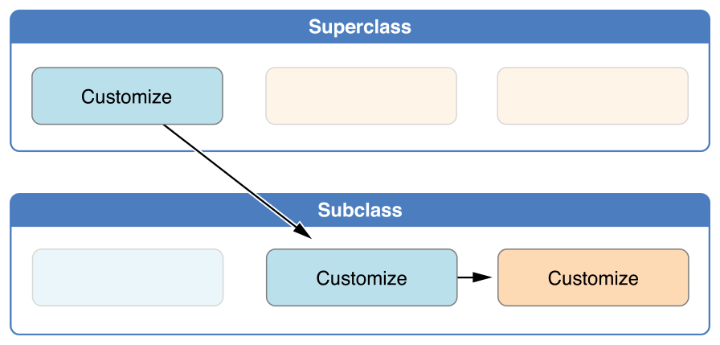
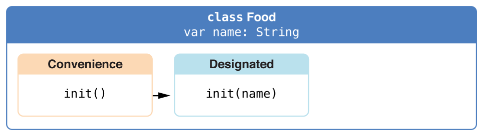

[‌](){#TP40016643-CH18}[‌](){#TP40016643-CH18-ID203}
Initialization {#initialization .chapter-name}
--------------


*Initialization* is the process of preparing an instance of a class, structure, or enumeration for use. This process involves setting an initial value for each stored property on that instance and performing any other setup or initialization that is required before the new instance is ready for use.

You implement this initialization process by defining *initializers*, which are like special methods that can be called to create a new instance of a particular type. Unlike Objective-C initializers, Swift initializers do not return a value. Their primary role is to ensure that new instances of a type are correctly initialized before they are used for the first time.

Instances of class types can also implement a *deinitializer*, which performs any custom cleanup just before an instance of that class is deallocated. For more information about deinitializers, see [Deinitialization](Deinitialization.md).


[‌](){#TP40016643-CH18-ID204}
### Setting Initial Values for Stored Properties {#setting-initial-values-for-stored-properties .section-name}

Classes and structures *must* set all of their stored properties to an appropriate initial value by the time an instance of that class or structure is created. Stored properties cannot be left in an indeterminate state.

You can set an initial value for a stored property within an initializer, or by assigning a default property value as part of the property’s definition. These actions are described in the following sections.


Note

When you assign a default value to a stored property, or set its initial value within an initializer, the value of that property is set directly, without calling any property observers.


[‌](){#TP40016643-CH18-ID205}
### Initializers {#initializers .section-name}

*Initializers* are called to create a new instance of a particular type. In its simplest form, an initializer is like an instance method with no parameters, written using the `init`{.code-voice} keyword:


1.  `init`{.code-voice}() {
2.  `    // perform some initialization here`{.code-voice}
3.  `}`{.code-voice}


The example below defines a new structure called `Fahrenheit`{.code-voice} to store temperatures expressed in the Fahrenheit scale. The `Fahrenheit`{.code-voice} structure has one stored property, `temperature`{.code-voice}, which is of type `Double`{.code-voice}:


1.  `struct`{.code-voice} `Fahrenheit`{.vc} {
2.  `    var`{.code-voice} `temperature`{.vc}: `Double`{.n}
3.  `    init`{.code-voice}() {
4.  `        temperature`{.code-voice} = `32.0`{.m}
5.  `    }`{.code-voice}
6.  `}`{.code-voice}
7.  `var`{.code-voice} `f`{.vc} = `Fahrenheit`{.vc}()
8.  `print`{.code-voice}(`"The default temperature is `{.s}\\(`f`{.vc}.`temperature`{.vc})`° Fahrenheit"`{.s})
9.  `// prints "The default temperature is 32.0° Fahrenheit"`{.code-voice}


The structure defines a single initializer, `init`{.code-voice}, with no parameters, which initializes the stored temperature with a value of `32.0`{.code-voice} (the freezing point of water when expressed in the Fahrenheit scale).


[‌](){#TP40016643-CH18-ID206}
### Default Property Values {#default-property-values .section-name}

You can set the initial value of a stored property from within an initializer, as shown above. Alternatively, specify a *default property value* as part of the property’s declaration. You specify a default property value by assigning an initial value to the property when it is defined.


Note

If a property always takes the same initial value, provide a default value rather than setting a value within an initializer. The end result is the same, but the default value ties the property’s initialization more closely to its declaration. It makes for shorter, clearer initializers and enables you to infer the type of the property from its default value. The default value also makes it easier for you to take advantage of default initializers and initializer inheritance, as described later in this chapter.


You can write the `Fahrenheit`{.code-voice} structure from above in a simpler form by providing a default value for its `temperature`{.code-voice} property at the point that the property is declared:


1.  `struct`{.code-voice} `Fahrenheit`{.vc} {
2.  `    var`{.code-voice} `temperature`{.vc} = `32.0`{.m}
3.  `}`{.code-voice}


[‌](){#TP40016643-CH18-ID207}
### Customizing Initialization {#customizing-initialization .section-name}

You can customize the initialization process with input parameters and optional property types, or by assigning constant properties during initialization, as described in the following sections.


[‌](){#TP40016643-CH18-ID208}
### Initialization Parameters {#initialization-parameters .section-name}

You can provide *initialization parameters* as part of an initializer’s definition, to define the types and names of values that customize the initialization process. Initialization parameters have the same capabilities and syntax as function and method parameters.

The following example defines a structure called `Celsius`{.code-voice}, which stores temperatures expressed in the Celsius scale. The `Celsius`{.code-voice} structure implements two custom initializers called `init(fromFahrenheit:)`{.code-voice} and `init(fromKelvin:)`{.code-voice}, which initialize a new instance of the structure with a value from a different temperature scale:


1.  `struct`{.code-voice} `Celsius`{.vc} {
2.  `    var`{.code-voice} `temperatureInCelsius`{.vc}: `Double`{.n}
3.  `    init`{.code-voice}(`fromFahrenheit`{.vc} `fahrenheit`{.vc}: `Double`{.n}) {
4.  `        temperatureInCelsius`{.code-voice} = (`fahrenheit`{.vc} - `32.0`{.m}) / `1.8`{.m}
5.  `    }`{.code-voice}
6.  `    init`{.code-voice}(`fromKelvin`{.vc} `kelvin`{.vc}: `Double`{.n}) {
7.  `        temperatureInCelsius`{.code-voice} = `kelvin`{.vc} - `273.15`{.m}
8.  `    }`{.code-voice}
9.  `}`{.code-voice}
10. `let`{.code-voice} `boilingPointOfWater`{.vc} = `Celsius`{.vc}(`fromFahrenheit`{.vc}: `212.0`{.m})
11. `// boilingPointOfWater.temperatureInCelsius is 100.0`{.code-voice}
12. `let`{.code-voice} `freezingPointOfWater`{.vc} = `Celsius`{.vc}(`fromKelvin`{.vc}: `273.15`{.m})
13. `// freezingPointOfWater.temperatureInCelsius is 0.0`{.code-voice}


The first initializer has a single initialization parameter with an external name of `fromFahrenheit`{.code-voice} and a local name of `fahrenheit`{.code-voice}. The second initializer has a single initialization parameter with an external name of `fromKelvin`{.code-voice} and a local name of `kelvin`{.code-voice}. Both initializers convert their single argument into a value in the Celsius scale and store this value in a property called `temperatureInCelsius`{.code-voice}.


[‌](){#TP40016643-CH18-ID209}
### Local and External Parameter Names {#local-and-external-parameter-names .section-name}

As with function and method parameters, initialization parameters can have both a local name for use within the initializer’s body and an external name for use when calling the initializer.

However, initializers do not have an identifying function name before their parentheses in the way that functions and methods do. Therefore, the names and types of an initializer’s parameters play a particularly important role in identifying which initializer should be called. Because of this, Swift provides an automatic external name for *every* parameter in an initializer if you don’t provide an external name yourself.

The following example defines a structure called `Color`{.code-voice}, with three constant properties called `red`{.code-voice}, `green`{.code-voice}, and `blue`{.code-voice}. These properties store a value between `0.0`{.code-voice} and `1.0`{.code-voice} to indicate the amount of red, green, and blue in the color.

`Color`{.code-voice} provides an initializer with three appropriately named parameters of type `Double`{.code-voice} for its red, green, and blue components. `Color`{.code-voice} also provides a second initializer with a single `white`{.code-voice} parameter, which is used to provide the same value for all three color components.


1.  `struct`{.code-voice} `Color`{.vc} {
2.  `    let`{.code-voice} `red`{.vc}, `green`{.vc}, `blue`{.vc}: `Double`{.n}
3.  `    init`{.code-voice}(`red`{.vc}: `Double`{.n}, `green`{.vc}: `Double`{.n}, `blue`{.vc}: `Double`{.n}) {
4.  `        self`{.code-voice}.`red`{.vc} = `red`{.vc}
5.  `        self`{.code-voice}.`green`{.vc} = `green`{.vc}
6.  `        self`{.code-voice}.`blue`{.vc} = `blue`{.vc}
7.  `    }`{.code-voice}
8.  `    init`{.code-voice}(`white`{.vc}: `Double`{.n}) {
9.  `        red`{.code-voice} = `white`{.vc}
10. `        green`{.code-voice} = `white`{.vc}
11. `        blue`{.code-voice} = `white`{.vc}
12. `    }`{.code-voice}
13. `}`{.code-voice}


Both initializers can be used to create a new `Color`{.code-voice} instance, by providing named values for each initializer parameter:


1.  `let`{.code-voice} `magenta`{.vc} = `Color`{.vc}(`red`{.vc}: `1.0`{.m}, `green`{.vc}: `0.0`{.m}, `blue`{.vc}: `1.0`{.m})
2.  `let`{.code-voice} `halfGray`{.vc} = `Color`{.vc}(`white`{.vc}: `0.5`{.m})


Note that it is not possible to call these initializers without using external parameter names. External names must always be used in an initializer if they are defined, and omitting them is a compile-time error:


1.  `let`{.code-voice} `veryGreen`{.vc} = `Color`{.vc}(`0.0`{.m}, `1.0`{.m}, `0.0`{.m})
2.  `// this reports a compile-time error - external names are required`{.code-voice}


[‌](){#TP40016643-CH18-ID210}
### Initializer Parameters Without External Names {#initializer-parameters-without-external-names .section-name}

If you do not want to use an external name for an initializer parameter, write an underscore (`_`{.code-voice}) instead of an explicit external name for that parameter to override the default behavior.

Here’s an expanded version of the `Celsius`{.code-voice} example from earlier, with an additional initializer to create a new `Celsius`{.code-voice} instance from a `Double`{.code-voice} value that is already in the Celsius scale:


1.  `struct`{.code-voice} `Celsius`{.vc} {
2.  `    var`{.code-voice} `temperatureInCelsius`{.vc}: `Double`{.n}
3.  `    init`{.code-voice}(`fromFahrenheit`{.vc} `fahrenheit`{.vc}: `Double`{.n}) {
4.  `        temperatureInCelsius`{.code-voice} = (`fahrenheit`{.vc} - `32.0`{.m}) / `1.8`{.m}
5.  `    }`{.code-voice}
6.  `    init`{.code-voice}(`fromKelvin`{.vc} `kelvin`{.vc}: `Double`{.n}) {
7.  `        temperatureInCelsius`{.code-voice} = `kelvin`{.vc} - `273.15`{.m}
8.  `    }`{.code-voice}
9.  `    init`{.code-voice}(`_`{.kt} `celsius`{.vc}: `Double`{.n}) {
10. `        temperatureInCelsius`{.code-voice} = `celsius`{.vc}
11. `    }`{.code-voice}
12. `}`{.code-voice}
13. `let`{.code-voice} `bodyTemperature`{.vc} = `Celsius`{.vc}(`37.0`{.m})
14. `// bodyTemperature.temperatureInCelsius is 37.0`{.code-voice}


The initializer call `Celsius(37.0)`{.code-voice} is clear in its intent without the need for an external parameter name. It is therefore appropriate to write this initializer as `init(_ celsius: Double)`{.code-voice} so that it can be called by providing an unnamed `Double`{.code-voice} value.


[‌](){#TP40016643-CH18-ID211}
### Optional Property Types {#optional-property-types .section-name}

If your custom type has a stored property that is logically allowed to have “no value”—perhaps because its value cannot be set during initialization, or because it is allowed to have “no value” at some later point—declare the property with an *optional* type. Properties of optional type are automatically initialized with a value of `nil`{.code-voice}, indicating that the property is deliberately intended to have “no value yet” during initialization.

The following example defines a class called `SurveyQuestion`{.code-voice}, with an optional `String`{.code-voice} property called `response`{.code-voice}:


1.  `class`{.code-voice} `SurveyQuestion`{.vc} {
2.  `    var`{.code-voice} `text`{.vc}: `String`{.n}
3.  `    var`{.code-voice} `response`{.vc}: `String`{.n}?
4.  `    init`{.code-voice}(`text`{.vc}: `String`{.n}) {
5.  `        self`{.code-voice}.`text`{.vc} = `text`{.vc}
6.  `    }`{.code-voice}
7.  `    func`{.code-voice} `ask`{.vc}() {
8.  `        print`{.code-voice}(`text`{.vc})
9.  `    }`{.code-voice}
10. `}`{.code-voice}
11. `let`{.code-voice} `cheeseQuestion`{.vc} = `SurveyQuestion`{.vc}(`text`{.vc}: `"Do you like cheese?"`{.s})
12. `cheeseQuestion`{.code-voice}.`ask`{.vc}()
13. `// prints "Do you like cheese?"`{.code-voice}
14. `cheeseQuestion`{.code-voice}.`response`{.vc} = `"Yes, I do like cheese."`{.s}


The response to a survey question cannot be known until it is asked, and so the `response`{.code-voice} property is declared with a type of `String?`{.code-voice}, or “optional `String`{.code-voice}”. It is automatically assigned a default value of `nil`{.code-voice}, meaning “no string yet”, when a new instance of `SurveyQuestion`{.code-voice} is initialized.


[‌](){#TP40016643-CH18-ID212}
### Assigning Constant Properties During Initialization {#assigning-constant-properties-during-initialization .section-name}

You can assign a value to a constant property at any point during initialization, as long as it is set to a definite value by the time initialization finishes. Once a constant property is assigned a value, it can’t be further modified.


Note

For class instances, a constant property can only be modified during initialization by the class that introduces it. It cannot be modified by a subclass.


You can revise the `SurveyQuestion`{.code-voice} example from above to use a constant property rather than a variable property for the `text`{.code-voice} property of the question, to indicate that the question does not change once an instance of `SurveyQuestion`{.code-voice} is created. Even though the `text`{.code-voice} property is now a constant, it can still be set within the class’s initializer:


1.  `class`{.code-voice} `SurveyQuestion`{.vc} {
2.  `    let`{.code-voice} `text`{.vc}: `String`{.n}
3.  `    var`{.code-voice} `response`{.vc}: `String`{.n}?
4.  `    init`{.code-voice}(`text`{.vc}: `String`{.n}) {
5.  `        self`{.code-voice}.`text`{.vc} = `text`{.vc}
6.  `    }`{.code-voice}
7.  `    func`{.code-voice} `ask`{.vc}() {
8.  `        print`{.code-voice}(`text`{.vc})
9.  `    }`{.code-voice}
10. `}`{.code-voice}
11. `let`{.code-voice} `beetsQuestion`{.vc} = `SurveyQuestion`{.vc}(`text`{.vc}: `"How about beets?"`{.s})
12. `beetsQuestion`{.code-voice}.`ask`{.vc}()
13. `// prints "How about beets?"`{.code-voice}
14. `beetsQuestion`{.code-voice}.`response`{.vc} = `"I also like beets. (But not with cheese.)"`{.s}


[‌](){#TP40016643-CH18-ID213}
### Default Initializers {#default-initializers .section-name}

Swift provides a *default initializer* for any structure or class that provides default values for all of its properties and does not provide at least one initializer itself. The default initializer simply creates a new instance with all of its properties set to their default values.

This example defines a class called `ShoppingListItem`{.code-voice}, which encapsulates the name, quantity, and purchase state of an item in a shopping list:


1.  `class`{.code-voice} `ShoppingListItem`{.vc} {
2.  `    var`{.code-voice} `name`{.vc}: `String`{.n}?
3.  `    var`{.code-voice} `quantity`{.vc} = `1`{.m}
4.  `    var`{.code-voice} `purchased`{.vc} = `false`{.kt}
5.  `}`{.code-voice}
6.  `var`{.code-voice} `item`{.vc} = `ShoppingListItem`{.vc}()


Because all properties of the `ShoppingListItem`{.code-voice} class have default values, and because it is a base class with no superclass, `ShoppingListItem`{.code-voice} automatically gains a default initializer implementation that creates a new instance with all of its properties set to their default values. (The `name`{.code-voice} property is an optional `String`{.code-voice} property, and so it automatically receives a default value of `nil`{.code-voice}, even though this value is not written in the code.) The example above uses the default initializer for the `ShoppingListItem`{.code-voice} class to create a new instance of the class with initializer syntax, written as `ShoppingListItem()`{.code-voice}, and assigns this new instance to a variable called `item`{.code-voice}.


[‌](){#TP40016643-CH18-ID214}
### Memberwise Initializers for Structure Types {#memberwise-initializers-for-structure-types .section-name}

Structure types automatically receive a *memberwise initializer* if they do not define any of their own custom initializers. Unlike a default initializer, the structure receives a memberwise initializer even if it has stored properties that do not have default values.

The memberwise initializer is a shorthand way to initialize the member properties of new structure instances. Initial values for the properties of the new instance can be passed to the memberwise initializer by name.

The example below defines a structure called `Size`{.code-voice} with two properties called `width`{.code-voice} and `height`{.code-voice}. Both properties are inferred to be of type `Double`{.code-voice} by assigning a default value of `0.0`{.code-voice}.

The `Size`{.code-voice} structure automatically receives an `init(width:height:)`{.code-voice} memberwise initializer, which you can use to initialize a new `Size`{.code-voice} instance:


1.  `struct`{.code-voice} `Size`{.vc} {
2.  `    var`{.code-voice} `width`{.vc} = `0.0`{.m}, `height`{.vc} = `0.0`{.m}
3.  `}`{.code-voice}
4.  `let`{.code-voice} `twoByTwo`{.vc} = `Size`{.vc}(`width`{.vc}: `2.0`{.m}, `height`{.vc}: `2.0`{.m})


[‌](){#TP40016643-CH18-ID215}
### Initializer Delegation for Value Types {#initializer-delegation-for-value-types .section-name}

Initializers can call other initializers to perform part of an instance’s initialization. This process, known as *initializer delegation*, avoids duplicating code across multiple initializers.

The rules for how initializer delegation works, and for what forms of delegation are allowed, are different for value types and class types. Value types (structures and enumerations) do not support inheritance, and so their initializer delegation process is relatively simple, because they can only delegate to another initializer that they provide themselves. Classes, however, can inherit from other classes, as described in [Inheritance](Inheritance.md). This means that classes have additional responsibilities for ensuring that all stored properties they inherit are assigned a suitable value during initialization. These responsibilities are described in [Class Inheritance and Initialization](Initialization.md#TP40016643-CH18-ID216) below.

For value types, you use `self.init`{.code-voice} to refer to other initializers from the same value type when writing your own custom initializers. You can only call `self.init`{.code-voice} from within an initializer.

Note that if you define a custom initializer for a value type, you will no longer have access to the default initializer (or the memberwise initializer, if it is a structure) for that type. This constraint prevents a situation in which additional essential setup provided in a more complex initializer is circumvented by someone accidentally using one of the automatic initializers instead.


Note

If you want your custom value type to be initializable with the default initializer and memberwise initializer, and also with your own custom initializers, write your custom initializers in an extension rather than as part of the value type’s original implementation. For more information, see [Extensions](Extensions.md).


The following example defines a custom `Rect`{.code-voice} structure to represent a geometric rectangle. The example requires two supporting structures called `Size`{.code-voice} and `Point`{.code-voice}, both of which provide default values of `0.0`{.code-voice} for all of their properties:


1.  `struct`{.code-voice} `Size`{.vc} {
2.  `    var`{.code-voice} `width`{.vc} = `0.0`{.m}, `height`{.vc} = `0.0`{.m}
3.  `}`{.code-voice}
4.  `struct`{.code-voice} `Point`{.vc} {
5.  `    var`{.code-voice} `x`{.vc} = `0.0`{.m}, `y`{.vc} = `0.0`{.m}
6.  `}`{.code-voice}


You can initialize the `Rect`{.code-voice} structure below in one of three ways—by using its default zero-initialized `origin`{.code-voice} and `size`{.code-voice} property values, by providing a specific origin point and size, or by providing a specific center point and size. These initialization options are represented by three custom initializers that are part of the `Rect`{.code-voice} structure’s definition:


1.  `struct`{.code-voice} `Rect`{.vc} {
2.  `    var`{.code-voice} `origin`{.vc} = `Point`{.vc}()
3.  `    var`{.code-voice} `size`{.vc} = `Size`{.vc}()
4.  `    init`{.code-voice}() {}
5.  `    init`{.code-voice}(`origin`{.vc}: `Point`{.n}, `size`{.vc}: `Size`{.n}) {
6.  `        self`{.code-voice}.`origin`{.vc} = `origin`{.vc}
7.  `        self`{.code-voice}.`size`{.vc} = `size`{.vc}
8.  `    }`{.code-voice}
9.  `    init`{.code-voice}(`center`{.vc}: `Point`{.n}, `size`{.vc}: `Size`{.n}) {
10. `        let`{.code-voice} `originX`{.vc} = `center`{.vc}.`x`{.vc} - (`size`{.vc}.`width`{.vc} / `2`{.m})
11. `        let`{.code-voice} `originY`{.vc} = `center`{.vc}.`y`{.vc} - (`size`{.vc}.`height`{.vc} / `2`{.m})
12. `        self`{.code-voice}.`init`{.kt}(`origin`{.vc}: `Point`{.vc}(`x`{.vc}: `originX`{.vc}, `y`{.vc}: `originY`{.vc}), `size`{.vc}: `size`{.vc})
13. `    }`{.code-voice}
14. `}`{.code-voice}


The first `Rect`{.code-voice} initializer, `init()`{.code-voice}, is functionally the same as the default initializer that the structure would have received if it did not have its own custom initializers. This initializer has an empty body, represented by an empty pair of curly braces `{}`{.code-voice}, and does not perform any initialization. Calling this initializer returns a `Rect`{.code-voice} instance whose `origin`{.code-voice} and `size`{.code-voice} properties are both initialized with the default values of `Point(x: 0.0, y: 0.0)`{.code-voice} and `Size(width: 0.0, height: 0.0)`{.code-voice} from their property definitions:


1.  `let`{.code-voice} `basicRect`{.vc} = `Rect`{.vc}()
2.  `// basicRect's origin is (0.0, 0.0) and its size is (0.0, 0.0)`{.code-voice}


The second `Rect`{.code-voice} initializer, `init(origin:size:)`{.code-voice}, is functionally the same as the memberwise initializer that the structure would have received if it did not have its own custom initializers. This initializer simply assigns the `origin`{.code-voice} and `size`{.code-voice} argument values to the appropriate stored properties:


1.  `let`{.code-voice} `originRect`{.vc} = `Rect`{.vc}(`origin`{.vc}: `Point`{.vc}(`x`{.vc}: `2.0`{.m}, `y`{.vc}: `2.0`{.m}),
2.  `    size`{.code-voice}: `Size`{.vc}(`width`{.vc}: `5.0`{.m}, `height`{.vc}: `5.0`{.m}))
3.  `// originRect's origin is (2.0, 2.0) and its size is (5.0, 5.0)`{.code-voice}


The third `Rect`{.code-voice} initializer, `init(center:size:)`{.code-voice}, is slightly more complex. It starts by calculating an appropriate origin point based on a `center`{.code-voice} point and a `size`{.code-voice} value. It then calls (or *delegates*) to the `init(origin:size:)`{.code-voice} initializer, which stores the new origin and size values in the appropriate properties:


1.  `let`{.code-voice} `centerRect`{.vc} = `Rect`{.vc}(`center`{.vc}: `Point`{.vc}(`x`{.vc}: `4.0`{.m}, `y`{.vc}: `4.0`{.m}),
2.  `    size`{.code-voice}: `Size`{.vc}(`width`{.vc}: `3.0`{.m}, `height`{.vc}: `3.0`{.m}))
3.  `// centerRect's origin is (2.5, 2.5) and its size is (3.0, 3.0)`{.code-voice}


The `init(center:size:)`{.code-voice} initializer could have assigned the new values of `origin`{.code-voice} and `size`{.code-voice} to the appropriate properties itself. However, it is more convenient (and clearer in intent) for the `init(center:size:)`{.code-voice} initializer to take advantage of an existing initializer that already provides exactly that functionality.


Note

For an alternative way to write this example without defining the `init()`{.code-voice} and `init(origin:size:)`{.code-voice} initializers yourself, see [Extensions](Extensions.md).


[‌](){#TP40016643-CH18-ID216}
### Class Inheritance and Initialization {#class-inheritance-and-initialization .section-name}

All of a class’s stored properties—including any properties the class inherits from its superclass—*must* be assigned an initial value during initialization.

Swift defines two kinds of initializers for class types to help ensure all stored properties receive an initial value. These are known as designated initializers and convenience initializers.


[‌](){#TP40016643-CH18-ID217}
### Designated Initializers and Convenience Initializers {#designated-initializers-and-convenience-initializers .section-name}

*Designated initializers* are the primary initializers for a class. A designated initializer fully initializes all properties introduced by that class and calls an appropriate superclass initializer to continue the initialization process up the superclass chain.

Classes tend to have very few designated initializers, and it is quite common for a class to have only one. Designated initializers are “funnel” points through which initialization takes place, and through which the initialization process continues up the superclass chain.

Every class must have at least one designated initializer. In some cases, this requirement is satisfied by inheriting one or more designated initializers from a superclass, as described in [Automatic Initializer Inheritance](Initialization.md#TP40016643-CH18-ID222) below.

*Convenience initializers* are secondary, supporting initializers for a class. You can define a convenience initializer to call a designated initializer from the same class as the convenience initializer with some of the designated initializer’s parameters set to default values. You can also define a convenience initializer to create an instance of that class for a specific use case or input value type.

You do not have to provide convenience initializers if your class does not require them. Create convenience initializers whenever a shortcut to a common initialization pattern will save time or make initialization of the class clearer in intent.


[‌](){#TP40016643-CH18-ID218}
### Syntax for Designated and Convenience Initializers {#syntax-for-designated-and-convenience-initializers .section-name}

Designated initializers for classes are written in the same way as simple initializers for value types:


-   ``` {.code-voice}
    init(parameters) {
    ```

-   ``` {.code-voice}
        statements
    ```

-   ``` {.code-voice}
    }
    ```


Convenience initializers are written in the same style, but with the `convenience`{.code-voice} modifier placed before the `init`{.code-voice} keyword, separated by a space:


-   ``` {.code-voice}
    convenience init(parameters) {
    ```

-   ``` {.code-voice}
        statements
    ```

-   ``` {.code-voice}
    }
    ```


[‌](){#TP40016643-CH18-ID219}
### Initializer Delegation for Class Types {#initializer-delegation-for-class-types .section-name}

To simplify the relationships between designated and convenience initializers, Swift applies the following three rules for delegation calls between initializers:

**Rule 1**

:   A designated initializer must call a designated initializer from its immediate superclass.

**Rule 2**

:   A convenience initializer must call another initializer from the *same* class.

**Rule 3**

:   A convenience initializer must ultimately call a designated initializer.

A simple way to remember this is:

-   Designated initializers must always delegate *up*.

-   Convenience initializers must always delegate *across*.

These rules are illustrated in the figure below:


{width="448" height="214"}


Here, the superclass has a single designated initializer and two convenience initializers. One convenience initializer calls another convenience initializer, which in turn calls the single designated initializer. This satisfies rules 2 and 3 from above. The superclass does not itself have a further superclass, and so rule 1 does not apply.

The subclass in this figure has two designated initializers and one convenience initializer. The convenience initializer must call one of the two designated initializers, because it can only call another initializer from the same class. This satisfies rules 2 and 3 from above. Both designated initializers must call the single designated initializer from the superclass, to satisfy rule 1 from above.


Note

These rules don’t affect how users of your classes *create* instances of each class. Any initializer in the diagram above can be used to create a fully-initialized instance of the class they belong to. The rules only affect how you write the class’s implementation.


The figure below shows a more complex class hierarchy for four classes. It illustrates how the designated initializers in this hierarchy act as “funnel” points for class initialization, simplifying the interrelationships among classes in the chain:


{width="448" height="444"}


[‌](){#TP40016643-CH18-ID220}
### Two-Phase Initialization {#two-phase-initialization .section-name}

Class initialization in Swift is a two-phase process. In the first phase, each stored property is assigned an initial value by the class that introduced it. Once the initial state for every stored property has been determined, the second phase begins, and each class is given the opportunity to customize its stored properties further before the new instance is considered ready for use.

The use of a two-phase initialization process makes initialization safe, while still giving complete flexibility to each class in a class hierarchy. Two-phase initialization prevents property values from being accessed before they are initialized, and prevents property values from being set to a different value by another initializer unexpectedly.


Note

Swift’s two-phase initialization process is similar to initialization in Objective-C. The main difference is that during phase 1, Objective-C assigns zero or null values (such as `0`{.code-voice} or `nil`{.code-voice}) to every property. Swift’s initialization flow is more flexible in that it lets you set custom initial values, and can cope with types for which `0`{.code-voice} or `nil`{.code-voice} is not a valid default value.


Swift’s compiler performs four helpful safety-checks to make sure that two-phase initialization is completed without error:

**Safety check 1**

:   A designated initializer must ensure that all of the properties introduced by its class are initialized before it delegates up to a superclass initializer.

As mentioned above, the memory for an object is only considered fully initialized once the initial state of all of its stored properties is known. In order for this rule to be satisfied, a designated initializer must make sure that all its own properties are initialized before it hands off up the chain.

**Safety check 2**

:   A designated initializer must delegate up to a superclass initializer before assigning a value to an inherited property. If it doesn’t, the new value the designated initializer assigns will be overwritten by the superclass as part of its own initialization.

**Safety check 3**

:   A convenience initializer must delegate to another initializer before assigning a value to *any* property (including properties defined by the same class). If it doesn’t, the new value the convenience initializer assigns will be overwritten by its own class’s designated initializer.

**Safety check 4**

:   An initializer cannot call any instance methods, read the values of any instance properties, or refer to `self`{.code-voice} as a value until after the first phase of initialization is complete.

The class instance is not fully valid until the first phase ends. Properties can only be accessed, and methods can only be called, once the class instance is known to be valid at the end of the first phase.

Here’s how two-phase initialization plays out, based on the four safety checks above:

**Phase 1**

-   A designated or convenience initializer is called on a class.

-   Memory for a new instance of that class is allocated. The memory is not yet initialized.

-   A designated initializer for that class confirms that all stored properties introduced by that class have a value. The memory for these stored properties is now initialized.

-   The designated initializer hands off to a superclass initializer to perform the same task for its own stored properties.

-   This continues up the class inheritance chain until the top of the chain is reached.

-   Once the top of the chain is reached, and the final class in the chain has ensured that all of its stored properties have a value, the instance’s memory is considered to be fully initialized, and phase 1 is complete.

**Phase 2**

-   Working back down from the top of the chain, each designated initializer in the chain has the option to customize the instance further. Initializers are now able to access `self`{.code-voice} and can modify its properties, call its instance methods, and so on.

-   Finally, any convenience initializers in the chain have the option to customize the instance and to work with `self`{.code-voice}.

Here’s how phase 1 looks for an initialization call for a hypothetical subclass and superclass:


{width="448" height="214"}


In this example, initialization begins with a call to a convenience initializer on the subclass. This convenience initializer cannot yet modify any properties. It delegates across to a designated initializer from the same class.

The designated initializer makes sure that all of the subclass’s properties have a value, as per safety check 1. It then calls a designated initializer on its superclass to continue the initialization up the chain.

The superclass’s designated initializer makes sure that all of the superclass properties have a value. There are no further superclasses to initialize, and so no further delegation is needed.

As soon as all properties of the superclass have an initial value, its memory is considered fully initialized, and Phase 1 is complete.

Here’s how phase 2 looks for the same initialization call:


{width="448" height="214"}


The superclass’s designated initializer now has an opportunity to customize the instance further (although it does not have to).

Once the superclass’s designated initializer is finished, the subclass’s designated initializer can perform additional customization (although again, it does not have to).

Finally, once the subclass’s designated initializer is finished, the convenience initializer that was originally called can perform additional customization.


[‌](){#TP40016643-CH18-ID221}
### Initializer Inheritance and Overriding {#initializer-inheritance-and-overriding .section-name}

Unlike subclasses in Objective-C, Swift subclasses do not inherit their superclass initializers by default. Swift’s approach prevents a situation in which a simple initializer from a superclass is inherited by a more specialized subclass and is used to create a new instance of the subclass that is not fully or correctly initialized.


Note

Superclass initializers *are* inherited in certain circumstances, but only when it is safe and appropriate to do so. For more information, see [Automatic Initializer Inheritance](Initialization.md#TP40016643-CH18-ID222) below.


If you want a custom subclass to present one or more of the same initializers as its superclass, you can provide a custom implementation of those initializers within the subclass.

When you write a subclass initializer that matches a superclass *designated* initializer, you are effectively providing an override of that designated initializer. Therefore, you must write the `override`{.code-voice} modifier before the subclass’s initializer definition. This is true even if you are overriding an automatically provided default initializer, as described in [Default Initializers](Initialization.md#TP40016643-CH18-ID213).

As with an overridden property, method or subscript, the presence of the `override`{.code-voice} modifier prompts Swift to check that the superclass has a matching designated initializer to be overridden, and validates that the parameters for your overriding initializer have been specified as intended.


Note

You always write the `override`{.code-voice} modifier when overriding a superclass designated initializer, even if your subclass’s implementation of the initializer is a convenience initializer.


Conversely, if you write a subclass initializer that matches a superclass *convenience* initializer, that superclass convenience initializer can never be called directly by your subclass, as per the rules described above in [Initializer Delegation for Class Types](Initialization.md#TP40016643-CH18-ID219). Therefore, your subclass is not (strictly speaking) providing an override of the superclass initializer. As a result, you do not write the `override`{.code-voice} modifier when providing a matching implementation of a superclass convenience initializer.

The example below defines a base class called `Vehicle`{.code-voice}. This base class declares a stored property called `numberOfWheels`{.code-voice}, with a default `Int`{.code-voice} value of `0`{.code-voice}. The `numberOfWheels`{.code-voice} property is used by a computed property called `description`{.code-voice} to create a `String`{.code-voice} description of the vehicle’s characteristics:


1.  `class`{.code-voice} `Vehicle`{.vc} {
2.  `    var`{.code-voice} `numberOfWheels`{.vc} = `0`{.m}
3.  `    var`{.code-voice} `description`{.vc}: `String`{.n} {
4.  `        return`{.code-voice} `"`{.s}\\(`numberOfWheels`{.vc})` wheel(s)"`{.s}
5.  `    }`{.code-voice}
6.  `}`{.code-voice}


The `Vehicle`{.code-voice} class provides a default value for its only stored property, and does not provide any custom initializers itself. As a result, it automatically receives a default initializer, as described in [Default Initializers](Initialization.md#TP40016643-CH18-ID213). The default initializer (when available) is always a designated initializer for a class, and can be used to create a new `Vehicle`{.code-voice} instance with a `numberOfWheels`{.code-voice} of `0`{.code-voice}:


1.  `let`{.code-voice} `vehicle`{.vc} = `Vehicle`{.vc}()
2.  `print`{.code-voice}(`"Vehicle: `{.s}\\(`vehicle`{.vc}.`description`{.vc})`"`{.s})
3.  `// Vehicle: 0 wheel(s)`{.code-voice}


The next example defines a subclass of `Vehicle`{.code-voice} called `Bicycle`{.code-voice}:


1.  `class`{.code-voice} `Bicycle`{.vc}: `Vehicle`{.n} {
2.  `    override`{.code-voice} `init`{.kt}() {
3.  `        super`{.code-voice}.`init`{.kt}()
4.  `        numberOfWheels`{.code-voice} = `2`{.m}
5.  `    }`{.code-voice}
6.  `}`{.code-voice}


The `Bicycle`{.code-voice} subclass defines a custom designated initializer, `init()`{.code-voice}. This designated initializer matches a designated initializer from the superclass of `Bicycle`{.code-voice}, and so the `Bicycle`{.code-voice} version of this initializer is marked with the `override`{.code-voice} modifier.

The `init()`{.code-voice} initializer for `Bicycle`{.code-voice} starts by calling `super.init()`{.code-voice}, which calls the default initializer for the `Bicycle`{.code-voice} class’s superclass, `Vehicle`{.code-voice}. This ensures that the `numberOfWheels`{.code-voice} inherited property is initialized by `Vehicle`{.code-voice} before `Bicycle`{.code-voice} has the opportunity to modify the property. After calling `super.init()`{.code-voice}, the original value of `numberOfWheels`{.code-voice} is replaced with a new value of `2`{.code-voice}.

If you create an instance of `Bicycle`{.code-voice}, you can call its inherited `description`{.code-voice} computed property to see how its `numberOfWheels`{.code-voice} property has been updated:


1.  `let`{.code-voice} `bicycle`{.vc} = `Bicycle`{.vc}()
2.  `print`{.code-voice}(`"Bicycle: `{.s}\\(`bicycle`{.vc}.`description`{.vc})`"`{.s})
3.  `// Bicycle: 2 wheel(s)`{.code-voice}


Note

Subclasses can modify inherited variable properties during initialization, but can not modify inherited constant properties.


[‌](){#TP40016643-CH18-ID222}
### Automatic Initializer Inheritance {#automatic-initializer-inheritance .section-name}

As mentioned above, subclasses do not inherit their superclass initializers by default. However, superclass initializers *are* automatically inherited if certain conditions are met. In practice, this means that you do not need to write initializer overrides in many common scenarios, and can inherit your superclass initializers with minimal effort whenever it is safe to do so.

Assuming that you provide default values for any new properties you introduce in a subclass, the following two rules apply:

**Rule 1**

:   If your subclass doesn’t define any designated initializers, it automatically inherits all of its superclass designated initializers.

**Rule 2**

:   If your subclass provides an implementation of *all* of its superclass designated initializers—either by inheriting them as per rule 1, or by providing a custom implementation as part of its definition—then it automatically inherits all of the superclass convenience initializers.

These rules apply even if your subclass adds further convenience initializers.


Note

A subclass can implement a superclass designated initializer as a subclass convenience initializer as part of satisfying rule 2.


[‌](){#TP40016643-CH18-ID223}
### Designated and Convenience Initializers in Action {#designated-and-convenience-initializers-in-action .section-name}

The following example shows designated initializers, convenience initializers, and automatic initializer inheritance in action. This example defines a hierarchy of three classes called `Food`{.code-voice}, `RecipeIngredient`{.code-voice}, and `ShoppingListItem`{.code-voice}, and demonstrates how their initializers interact.

The base class in the hierarchy is called `Food`{.code-voice}, which is a simple class to encapsulate the name of a foodstuff. The `Food`{.code-voice} class introduces a single `String`{.code-voice} property called `name`{.code-voice} and provides two initializers for creating `Food`{.code-voice} instances:


1.  `class`{.code-voice} `Food`{.vc} {
2.  `    var`{.code-voice} `name`{.vc}: `String`{.n}
3.  `    init`{.code-voice}(`name`{.vc}: `String`{.n}) {
4.  `        self`{.code-voice}.`name`{.vc} = `name`{.vc}
5.  `    }`{.code-voice}
6.  `    convenience`{.code-voice} `init`{.kt}() {
7.  `        self`{.code-voice}.`init`{.kt}(`name`{.vc}: `"[Unnamed]"`{.s})
8.  `    }`{.code-voice}
9.  `}`{.code-voice}


The figure below shows the initializer chain for the `Food`{.code-voice} class:


{width="482" height="136"}


Classes do not have a default memberwise initializer, and so the `Food`{.code-voice} class provides a designated initializer that takes a single argument called `name`{.code-voice}. This initializer can be used to create a new `Food`{.code-voice} instance with a specific name:


1.  `let`{.code-voice} `namedMeat`{.vc} = `Food`{.vc}(`name`{.vc}: `"Bacon"`{.s})
2.  `// namedMeat's name is "Bacon"`{.code-voice}


The `init(name: String)`{.code-voice} initializer from the `Food`{.code-voice} class is provided as a *designated* initializer, because it ensures that all stored properties of a new `Food`{.code-voice} instance are fully initialized. The `Food`{.code-voice} class does not have a superclass, and so the `init(name: String)`{.code-voice} initializer does not need to call `super.init()`{.code-voice} to complete its initialization.

The `Food`{.code-voice} class also provides a *convenience* initializer, `init()`{.code-voice}, with no arguments. The `init()`{.code-voice} initializer provides a default placeholder name for a new food by delegating across to the `Food`{.code-voice} class’s `init(name: String)`{.code-voice} with a `name`{.code-voice} value of `[Unnamed]`{.code-voice}:


1.  `let`{.code-voice} `mysteryMeat`{.vc} = `Food`{.vc}()
2.  `// mysteryMeat's name is "[Unnamed]"`{.code-voice}


The second class in the hierarchy is a subclass of `Food`{.code-voice} called `RecipeIngredient`{.code-voice}. The `RecipeIngredient`{.code-voice} class models an ingredient in a cooking recipe. It introduces an `Int`{.code-voice} property called `quantity`{.code-voice} (in addition to the `name`{.code-voice} property it inherits from `Food`{.code-voice}) and defines two initializers for creating `RecipeIngredient`{.code-voice} instances:


1.  `class`{.code-voice} `RecipeIngredient`{.vc}: `Food`{.n} {
2.  `    var`{.code-voice} `quantity`{.vc}: `Int`{.n}
3.  `    init`{.code-voice}(`name`{.vc}: `String`{.n}, `quantity`{.vc}: `Int`{.n}) {
4.  `        self`{.code-voice}.`quantity`{.vc} = `quantity`{.vc}
5.  `        super`{.code-voice}.`init`{.kt}(`name`{.vc}: `name`{.vc})
6.  `    }`{.code-voice}
7.  `    override`{.code-voice} `convenience`{.kt} `init`{.kt}(`name`{.vc}: `String`{.n}) {
8.  `        self`{.code-voice}.`init`{.kt}(`name`{.vc}: `name`{.vc}, `quantity`{.vc}: `1`{.m})
9.  `    }`{.code-voice}
10. `}`{.code-voice}


The figure below shows the initializer chain for the `RecipeIngredient`{.code-voice} class:


{width="482" height="286"}


The `RecipeIngredient`{.code-voice} class has a single designated initializer, `init(name: String, quantity: Int)`{.code-voice}, which can be used to populate all of the properties of a new `RecipeIngredient`{.code-voice} instance. This initializer starts by assigning the passed `quantity`{.code-voice} argument to the `quantity`{.code-voice} property, which is the only new property introduced by `RecipeIngredient`{.code-voice}. After doing so, the initializer delegates up to the `init(name: String)`{.code-voice} initializer of the `Food`{.code-voice} class. This process satisfies safety check 1 from [Two-Phase Initialization](Initialization.md#TP40016643-CH18-ID220) above.

`RecipeIngredient`{.code-voice} also defines a convenience initializer, `init(name: String)`{.code-voice}, which is used to create a `RecipeIngredient`{.code-voice} instance by name alone. This convenience initializer assumes a quantity of `1`{.code-voice} for any `RecipeIngredient`{.code-voice} instance that is created without an explicit quantity. The definition of this convenience initializer makes `RecipeIngredient`{.code-voice} instances quicker and more convenient to create, and avoids code duplication when creating several single-quantity `RecipeIngredient`{.code-voice} instances. This convenience initializer simply delegates across to the class’s designated initializer, passing in a `quantity`{.code-voice} value of `1`{.code-voice}.

The `init(name: String)`{.code-voice} convenience initializer provided by `RecipeIngredient`{.code-voice} takes the same parameters as the `init(name: String)`{.code-voice} *designated* initializer from `Food`{.code-voice}. Because this convenience initializer overrides a designated initializer from its superclass, it must be marked with the `override`{.code-voice} modifier (as described in [Initializer Inheritance and Overriding](Initialization.md#TP40016643-CH18-ID221)).

Even though `RecipeIngredient`{.code-voice} provides the `init(name: String)`{.code-voice} initializer as a convenience initializer, `RecipeIngredient`{.code-voice} has nonetheless provided an implementation of all of its superclass’s designated initializers. Therefore, `RecipeIngredient`{.code-voice} automatically inherits all of its superclass’s convenience initializers too.

In this example, the superclass for `RecipeIngredient`{.code-voice} is `Food`{.code-voice}, which has a single convenience initializer called `init()`{.code-voice}. This initializer is therefore inherited by `RecipeIngredient`{.code-voice}. The inherited version of `init()`{.code-voice} functions in exactly the same way as the `Food`{.code-voice} version, except that it delegates to the `RecipeIngredient`{.code-voice} version of `init(name: String)`{.code-voice} rather than the `Food`{.code-voice} version.

All three of these initializers can be used to create new `RecipeIngredient`{.code-voice} instances:


1.  `let`{.code-voice} `oneMysteryItem`{.vc} = `RecipeIngredient`{.vc}()
2.  `let`{.code-voice} `oneBacon`{.vc} = `RecipeIngredient`{.vc}(`name`{.vc}: `"Bacon"`{.s})
3.  `let`{.code-voice} `sixEggs`{.vc} = `RecipeIngredient`{.vc}(`name`{.vc}: `"Eggs"`{.s}, `quantity`{.vc}: `6`{.m})


The third and final class in the hierarchy is a subclass of `RecipeIngredient`{.code-voice} called `ShoppingListItem`{.code-voice}. The `ShoppingListItem`{.code-voice} class models a recipe ingredient as it appears in a shopping list.

Every item in the shopping list starts out as “unpurchased”. To represent this fact, `ShoppingListItem`{.code-voice} introduces a Boolean property called `purchased`{.code-voice}, with a default value of `false`{.code-voice}. `ShoppingListItem`{.code-voice} also adds a computed `description`{.code-voice} property, which provides a textual description of a `ShoppingListItem`{.code-voice} instance:


1.  `class`{.code-voice} `ShoppingListItem`{.vc}: `RecipeIngredient`{.n} {
2.  `    var`{.code-voice} `purchased`{.vc} = `false`{.kt}
3.  `    var`{.code-voice} `description`{.vc}: `String`{.n} {
4.  `        var`{.code-voice} `output`{.vc} = `"`{.s}\\(`quantity`{.vc})` x `{.s}\\(`name`{.vc})`"`{.s}
5.  `        output`{.code-voice} += `purchased`{.vc} ? `" ✔"`{.s} : `" ✘"`{.s}
6.  `        return`{.code-voice} `output`{.vc}
7.  `    }`{.code-voice}
8.  `}`{.code-voice}


Note

`ShoppingListItem`{.code-voice} does not define an initializer to provide an initial value for `purchased`{.code-voice}, because items in a shopping list (as modeled here) always start out unpurchased.


Because it provides a default value for all of the properties it introduces and does not define any initializers itself, `ShoppingListItem`{.code-voice} automatically inherits *all* of the designated and convenience initializers from its superclass.

The figure below shows the overall initializer chain for all three classes:


{width="482" height="436"}


You can use all three of the inherited initializers to create a new `ShoppingListItem`{.code-voice} instance:


1.  `var`{.code-voice} `breakfastList`{.vc} = \[
2.  `    ShoppingListItem`{.code-voice}(),
3.  `    ShoppingListItem`{.code-voice}(`name`{.vc}: `"Bacon"`{.s}),
4.  `    ShoppingListItem`{.code-voice}(`name`{.vc}: `"Eggs"`{.s}, `quantity`{.vc}: `6`{.m}),
5.  `]`{.code-voice}
6.  `breakfastList`{.code-voice}\[`0`{.m}\].`name`{.vc} = `"Orange juice"`{.s}
7.  `breakfastList`{.code-voice}\[`0`{.m}\].`purchased`{.vc} = `true`{.kt}
8.  `for`{.code-voice} `item`{.vc} `in`{.kt} `breakfastList`{.vc} {
9.  `    print`{.code-voice}(`item`{.vc}.`description`{.vc})
10. `}`{.code-voice}
11. `// 1 x Orange juice ✔`{.code-voice}
12. `// 1 x Bacon ✘`{.code-voice}
13. `// 6 x Eggs ✘`{.code-voice}


Here, a new array called `breakfastList`{.code-voice} is created from an array literal containing three new `ShoppingListItem`{.code-voice} instances. The type of the array is inferred to be `[ShoppingListItem]`{.code-voice}. After the array is created, the name of the `ShoppingListItem`{.code-voice} at the start of the array is changed from `"[Unnamed]"`{.code-voice} to `"Orange juice"`{.code-voice} and it is marked as having been purchased. Printing the description of each item in the array shows that their default states have been set as expected.


[‌](){#TP40016643-CH18-ID224}
### Failable Initializers {#failable-initializers .section-name}

It is sometimes useful to define a class, structure, or enumeration for which initialization can fail. This failure might be triggered by invalid initialization parameter values, the absence of a required external resource, or some other condition that prevents initialization from succeeding.

To cope with initialization conditions that can fail, define one or more *failable initializers* as part of a class, structure, or enumeration definition. You write a failable initializer by placing a question mark after the `init`{.code-voice} keyword (`init?`{.code-voice}).


Note

You cannot define a failable and a nonfailable initializer with the same parameter types and names.


A failable initializer creates an *optional* value of the type it initializes. You write `return nil`{.code-voice} within a failable initializer to indicate a point at which initialization failure can be triggered.


Note

Strictly speaking, initializers do not return a value. Rather, their role is to ensure that `self`{.code-voice} is fully and correctly initialized by the time that initialization ends. Although you write `return nil`{.code-voice} to trigger an initialization failure, you do not use the `return`{.code-voice} keyword to indicate initialization success.


The example below defines a structure called `Animal`{.code-voice}, with a constant `String`{.code-voice} property called `species`{.code-voice}. The `Animal`{.code-voice} structure also defines a failable initializer with a single parameter called `species`{.code-voice}. This initializer checks if the `species`{.code-voice} value passed to the initializer is an empty string. If an empty string is found, an initialization failure is triggered. Otherwise, the `species`{.code-voice} property’s value is set, and initialization succeeds:


1.  `struct`{.code-voice} `Animal`{.vc} {
2.  `    let`{.code-voice} `species`{.vc}: `String`{.n}
3.  `    init`{.code-voice}?(`species`{.vc}: `String`{.n}) {
4.  `        if`{.code-voice} `species`{.vc}.`isEmpty`{.vc} { `return`{.kt} `nil`{.kt} }
5.  `        self`{.code-voice}.`species`{.vc} = `species`{.vc}
6.  `    }`{.code-voice}
7.  `}`{.code-voice}


You can use this failable initializer to try to initialize a new `Animal`{.code-voice} instance and to check if initialization succeeded:


1.  `let`{.code-voice} `someCreature`{.vc} = `Animal`{.vc}(`species`{.vc}: `"Giraffe"`{.s})
2.  `// someCreature is of type Animal?, not Animal`{.code-voice}
3.  ` `{.code-voice}
4.  `if`{.code-voice} `let`{.kt} `giraffe`{.vc} = `someCreature`{.vc} {
5.  `    print`{.code-voice}(`"An animal was initialized with a species of `{.s}\\(`giraffe`{.vc}.`species`{.vc})`"`{.s})
6.  `}`{.code-voice}
7.  `// prints "An animal was initialized with a species of Giraffe"`{.code-voice}


If you pass an empty string value to the failable initializer’s `species`{.code-voice} parameter, the initializer triggers an initialization failure:


1.  `let`{.code-voice} `anonymousCreature`{.vc} = `Animal`{.vc}(`species`{.vc}: `""`{.s})
2.  `// anonymousCreature is of type Animal?, not Animal`{.code-voice}
3.  ` `{.code-voice}
4.  `if`{.code-voice} `anonymousCreature`{.vc} == `nil`{.kt} {
5.  `    print`{.code-voice}(`"The anonymous creature could not be initialized"`{.s})
6.  `}`{.code-voice}
7.  `// prints "The anonymous creature could not be initialized"`{.code-voice}


Note

Checking for an empty string value (such as `""`{.code-voice} rather than `"Giraffe"`{.code-voice}) is not the same as checking for `nil`{.code-voice} to indicate the absence of an *optional* `String`{.code-voice} value. In the example above, an empty string (`""`{.code-voice}) is a valid, nonoptional `String`{.code-voice}. However, it is not appropriate for an animal to have an empty string as the value of its `species`{.code-voice} property. To model this restriction, the failable initializer triggers an initialization failure if an empty string is found.


[‌](){#TP40016643-CH18-ID225}
### Failable Initializers for Enumerations {#failable-initializers-for-enumerations .section-name}

You can use a failable initializer to select an appropriate enumeration case based on one or more parameters. The initializer can then fail if the provided parameters do not match an appropriate enumeration case.

The example below defines an enumeration called `TemperatureUnit`{.code-voice}, with three possible states (`Kelvin`{.code-voice}, `Celsius`{.code-voice}, and `Fahrenheit`{.code-voice}). A failable initializer is used to find an appropriate enumeration case for a `Character`{.code-voice} value representing a temperature symbol:


1.  `enum`{.code-voice} `TemperatureUnit`{.vc} {
2.  `    case`{.code-voice} `Kelvin`{.vc}, `Celsius`{.vc}, `Fahrenheit`{.vc}
3.  `    init`{.code-voice}?(`symbol`{.vc}: `Character`{.n}) {
4.  `        switch`{.code-voice} `symbol`{.vc} {
5.  `        case`{.code-voice} `"K"`{.s}:
6.  `            self`{.code-voice} = .`Kelvin`{.vc}
7.  `        case`{.code-voice} `"C"`{.s}:
8.  `            self`{.code-voice} = .`Celsius`{.vc}
9.  `        case`{.code-voice} `"F"`{.s}:
10. `            self`{.code-voice} = .`Fahrenheit`{.vc}
11. `        default`{.code-voice}:
12. `            return`{.code-voice} `nil`{.kt}
13. `        }`{.code-voice}
14. `    }`{.code-voice}
15. `}`{.code-voice}


You can use this failable initializer to choose an appropriate enumeration case for the three possible states and to cause initialization to fail if the parameter does not match one of these states:


1.  `let`{.code-voice} `fahrenheitUnit`{.vc} = `TemperatureUnit`{.vc}(`symbol`{.vc}: `"F"`{.s})
2.  `if`{.code-voice} `fahrenheitUnit`{.vc} != `nil`{.kt} {
3.  `    print`{.code-voice}(`"This is a defined temperature unit, so initialization succeeded."`{.s})
4.  `}`{.code-voice}
5.  `// prints "This is a defined temperature unit, so initialization succeeded."`{.code-voice}
6.  ` `{.code-voice}
7.  `let`{.code-voice} `unknownUnit`{.vc} = `TemperatureUnit`{.vc}(`symbol`{.vc}: `"X"`{.s})
8.  `if`{.code-voice} `unknownUnit`{.vc} == `nil`{.kt} {
9.  `    print`{.code-voice}(`"This is not a defined temperature unit, so initialization failed."`{.s})
10. `}`{.code-voice}
11. `// prints "This is not a defined temperature unit, so initialization failed."`{.code-voice}


[‌](){#TP40016643-CH18-ID226}
### Failable Initializers for Enumerations with Raw Values {#failable-initializers-for-enumerations-with-raw-values .section-name}

Enumerations with raw values automatically receive a failable initializer, `init?(rawValue:)`{.code-voice}, that takes a parameter called `rawValue`{.code-voice} of the appropriate raw-value type and selects a matching enumeration case if one is found, or triggers an initialization failure if no matching value exists.

You can rewrite the `TemperatureUnit`{.code-voice} example from above to use raw values of type `Character`{.code-voice} and to take advantage of the `init?(rawValue:)`{.code-voice} initializer:


1.  `enum`{.code-voice} `TemperatureUnit`{.vc}: `Character`{.n} {
2.  `    case`{.code-voice} `Kelvin`{.vc} = `"K"`{.s}, `Celsius`{.vc} = `"C"`{.s}, `Fahrenheit`{.vc} = `"F"`{.s}
3.  `}`{.code-voice}
4.  ` `{.code-voice}
5.  `let`{.code-voice} `fahrenheitUnit`{.vc} = `TemperatureUnit`{.vc}(`rawValue`{.vc}: `"F"`{.s})
6.  `if`{.code-voice} `fahrenheitUnit`{.vc} != `nil`{.kt} {
7.  `    print`{.code-voice}(`"This is a defined temperature unit, so initialization succeeded."`{.s})
8.  `}`{.code-voice}
9.  `// prints "This is a defined temperature unit, so initialization succeeded."`{.code-voice}
10. ` `{.code-voice}
11. `let`{.code-voice} `unknownUnit`{.vc} = `TemperatureUnit`{.vc}(`rawValue`{.vc}: `"X"`{.s})
12. `if`{.code-voice} `unknownUnit`{.vc} == `nil`{.kt} {
13. `    print`{.code-voice}(`"This is not a defined temperature unit, so initialization failed."`{.s})
14. `}`{.code-voice}
15. `// prints "This is not a defined temperature unit, so initialization failed."`{.code-voice}


[‌](){#TP40016643-CH18-ID227}
### Failable Initializers for Classes {#failable-initializers-for-classes .section-name}

A failable initializer for a value type (that is, a structure or enumeration) can trigger an initialization failure at any point within its initializer implementation. In the `Animal`{.code-voice} structure example above, the initializer triggers an initialization failure at the very start of its implementation, before the `species`{.code-voice} property has been set.

For classes, however, a failable initializer can trigger an initialization failure only *after* all stored properties introduced by that class have been set to an initial value and any initializer delegation has taken place.

The example below shows how you can use an implicitly unwrapped optional property to satisfy this requirement within a failable class initializer:


1.  `class`{.code-voice} `Product`{.vc} {
2.  `    let`{.code-voice} `name`{.vc}: `String`{.n}!
3.  `    init`{.code-voice}?(`name`{.vc}: `String`{.n}) {
4.  `        self`{.code-voice}.`name`{.vc} = `name`{.vc}
5.  `        if`{.code-voice} `name`{.vc}.`isEmpty`{.vc} { `return`{.kt} `nil`{.kt} }
6.  `    }`{.code-voice}
7.  `}`{.code-voice}


The `Product`{.code-voice} class defined above is very similar to the `Animal`{.code-voice} structure seen earlier. The `Product`{.code-voice} class has a constant `name`{.code-voice} property that must not be allowed to take an empty string value. To enforce this requirement, the `Product`{.code-voice} class uses a failable initializer to ensure that the property’s value is nonempty before allowing initialization to succeed.

However, `Product`{.code-voice} is a class, not a structure. This means that unlike `Animal`{.code-voice}, any failable initializer for the `Product`{.code-voice} class must provide an initial value for the `name`{.code-voice} property *before* triggering an initialization failure.

In the example above, the `name`{.code-voice} property of the `Product`{.code-voice} class is defined as having an implicitly unwrapped optional string type (`String!`{.code-voice}). Because it is of an optional type, this means that the `name`{.code-voice} property has a default value of `nil`{.code-voice} before it is assigned a specific value during initialization. This default value of `nil`{.code-voice} in turn means that all of the properties introduced by the `Product`{.code-voice} class have a valid initial value. As a result, the failable initializer for `Product`{.code-voice} can trigger an initialization failure at the start of the initializer if it is passed an empty string, *before* assigning a specific value to the `name`{.code-voice} property within the initializer.

Because the `name`{.code-voice} property is a constant, you can be confident that it will always contain a non-`nil`{.code-voice} value if initialization succeeds. Even though it is defined with an implicitly unwrapped optional type, you can always access its implicitly unwrapped value with confidence, without needing to check for a value of `nil`{.code-voice}:


1.  `if`{.code-voice} `let`{.kt} `bowTie`{.vc} = `Product`{.vc}(`name`{.vc}: `"bow tie"`{.s}) {
2.  `    // no need to check if bowTie.name == nil`{.code-voice}
3.  `    print`{.code-voice}(`"The product's name is `{.s}\\(`bowTie`{.vc}.`name`{.vc})`"`{.s})
4.  `}`{.code-voice}
5.  `// prints "The product's name is bow tie"`{.code-voice}


[‌](){#TP40016643-CH18-ID228}
### Propagation of Initialization Failure {#propagation-of-initialization-failure .section-name}

A failable initializer of a class, structure, or enumeration can delegate across to another failable initializer from the same class, structure, or enumeration. Similarly, a subclass failable initializer can delegate up to a superclass failable initializer.

In either case, if you delegate to another initializer that causes initialization to fail, the entire initialization process fails immediately, and no further initialization code is executed.


Note

A failable initializer can also delegate to a nonfailable initializer. Use this approach if you need to add a potential failure state to an existing initialization process that does not otherwise fail.


The example below defines a subclass of `Product`{.code-voice} called `CartItem`{.code-voice}. The `CartItem`{.code-voice} class models an item in an online shopping cart. `CartItem`{.code-voice} introduces a stored constant property called `quantity`{.code-voice} and ensures that this property always has a value of at least `1`{.code-voice}:


1.  `class`{.code-voice} `CartItem`{.vc}: `Product`{.n} {
2.  `    let`{.code-voice} `quantity`{.vc}: `Int`{.n}!
3.  `    init`{.code-voice}?(`name`{.vc}: `String`{.n}, `quantity`{.vc}: `Int`{.n}) {
4.  `        self`{.code-voice}.`quantity`{.vc} = `quantity`{.vc}
5.  `        super`{.code-voice}.`init`{.kt}(`name`{.vc}: `name`{.vc})
6.  `        if`{.code-voice} `quantity`{.vc} &lt; `1`{.m} { `return`{.kt} `nil`{.kt} }
7.  `    }`{.code-voice}
8.  `}`{.code-voice}


The `quantity`{.code-voice} property has an implicitly unwrapped integer type (`Int!`{.code-voice}). As with the `name`{.code-voice} property of the `Product`{.code-voice} class, this means that the `quantity`{.code-voice} property has a default value of `nil`{.code-voice} before it is assigned a specific value during initialization.

The failable initializer for `CartItem`{.code-voice} starts by delegating up to the `init(name:)`{.code-voice} initializer from its superclass, `Product`{.code-voice}. This satisfies the requirement that a failable initializer must always perform initializer delegation before triggering an initialization failure.

If the superclass initialization fails because of an empty `name`{.code-voice} value, the entire initialization process fails immediately and no further initialization code is executed. If the superclass initialization succeeds, the `CartItem`{.code-voice} initializer validates that it has received a `quantity`{.code-voice} value of `1`{.code-voice} or more.

If you create a `CartItem`{.code-voice} instance with a nonempty name and a quantity of `1`{.code-voice} or more, initialization succeeds:


1.  `if`{.code-voice} `let`{.kt} `twoSocks`{.vc} = `CartItem`{.vc}(`name`{.vc}: `"sock"`{.s}, `quantity`{.vc}: `2`{.m}) {
2.  `    print`{.code-voice}(`"Item: `{.s}\\(`twoSocks`{.vc}.`name`{.vc})`, quantity: `{.s}\\(`twoSocks`{.vc}.`quantity`{.vc})`"`{.s})
3.  `}`{.code-voice}
4.  `// prints "Item: sock, quantity: 2"`{.code-voice}


If you try to create a `CartItem`{.code-voice} instance with a `quantity`{.code-voice} value of `0`{.code-voice}, the `CartItem`{.code-voice} initializer causes initialization to fail:


1.  `if`{.code-voice} `let`{.kt} `zeroShirts`{.vc} = `CartItem`{.vc}(`name`{.vc}: `"shirt"`{.s}, `quantity`{.vc}: `0`{.m}) {
2.  `    print`{.code-voice}(`"Item: `{.s}\\(`zeroShirts`{.vc}.`name`{.vc})`, quantity: `{.s}\\(`zeroShirts`{.vc}.`quantity`{.vc})`"`{.s})
3.  `} else`{.code-voice} {
4.  `    print`{.code-voice}(`"Unable to initialize zero shirts"`{.s})
5.  `}`{.code-voice}
6.  `// prints "Unable to initialize zero shirts"`{.code-voice}


Similarly, if you try to create a `CartItem`{.code-voice} instance with an empty `name`{.code-voice} value, the superclass `Product`{.code-voice} initializer causes initialization to fail:


1.  `if`{.code-voice} `let`{.kt} `oneUnnamed`{.vc} = `CartItem`{.vc}(`name`{.vc}: `""`{.s}, `quantity`{.vc}: `1`{.m}) {
2.  `    print`{.code-voice}(`"Item: `{.s}\\(`oneUnnamed`{.vc}.`name`{.vc})`, quantity: `{.s}\\(`oneUnnamed`{.vc}.`quantity`{.vc})`"`{.s})
3.  `} else`{.code-voice} {
4.  `    print`{.code-voice}(`"Unable to initialize one unnamed product"`{.s})
5.  `}`{.code-voice}
6.  `// prints "Unable to initialize one unnamed product"`{.code-voice}


[‌](){#TP40016643-CH18-ID229}
### Overriding a Failable Initializer {#overriding-a-failable-initializer .section-name}

You can override a superclass failable initializer in a subclass, just like any other initializer. Alternatively, you can override a superclass failable initializer with a subclass *nonfailable* initializer. This enables you to define a subclass for which initialization cannot fail, even though initialization of the superclass is allowed to fail.

Note that if you override a failable superclass initializer with a nonfailable subclass initializer, the only way to delegate up to the superclass initializer is to force-unwrap the result of the failable superclass initializer.


Note

You can override a failable initializer with a nonfailable initializer but not the other way around.


The example below defines a class called `Document`{.code-voice}. This class models a document that can be initialized with a `name`{.code-voice} property that is either a nonempty string value or `nil`{.code-voice}, but cannot be an empty string:


1.  `class`{.code-voice} `Document`{.vc} {
2.  `    var`{.code-voice} `name`{.vc}: `String`{.n}?
3.  `    // this initializer creates a document with a nil name value`{.code-voice}
4.  `    init`{.code-voice}() {}
5.  `    // this initializer creates a document with a nonempty name value`{.code-voice}
6.  `    init`{.code-voice}?(`name`{.vc}: `String`{.n}) {
7.  `        self`{.code-voice}.`name`{.vc} = `name`{.vc}
8.  `        if`{.code-voice} `name`{.vc}.`isEmpty`{.vc} { `return`{.kt} `nil`{.kt} }
9.  `    }`{.code-voice}
10. `}`{.code-voice}


The next example defines a subclass of `Document`{.code-voice} called `AutomaticallyNamedDocument`{.code-voice}. The `AutomaticallyNamedDocument`{.code-voice} subclass overrides both of the designated initializers introduced by `Document`{.code-voice}. These overrides ensure that an `AutomaticallyNamedDocument`{.code-voice} instance has an initial `name`{.code-voice} value of `"[Untitled]"`{.code-voice} if the instance is initialized without a name, or if an empty string is passed to the `init(name:)`{.code-voice} initializer:


1.  `class`{.code-voice} `AutomaticallyNamedDocument`{.vc}: `Document`{.n} {
2.  `    override`{.code-voice} `init`{.kt}() {
3.  `        super`{.code-voice}.`init`{.kt}()
4.  `        self`{.code-voice}.`name`{.vc} = `"[Untitled]"`{.s}
5.  `    }`{.code-voice}
6.  `    override`{.code-voice} `init`{.kt}(`name`{.vc}: `String`{.n}) {
7.  `        super`{.code-voice}.`init`{.kt}()
8.  `        if`{.code-voice} `name`{.vc}.`isEmpty`{.vc} {
9.  `            self`{.code-voice}.`name`{.vc} = `"[Untitled]"`{.s}
10. `        } else`{.code-voice} {
11. `            self`{.code-voice}.`name`{.vc} = `name`{.vc}
12. `        }`{.code-voice}
13. `    }`{.code-voice}
14. `}`{.code-voice}


The `AutomaticallyNamedDocument`{.code-voice} overrides its superclass’s failable `init?(name:)`{.code-voice} initializer with a nonfailable `init(name:)`{.code-voice} initializer. Because `AutomaticallyNamedDocument`{.code-voice} copes with the empty string case in a different way than its superclass, its initializer does not need to fail, and so it provides a nonfailable version of the initializer instead.

You can use forced unwrapping in an initializer to call a failable initializer from the superclass as part of the implementation of a subclass’s nonfailable initializer. For example, the `UntitledDocument`{.code-voice} subclass below is always named `"[Untitled]"`{.code-voice}, and it uses the failable `init(name:)`{.code-voice} initializer from its superclass during initialization.


1.  `class`{.code-voice} `UntitledDocument`{.vc}: `Document`{.n} {
2.  `    override`{.code-voice} `init`{.kt}() {
3.  `        super`{.code-voice}.`init`{.kt}(`name`{.vc}: `"[Untitled]"`{.s})!
4.  `    }`{.code-voice}
5.  `}`{.code-voice}


In this case, if the `init(name:)`{.code-voice} initializer of the superclass were ever called with an empty string as the name, the forced unwrapping operation would result in a runtime error. However, because it’s called with a string constant, you can see that the initializer won’t fail, so no runtime error can occur in this case.


[‌](){#TP40016643-CH18-ID230}
### The init! Failable Initializer {#the-init-failable-initializer .section-name}

You typically define a failable initializer that creates an optional instance of the appropriate type by placing a question mark after the `init`{.code-voice} keyword (`init?`{.code-voice}). Alternatively, you can define a failable initializer that creates an implicitly unwrapped optional instance of the appropriate type. Do this by placing an exclamation mark after the `init`{.code-voice} keyword (`init!`{.code-voice}) instead of a question mark.

You can delegate from `init?`{.code-voice} to `init!`{.code-voice} and vice versa, and you can override `init?`{.code-voice} with `init!`{.code-voice} and vice versa. You can also delegate from `init`{.code-voice} to `init!`{.code-voice}, although doing so will trigger an assertion if the `init!`{.code-voice} initializer causes initialization to fail.


[‌](){#TP40016643-CH18-ID231}
### Required Initializers {#required-initializers .section-name}

Write the `required`{.code-voice} modifier before the definition of a class initializer to indicate that every subclass of the class must implement that initializer:


1.  `class`{.code-voice} `SomeClass`{.vc} {
2.  `    required`{.code-voice} `init`{.kt}() {
3.  `        // initializer implementation goes here`{.code-voice}
4.  `    }`{.code-voice}
5.  `}`{.code-voice}


You must also write the `required`{.code-voice} modifier before every subclass implementation of a required initializer, to indicate that the initializer requirement applies to further subclasses in the chain. You do not write the `override`{.code-voice} modifier when overriding a required designated initializer:


1.  `class`{.code-voice} `SomeSubclass`{.vc}: `SomeClass`{.n} {
2.  `    required`{.code-voice} `init`{.kt}() {
3.  `        // subclass implementation of the required initializer goes here`{.code-voice}
4.  `    }`{.code-voice}
5.  `}`{.code-voice}


Note

You do not have to provide an explicit implementation of a required initializer if you can satisfy the requirement with an inherited initializer.


[‌](){#TP40016643-CH18-ID232}
### Setting a Default Property Value with a Closure or Function {#setting-a-default-property-value-with-a-closure-or-function .section-name}

If a stored property’s default value requires some customization or setup, you can use a closure or global function to provide a customized default value for that property. Whenever a new instance of the type that the property belongs to is initialized, the closure or function is called, and its return value is assigned as the property’s default value.

These kinds of closures or functions typically create a temporary value of the same type as the property, tailor that value to represent the desired initial state, and then return that temporary value to be used as the property’s default value.

Here’s a skeleton outline of how a closure can be used to provide a default property value:


1.  `class`{.code-voice} `SomeClass`{.vc} {
2.  `    let`{.code-voice} `someProperty`{.vc}: `SomeType`{.n} = {
3.  `        // create a default value for someProperty inside this closure`{.code-voice}
4.  `        // someValue must be of the same type as SomeType`{.code-voice}
5.  `        return`{.code-voice} `someValue`{.vc}
6.  `    }()`{.code-voice}
7.  `}`{.code-voice}


Note that the closure’s end curly brace is followed by an empty pair of parentheses. This tells Swift to execute the closure immediately. If you omit these parentheses, you are trying to assign the closure itself to the property, and not the return value of the closure.


Note

If you use a closure to initialize a property, remember that the rest of the instance has not yet been initialized at the point that the closure is executed. This means that you cannot access any other property values from within your closure, even if those properties have default values. You also cannot use the implicit `self`{.code-voice} property, or call any of the instance’s methods.


The example below defines a structure called `Checkerboard`{.code-voice}, which models a board for the game of *Checkers* (also known as *Draughts*):


{width="283" height="283"}


The game of *Checkers* is played on a ten-by-ten board, with alternating black and white squares. To represent this game board, the `Checkerboard`{.code-voice} structure has a single property called `boardColors`{.code-voice}, which is an array of 100 `Bool`{.code-voice} values. A value of `true`{.code-voice} in the array represents a black square and a value of `false`{.code-voice} represents a white square. The first item in the array represents the top left square on the board and the last item in the array represents the bottom right square on the board.

The `boardColors`{.code-voice} array is initialized with a closure to set up its color values:


1.  `struct`{.code-voice} `Checkerboard`{.vc} {
2.  `    let`{.code-voice} `boardColors`{.vc}: \[`Bool`{.n}\] = {
3.  `        var`{.code-voice} `temporaryBoard`{.vc} = \[`Bool`{.vc}\]()
4.  `        var`{.code-voice} `isBlack`{.vc} = `false`{.kt}
5.  `        for`{.code-voice} `i`{.vc} `in`{.kt} `1`{.m}...`10`{.m} {
6.  `            for`{.code-voice} `j`{.vc} `in`{.kt} `1`{.m}...`10`{.m} {
7.  `                temporaryBoard`{.code-voice}.`append`{.vc}(`isBlack`{.vc})
8.  `                isBlack`{.code-voice} = !`isBlack`{.vc}
9.  `            }`{.code-voice}
10. `            isBlack`{.code-voice} = !`isBlack`{.vc}
11. `        }`{.code-voice}
12. `        return`{.code-voice} `temporaryBoard`{.vc}
13. `    }()`{.code-voice}
14. `    func`{.code-voice} `squareIsBlackAtRow`{.vc}(`row`{.vc}: `Int`{.n}, `column`{.vc}: `Int`{.n}) -&gt; `Bool`{.n} {
15. `        return`{.code-voice} `boardColors`{.vc}\[(`row`{.vc} \* `10`{.m}) + `column`{.vc}\]
16. `    }`{.code-voice}
17. `}`{.code-voice}


Whenever a new `Checkerboard`{.code-voice} instance is created, the closure is executed, and the default value of `boardColors`{.code-voice} is calculated and returned. The closure in the example above calculates and sets the appropriate color for each square on the board in a temporary array called `temporaryBoard`{.code-voice}, and returns this temporary array as the closure’s return value once its setup is complete. The returned array value is stored in `boardColors`{.code-voice} and can be queried with the `squareIsBlackAtRow`{.code-voice} utility function:


1.  `let`{.code-voice} `board`{.vc} = `Checkerboard`{.vc}()
2.  `print`{.code-voice}(`board`{.vc}.`squareIsBlackAtRow`{.vc}(`0`{.m}, `column`{.vc}: `1`{.m}))
3.  `// prints "true"`{.code-voice}
4.  `print`{.code-voice}(`board`{.vc}.`squareIsBlackAtRow`{.vc}(`9`{.m}, `column`{.vc}: `9`{.m}))
5.  `// prints "false"`{.code-voice}


