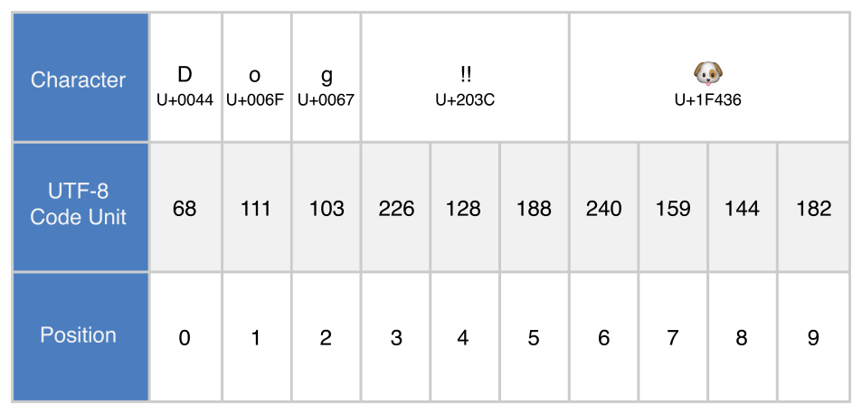

[‌]()[‌]()
Strings and Characters 
----------------------

A *string* is a series of characters, such as `"hello, world"` or `"albatross"`. Swift strings are represented by the `String` type. The contents of a `String` can be accessed in various ways, including as a collection of `Character` values.

Swift’s `String` and `Character` types provide a fast, Unicode-compliant way to work with text in your code. The syntax for string creation and manipulation is lightweight and readable, with a string literal syntax that is similar to C. String concatenation is as simple as combining two strings with the `+` operator, and string mutability is managed by choosing between a constant or a variable, just like any other value in Swift. You can also use strings to insert constants, variables, literals, and expressions into longer strings, in a process known as string interpolation. This makes it easy to create custom string values for display, storage, and printing.

Despite this simplicity of syntax, Swift’s `String` type is a fast, modern string implementation. Every string is composed of encoding-independent Unicode characters, and provides support for accessing those characters in various Unicode representations.

Note

Swift’s `String` type is bridged with Foundation’s `NSString` class. If you are working with the Foundation framework in Cocoa, the entire `NSString` API is available to call on any `String` value you create when type cast to `NSString`, as described in [AnyObject](TypeCasting.md#TP40016643-CH22-ID343). You can also use a `String` value with any API that requires an `NSString` instance.

For more information about using `String` with Foundation and Cocoa, see *Using Swift with Cocoa and Objective-C (Swift 2.1)*.

[‌]()
### String Literals 

You can include predefined `String` values within your code as *string literals*. A string literal is a fixed sequence of textual characters surrounded by a pair of double quotes (`""`).

Use a string literal as an initial value for a constant or variable:

1.  `let` `someString` = `"Some string literal value"`

Note that Swift infers a type of `String` for the `someString` constant, because it is initialized with a string literal value.

Note

For information about using special characters in string literals, see [Special Characters in String Literals](StringsAndCharacters.md#TP40016643-CH7-ID295).

[‌]()
### Initializing an Empty String 

To create an empty `String` value as the starting point for building a longer string, either assign an empty string literal to a variable, or initialize a new `String` instance with initializer syntax:

1.  `var` `emptyString` = `""` `// empty string literal`
2.  `var` `anotherEmptyString` = `String`() `// initializer syntax`
3.  `// these two strings are both empty, and are equivalent to each other`

Find out whether a `String` value is empty by checking its Boolean `isEmpty` property:

1.  `if` `emptyString`.`isEmpty` {
2.  `    print`(`"Nothing to see here"`)
3.  `}`
4.  `// prints "Nothing to see here"`

[‌]()
### String Mutability 

You indicate whether a particular `String` can be modified (or *mutated*) by assigning it to a variable (in which case it can be modified), or to a constant (in which case it cannot be modified):

1.  `var` `variableString` = `"Horse"`
2.  `variableString` += `" and carriage"`
3.  `// variableString is now "Horse and carriage"`
4.  ` `
5.  `let` `constantString` = `"Highlander"`
6.  `constantString` += `" and another Highlander"`
7.  `// this reports a compile-time error - a constant string cannot be modified`

Note

This approach is different from string mutation in Objective-C and Cocoa, where you choose between two classes (`NSString` and `NSMutableString`) to indicate whether a string can be mutated.

[‌]()
### Strings Are Value Types 

Swift’s `String` type is a *value type*. If you create a new `String` value, that `String` value is *copied* when it is passed to a function or method, or when it is assigned to a constant or variable. In each case, a new copy of the existing `String` value is created, and the new copy is passed or assigned, not the original version. Value types are described in [Structures and Enumerations Are Value Types](ClassesAndStructures.md#TP40016643-CH13-ID88).

Swift’s copy-by-default `String` behavior ensures that when a function or method passes you a `String` value, it is clear that you own that exact `String` value, regardless of where it came from. You can be confident that the string you are passed will not be modified unless you modify it yourself.

Behind the scenes, Swift’s compiler optimizes string usage so that actual copying takes place only when absolutely necessary. This means you always get great performance when working with strings as value types.

[‌]()
### Working with Characters 

You can access the individual `Character` values for a `String` by iterating over its `characters` property with a `for`-`in` loop:

1.  `for` `character` `in` `"Dog!🐶"`.`characters` {
2.  `    print`(`character`)
3.  `}`
4.  `// D`
5.  `// o`
6.  `// g`
7.  `// !`
8.  `// 🐶`

The `for`-`in` loop is described in [For Loops](ControlFlow.md#TP40016643-CH9-ID121).

Alternatively, you can create a stand-alone `Character` constant or variable from a single-character string literal by providing a `Character` type annotation:

1.  `let` `exclamationMark`: `Character` = `"!"`

`String` values can be constructed by passing an array of `Character` values as an argument to its initializer:

1.  `let` `catCharacters`: \[`Character`\] = \[`"C"`, `"a"`, `"t"`, `"!"`, `"🐱"`\]
2.  `let` `catString` = `String`(`catCharacters`)
3.  `print`(`catString`)
4.  `// prints "Cat!🐱"`

[‌]()
### Concatenating Strings and Characters 

`String` values can be added together (or *concatenated*) with the addition operator (`+`) to create a new `String` value:

1.  `let` `string1` = `"hello"`
2.  `let` `string2` = `" there"`
3.  `var` `welcome` = `string1` + `string2`
4.  `// welcome now equals "hello there"`

You can also append a `String` value to an existing `String` variable with the addition assignment operator (`+=`):

1.  `var` `instruction` = `"look over"`
2.  `instruction` += `string2`
3.  `// instruction now equals "look over there"`

You can append a `Character` value to a `String` variable with the `String` type’s `append()` method:

1.  `let` `exclamationMark`: `Character` = `"!"`
2.  `welcome`.`append`(`exclamationMark`)
3.  `// welcome now equals "hello there!"`

Note

You can’t append a `String` or `Character` to an existing `Character` variable, because a `Character` value must contain a single character only.

[‌]()
### String Interpolation 

*String interpolation* is a way to construct a new `String` value from a mix of constants, variables, literals, and expressions by including their values inside a string literal. Each item that you insert into the string literal is wrapped in a pair of parentheses, prefixed by a backslash:

1.  `let` `multiplier` = `3`
2.  `let` `message` = `"`\\(`multiplier`)` times 2.5 is `\\(`Double`(`multiplier`) \* `2.5`)`"`
3.  `// message is "3 times 2.5 is 7.5"`

In the example above, the value of `multiplier` is inserted into a string literal as `\(multiplier)`. This placeholder is replaced with the actual value of `multiplier` when the string interpolation is evaluated to create an actual string.

The value of `multiplier` is also part of a larger expression later in the string. This expression calculates the value of `Double(multiplier) * 2.5` and inserts the result (`7.5`) into the string. In this case, the expression is written as `\(Double(multiplier) * 2.5)` when it is included inside the string literal.

Note

The expressions you write inside parentheses within an interpolated string cannot contain an unescaped backslash (`\`), a carriage return, or a line feed. However, they can contain other string literals.

[‌]()
### Unicode 

*Unicode* is an international standard for encoding, representing, and processing text in different writing systems. It enables you to represent almost any character from any language in a standardized form, and to read and write those characters to and from an external source such as a text file or web page. Swift’s `String` and `Character` types are fully Unicode-compliant, as described in this section.

[‌]()
### Unicode Scalars 

Behind the scenes, Swift’s native `String` type is built from *Unicode scalar* values. A Unicode scalar is a unique 21-bit number for a character or modifier, such as `U+0061` for `LATIN SMALL LETTER A` (`"a"`), or `U+1F425` for `FRONT-FACING BABY CHICK` (`"🐥"`).

Note

A Unicode scalar is any Unicode *code point* in the range `U+0000` to `U+D7FF` inclusive or `U+E000` to `U+10FFFF` inclusive. Unicode scalars do not include the Unicode *surrogate pair* code points, which are the code points in the range `U+D800` to `U+DFFF` inclusive.

Note that not all 21-bit Unicode scalars are assigned to a character—some scalars are reserved for future assignment. Scalars that have been assigned to a character typically also have a name, such as `LATIN SMALL LETTER A` and `FRONT-FACING BABY CHICK` in the examples above.

[‌]()
### Special Characters in String Literals 

String literals can include the following special characters:

-   The escaped special characters `\0` (null character), `\\` (backslash), `\t` (horizontal tab), `\n` (line feed), `\r` (carriage return), `\"` (double quote) and `\'` (single quote)

-   An arbitrary Unicode scalar, written as `\u{`*n*`}`, where *n* is a 1–8 digit hexadecimal number with a value equal to a valid Unicode code point

The code below shows four examples of these special characters. The `wiseWords` constant contains two escaped double quote characters. The `dollarSign`, `blackHeart`, and `sparklingHeart` constants demonstrate the Unicode scalar format:

1.  `let` `wiseWords` = `"\"Imagination is more important than knowledge\" - Einstein"`
2.  `// "Imagination is more important than knowledge" - Einstein`
3.  `let` `dollarSign` = `"\u{24}"` `// $,  Unicode scalar U+0024`
4.  `let` `blackHeart` = `"\u{2665}"` `// ♥,  Unicode scalar U+2665`
5.  `let` `sparklingHeart` = `"\u{1F496}"` `// 💖, Unicode scalar U+1F496`

[‌]()
### Extended Grapheme Clusters 

Every instance of Swift’s `Character` type represents a single *extended grapheme cluster*. An extended grapheme cluster is a sequence of one or more Unicode scalars that (when combined) produce a single human-readable character.

Here’s an example. The letter `é` can be represented as the single Unicode scalar `é` (`LATIN SMALL LETTER E WITH ACUTE`, or `U+00E9`). However, the same letter can also be represented as a *pair* of scalars—a standard letter `e` (`LATIN SMALL LETTER E`, or `U+0065`), followed by the `COMBINING ACUTE ACCENT` scalar (`U+0301`). The `COMBINING ACUTE ACCENT` scalar is graphically applied to the scalar that precedes it, turning an `e` into an `é` when it is rendered by a Unicode-aware text-rendering system.

In both cases, the letter `é` is represented as a single Swift `Character` value that represents an extended grapheme cluster. In the first case, the cluster contains a single scalar; in the second case, it is a cluster of two scalars:

1.  `let` `eAcute`: `Character` = `"\u{E9}"` `// é`
2.  `let` `combinedEAcute`: `Character` = `"\u{65}\u{301}"` `// e followed by ́`
3.  `// eAcute is é, combinedEAcute is é`

Extended grapheme clusters are a flexible way to represent many complex script characters as a single `Character` value. For example, Hangul syllables from the Korean alphabet can be represented as either a precomposed or decomposed sequence. Both of these representations qualify as a single `Character` value in Swift:

1.  `let` `precomposed`: `Character` = `"\u{D55C}"` `// 한`
2.  `let` `decomposed`: `Character` = `"\u{1112}\u{1161}\u{11AB}"` `// ᄒ, ᅡ, ᆫ`
3.  `// precomposed is 한, decomposed is 한`

Extended grapheme clusters enable scalars for enclosing marks (such as `COMBINING ENCLOSING CIRCLE`, or `U+20DD`) to enclose other Unicode scalars as part of a single `Character` value:

1.  `let` `enclosedEAcute`: `Character` = `"\u{E9}\u{20DD}"`
2.  `// enclosedEAcute is é⃝`

Unicode scalars for regional indicator symbols can be combined in pairs to make a single `Character` value, such as this combination of `REGIONAL INDICATOR SYMBOL LETTER U` (`U+1F1FA`) and `REGIONAL INDICATOR SYMBOL LETTER S` (`U+1F1F8`):

1.  `let` `regionalIndicatorForUS`: `Character` = `"\u{1F1FA}\u{1F1F8}"`
2.  `// regionalIndicatorForUS is 🇺🇸`

[‌]()
### Counting Characters 

To retrieve a count of the `Character` values in a string, use the `count` property of the string’s `characters` property:

1.  `let` `unusualMenagerie` = `"Koala 🐨, Snail 🐌, Penguin 🐧, Dromedary 🐪"`
2.  `print`(`"unusualMenagerie has `\\(`unusualMenagerie`.`characters`.`count`)` characters"`)
3.  `// prints "unusualMenagerie has 40 characters"`

Note that Swift’s use of extended grapheme clusters for `Character` values means that string concatenation and modification may not always affect a string’s character count.

For example, if you initialize a new string with the four-character word `cafe`, and then append a `COMBINING ACUTE ACCENT` (`U+0301`) to the end of the string, the resulting string will still have a character count of `4`, with a fourth character of `é`, not `e`:

1.  `var` `word` = `"cafe"`
2.  `print`(`"the number of characters in `\\(`word`)` is `\\(`word`.`characters`.`count`)`"`)
3.  `// prints "the number of characters in cafe is 4"`
4.  ` `
5.  `word` += `"\u{301}"` `// COMBINING ACUTE ACCENT, U+0301`
6.  ` `
7.  `print`(`"the number of characters in `\\(`word`)` is `\\(`word`.`characters`.`count`)`"`)
8.  `// prints "the number of characters in café is 4"`

Note

Extended grapheme clusters can be composed of one or more Unicode scalars. This means that different characters—and different representations of the same character—can require different amounts of memory to store. Because of this, characters in Swift do not each take up the same amount of memory within a string’s representation. As a result, the number of characters in a string cannot be calculated without iterating through the string to determine its extended grapheme cluster boundaries. If you are working with particularly long string values, be aware that the `characters` property must iterate over the Unicode scalars in the entire string in order to determine the characters for that string.

The count of the characters returned by the `characters` property is not always the same as the `length` property of an `NSString` that contains the same characters. The length of an `NSString` is based on the number of 16-bit code units within the string’s UTF-16 representation and not the number of Unicode extended grapheme clusters within the string.

[‌]()
### Accessing and Modifying a String 

You access and modify a string through its methods and properties, or by using subscript syntax.

[‌]()
### String Indices 

Each `String` value has an associated *index type*, `String.Index`, which corresponds to the position of each `Character` in the string.

As mentioned above, different characters can require different amounts of memory to store, so in order to determine which `Character` is at a particular position, you must iterate over each Unicode scalar from the start or end of that `String`. For this reason, Swift strings cannot be indexed by integer values.

Use the `startIndex` property to access the position of the first `Character` of a `String`. The `endIndex` property is the position after the last character in a `String`. As a result, the `endIndex` property isn’t a valid argument to a string’s subscript. If a `String` is empty, `startIndex` and `endIndex` are equal.

A `String.Index` value can access its immediately preceding index by calling the `predecessor()` method, and its immediately succeeding index by calling the `successor()` method. Any index in a `String` can be accessed from any other index by chaining these methods together, or by using the `advancedBy(_:)` method. Attempting to access an index outside of a string’s range will trigger a runtime error.

You can use subscript syntax to access the `Character` at a particular `String` index.

1.  `let` `greeting` = `"Guten Tag!"`
2.  `greeting`\[`greeting`.`startIndex`\]
3.  `// G`
4.  `greeting`\[`greeting`.`endIndex`.`predecessor`()\]
5.  `// !`
6.  `greeting`\[`greeting`.`startIndex`.`successor`()\]
7.  `// u`
8.  `let` `index` = `greeting`.`startIndex`.`advancedBy`(`7`)
9.  `greeting`\[`index`\]
10. `// a`

Attempting to access a `Character` at an index outside of a string’s range will trigger a runtime error.

1.  `greeting`\[`greeting`.`endIndex`\] `// error`
2.  `greeting`.`endIndex`.`successor`() `// error`

Use the `indices` property of the `characters` property to create a `Range` of all of the indexes used to access individual characters in a string.

1.  `for` `index` `in` `greeting`.`characters`.`indices` {
2.  `    print`(`"`\\(`greeting`\[`index`\])` "`, `terminator`: `""`)
3.  `}`
4.  `// prints "G u t e n   T a g ! "`

[‌]()
### Inserting and Removing 

To insert a character into a string at a specified index, use the `insert(_:atIndex:)` method.

1.  `var` `welcome` = `"hello"`
2.  `welcome`.`insert`(`"!"`, `atIndex`: `welcome`.`endIndex`)
3.  `// welcome now equals "hello!"`

To insert the contents of another string at a specified index, use the `insertContentsOf(_:at:)` method.

1.  `welcome`.`insertContentsOf`(`" there"`.`characters`, `at`: `welcome`.`endIndex`.`predecessor`())
2.  `// welcome now equals "hello there!"`

To remove a character from a string at a specified index, use the `removeAtIndex(_:)` method.

1.  `welcome`.`removeAtIndex`(`welcome`.`endIndex`.`predecessor`())
2.  `// welcome now equals "hello there"`

To remove a substring at a specified range, use the `removeRange(_:)` method:

1.  `let` `range` = `welcome`.`endIndex`.`advancedBy`(-`6`)..&lt;`welcome`.`endIndex`
2.  `welcome`.`removeRange`(`range`)
3.  `// welcome now equals "hello"`

[‌]()
### Comparing Strings 

Swift provides three ways to compare textual values: string and character equality, prefix equality, and suffix equality.

[‌]()
### String and Character Equality 

String and character equality is checked with the “equal to” operator (`==`) and the “not equal to” operator (`!=`), as described in [Comparison Operators](BasicOperators.md#TP40016643-CH6-ID70):

1.  `let` `quotation` = `"We're a lot alike, you and I."`
2.  `let` `sameQuotation` = `"We're a lot alike, you and I."`
3.  `if` `quotation` == `sameQuotation` {
4.  `    print`(`"These two strings are considered equal"`)
5.  `}`
6.  `// prints "These two strings are considered equal"`

Two `String` values (or two `Character` values) are considered equal if their extended grapheme clusters are *canonically equivalent*. Extended grapheme clusters are canonically equivalent if they have the same linguistic meaning and appearance, even if they are composed from different Unicode scalars behind the scenes.

For example, `LATIN SMALL LETTER E WITH ACUTE` (`U+00E9`) is canonically equivalent to `LATIN SMALL LETTER E` (`U+0065`) followed by `COMBINING ACUTE ACCENT` (`U+0301`). Both of these extended grapheme clusters are valid ways to represent the character `é`, and so they are considered to be canonically equivalent:

1.  `// "Voulez-vous un café?" using LATIN SMALL LETTER E WITH ACUTE`
2.  `let` `eAcuteQuestion` = `"Voulez-vous un caf\u{E9}?"`
3.  ` `
4.  `// "Voulez-vous un café?" using LATIN SMALL LETTER E and COMBINING ACUTE ACCENT`
5.  `let` `combinedEAcuteQuestion` = `"Voulez-vous un caf\u{65}\u{301}?"`
6.  ` `
7.  `if` `eAcuteQuestion` == `combinedEAcuteQuestion` {
8.  `    print`(`"These two strings are considered equal"`)
9.  `}`
10. `// prints "These two strings are considered equal"`

Conversely, `LATIN CAPITAL LETTER A` (`U+0041`, or `"A"`), as used in English, is *not* equivalent to `CYRILLIC CAPITAL LETTER A` (`U+0410`, or `"А"`), as used in Russian. The characters are visually similar, but do not have the same linguistic meaning:

1.  `let` `latinCapitalLetterA`: `Character` = `"\u{41}"`
2.  ` `
3.  `let` `cyrillicCapitalLetterA`: `Character` = `"\u{0410}"`
4.  ` `
5.  `if` `latinCapitalLetterA` != `cyrillicCapitalLetterA` {
6.  `    print`(`"These two characters are not equivalent"`)
7.  `}`
8.  `// prints "These two characters are not equivalent"`

Note

String and character comparisons in Swift are not locale-sensitive.

[‌]()
### Prefix and Suffix Equality 

To check whether a string has a particular string prefix or suffix, call the string’s `hasPrefix(_:)` and `hasSuffix(_:)` methods, both of which take a single argument of type `String` and return a Boolean value.

The examples below consider an array of strings representing the scene locations from the first two acts of Shakespeare’s *Romeo and Juliet*:

1.  `let` `romeoAndJuliet` = \[
2.  `    "Act 1 Scene 1: Verona, A public place"`,
3.  `    "Act 1 Scene 2: Capulet's mansion"`,
4.  `    "Act 1 Scene 3: A room in Capulet's mansion"`,
5.  `    "Act 1 Scene 4: A street outside Capulet's mansion"`,
6.  `    "Act 1 Scene 5: The Great Hall in Capulet's mansion"`,
7.  `    "Act 2 Scene 1: Outside Capulet's mansion"`,
8.  `    "Act 2 Scene 2: Capulet's orchard"`,
9.  `    "Act 2 Scene 3: Outside Friar Lawrence's cell"`,
10. `    "Act 2 Scene 4: A street in Verona"`,
11. `    "Act 2 Scene 5: Capulet's mansion"`,
12. `    "Act 2 Scene 6: Friar Lawrence's cell"`
13. `]`

You can use the `hasPrefix(_:)` method with the `romeoAndJuliet` array to count the number of scenes in Act 1 of the play:

1.  `var` `act1SceneCount` = `0`
2.  `for` `scene` `in` `romeoAndJuliet` {
3.  `    if` `scene`.`hasPrefix`(`"Act 1 "`) {
4.  `        ++act1SceneCount`
5.  `    }`
6.  `}`
7.  `print`(`"There are `\\(`act1SceneCount`)` scenes in Act 1"`)
8.  `// prints "There are 5 scenes in Act 1"`

Similarly, use the `hasSuffix(_:)` method to count the number of scenes that take place in or around Capulet’s mansion and Friar Lawrence’s cell:

1.  `var` `mansionCount` = `0`
2.  `var` `cellCount` = `0`
3.  `for` `scene` `in` `romeoAndJuliet` {
4.  `    if` `scene`.`hasSuffix`(`"Capulet's mansion"`) {
5.  `        ++mansionCount`
6.  `    } else` `if` `scene`.`hasSuffix`(`"Friar Lawrence's cell"`) {
7.  `        ++cellCount`
8.  `    }`
9.  `}`
10. `print`(`"`\\(`mansionCount`)` mansion scenes; `\\(`cellCount`)` cell scenes"`)
11. `// prints "6 mansion scenes; 2 cell scenes"`

Note

The `hasPrefix(_:)` and `hasSuffix(_:)` methods perform a character-by-character canonical equivalence comparison between the extended grapheme clusters in each string, as described in [String and Character Equality](StringsAndCharacters.md#TP40016643-CH7-ID299).

[‌]()
### Unicode Representations of Strings 

When a Unicode string is written to a text file or some other storage, the Unicode scalars in that string are encoded in one of several Unicode-defined *encoding forms*. Each form encodes the string in small chunks known as *code units*. These include the UTF-8 encoding form (which encodes a string as 8-bit code units), the UTF-16 encoding form (which encodes a string as 16-bit code units), and the UTF-32 encoding form (which encodes a string as 32-bit code units).

Swift provides several different ways to access Unicode representations of strings. You can iterate over the string with a `for`-`in` statement, to access its individual `Character` values as Unicode extended grapheme clusters. This process is described in [Working with Characters](StringsAndCharacters.md#TP40016643-CH7-ID290).

Alternatively, access a `String` value in one of three other Unicode-compliant representations:

-   A collection of UTF-8 code units (accessed with the string’s `utf8` property)

-   A collection of UTF-16 code units (accessed with the string’s `utf16` property)

-   A collection of 21-bit Unicode scalar values, equivalent to the string’s UTF-32 encoding form (accessed with the string’s `unicodeScalars` property)

Each example below shows a different representation of the following string, which is made up of the characters `D`, `o`, `g`, `‼` (`DOUBLE EXCLAMATION MARK`, or Unicode scalar `U+203C`), and the 🐶 character (`DOG FACE`, or Unicode scalar `U+1F436`):

1.  `let` `dogString` = `"Dog‼🐶"`

[‌]()
### UTF-8 Representation 

You can access a UTF-8 representation of a `String` by iterating over its `utf8` property. This property is of type `String.UTF8View`, which is a collection of unsigned 8-bit (`UInt8`) values, one for each byte in the string’s UTF-8 representation:

{width="476" height="229"}

1.  `for` `codeUnit` `in` `dogString`.`utf8` {
2.  `    print`(`"`\\(`codeUnit`)` "`, `terminator`: `""`)
3.  `}`
4.  `print`(`""`)
5.  `// 68 111 103 226 128 188 240 159 144 182`

In the example above, the first three decimal `codeUnit` values (`68`, `111`, `103`) represent the characters `D`, `o`, and `g`, whose UTF-8 representation is the same as their ASCII representation. The next three decimal `codeUnit` values (`226`, `128`, `188`) are a three-byte UTF-8 representation of the `DOUBLE EXCLAMATION MARK` character. The last four `codeUnit` values (`240`, `159`, `144`, `182`) are a four-byte UTF-8 representation of the `DOG FACE` character.

[‌]()
### UTF-16 Representation 

You can access a UTF-16 representation of a `String` by iterating over its `utf16` property. This property is of type `String.UTF16View`, which is a collection of unsigned 16-bit (`UInt16`) values, one for each 16-bit code unit in the string’s UTF-16 representation:

{width="477" height="229"}

1.  `for` `codeUnit` `in` `dogString`.`utf16` {
2.  `    print`(`"`\\(`codeUnit`)` "`, `terminator`: `""`)
3.  `}`
4.  `print`(`""`)
5.  `// 68 111 103 8252 55357 56374`

Again, the first three `codeUnit` values (`68`, `111`, `103`) represent the characters `D`, `o`, and `g`, whose UTF-16 code units have the same values as in the string’s UTF-8 representation (because these Unicode scalars represent ASCII characters).

The fourth `codeUnit` value (`8252`) is a decimal equivalent of the hexadecimal value `203C`, which represents the Unicode scalar `U+203C` for the `DOUBLE EXCLAMATION MARK` character. This character can be represented as a single code unit in UTF-16.

The fifth and sixth `codeUnit` values (`55357` and `56374`) are a UTF-16 surrogate pair representation of the `DOG FACE` character. These values are a high-surrogate value of `U+D83D` (decimal value `55357`) and a low-surrogate value of `U+DC36` (decimal value `56374`).

[‌]()
### Unicode Scalar Representation 

You can access a Unicode scalar representation of a `String` value by iterating over its `unicodeScalars` property. This property is of type `UnicodeScalarView`, which is a collection of values of type `UnicodeScalar`.

Each `UnicodeScalar` has a `value` property that returns the scalar’s 21-bit value, represented within a `UInt32` value:

{width="477" height="229"}

1.  `for` `scalar` `in` `dogString`.`unicodeScalars` {
2.  `    print`(`"`\\(`scalar`.`value`)` "`, `terminator`: `""`)
3.  `}`
4.  `print`(`""`)
5.  `// 68 111 103 8252 128054`

The `value` properties for the first three `UnicodeScalar` values (`68`, `111`, `103`) once again represent the characters `D`, `o`, and `g`.

The fourth `codeUnit` value (`8252`) is again a decimal equivalent of the hexadecimal value `203C`, which represents the Unicode scalar `U+203C` for the `DOUBLE EXCLAMATION MARK` character.

The `value` property of the fifth and final `UnicodeScalar`, `128054`, is a decimal equivalent of the hexadecimal value `1F436`, which represents the Unicode scalar `U+1F436` for the `DOG FACE` character.

As an alternative to querying their `value` properties, each `UnicodeScalar` value can also be used to construct a new `String` value, such as with string interpolation:

1.  `for` `scalar` `in` `dogString`.`unicodeScalars` {
2.  `    print`(`"`\\(`scalar`)` "`)
3.  `}`
4.  `// D`
5.  `// o`
6.  `// g`
7.  `// ‼`
8.  `// 🐶`

